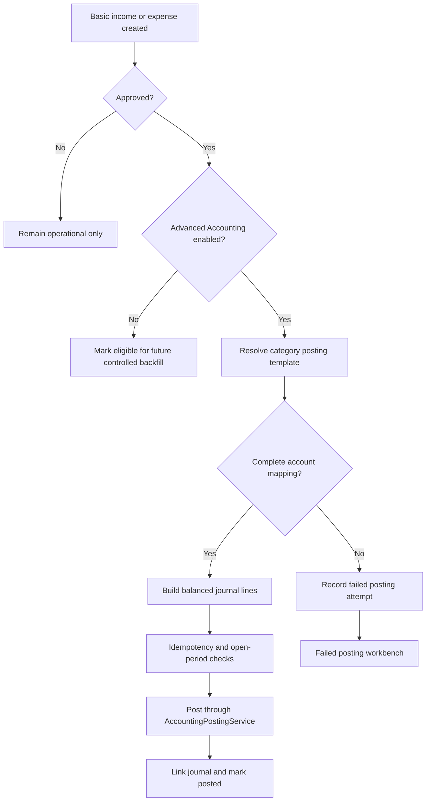
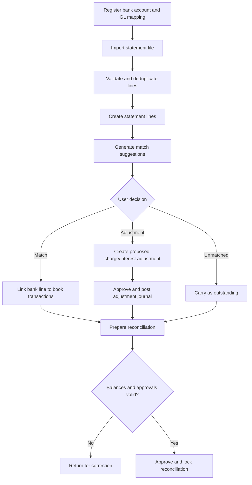
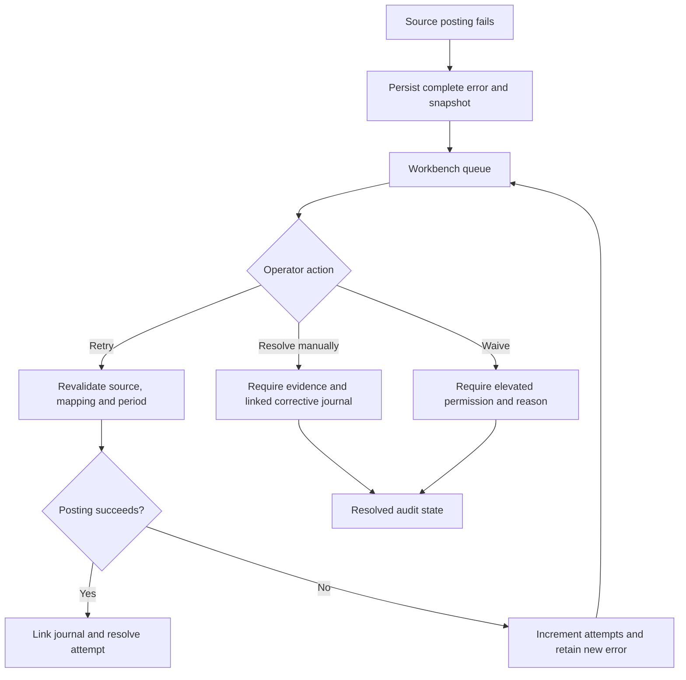
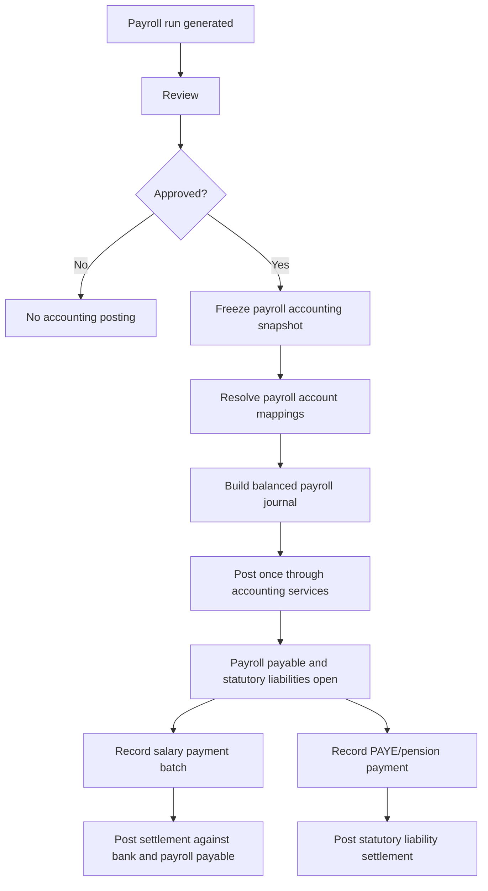
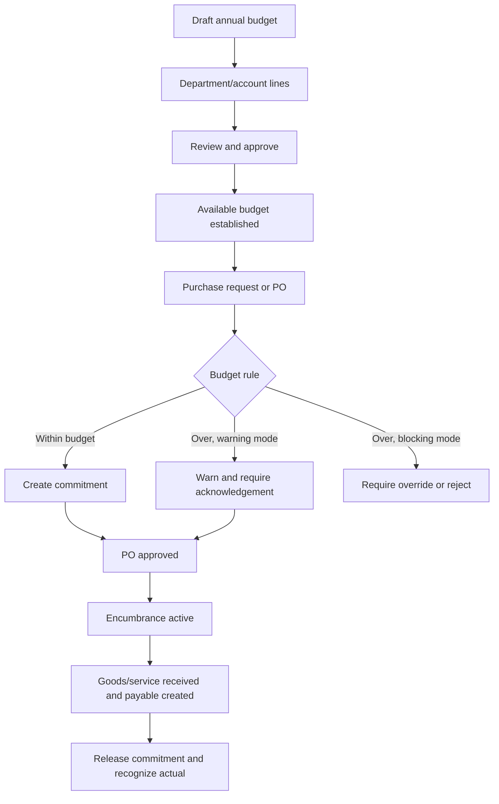
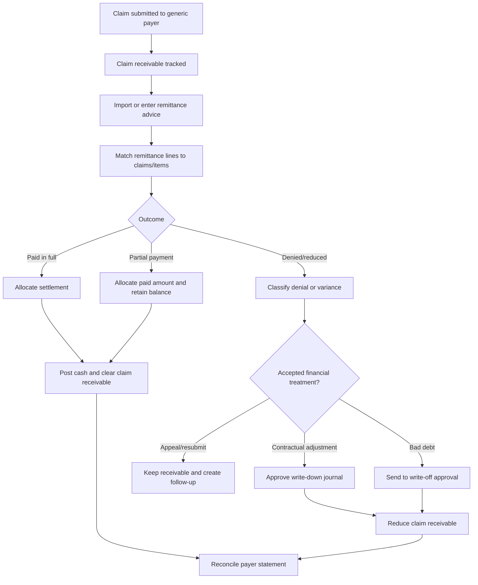

# UHMS Accounting Gap Execution Master Plan

**Planning date:** 2026-06-15  
**Status:** Implementation-ready planning only  
**Primary source:** `docs/ACCOUNTING_MODULE_SPLIT_AND_GAP_REPORT.md`

## 1. Executive Summary

UHMS already has a credible double-entry foundation: a chart of accounts, fiscal years and periods, journals, financial statements, operational receivables and payables, inventory valuation, payment posting, cashier controls, and source-specific accounting services. The remaining risk is not the absence of a ledger. It is the incomplete connection between operational modules and that ledger, plus missing control workbenches for failures, bank reconciliation, subledger reconciliation, payroll, tax, budgets, assets, receivables, and claim settlements.

This plan delivers the ten high-priority gaps in dependency order:

1. Connect approved Basic Accounting entries to Advanced Accounting through configurable posting templates.
2. Add bank accounts, statement import, matching, and formal reconciliation.
3. Add failed-posting and GL-to-subledger reconciliation workbenches.
4. Post approved payroll and settle salary and statutory liabilities.
5. Add cash flow reporting and controlled accounting exports.
6. Add budgets, commitments, and encumbrances.
7. Add fixed assets and depreciation.
8. Add statutory tax ledgers, returns, settlement, and reconciliation.
9. Extend existing AR aging into a collector workbench.
10. Add generic insurer and sponsor remittance settlement accounting.

The safest architecture is evolutionary:

- Keep Billing & Collections independent from accounting module toggles.
- Keep `accounting_advanced` dependent on `accounting_basic`.
- Reuse `JournalEntryService` and `AccountingPostingService`; no source module writes journal rows directly.
- Add a shared posting-attempt register without removing the existing source-level accounting status fields.
- Use explicit approvals, idempotency keys, reversals, and audit events.
- Never auto-post historical data.
- Add optional module toggles only where a capability has a distinct lifecycle and deployment value.
- Preserve the EN/FR localization lock and zero active runtime candidates.

## 2. Planning Principles and Non-Negotiable Controls

1. Every ledger-affecting operation must be balanced, transactional, idempotent, traceable to a source record, and reversible.
2. Posted journal entries are immutable. Corrections use reversal and replacement entries.
3. Source modules calculate business amounts; accounting services map those amounts to accounts and post them.
4. Billing, payment collection, payroll calculation, stock operations, and claim submission must continue when Advanced Accounting is disabled.
5. A disabled accounting integration records no hidden journal and must not leave a false `posted` status.
6. Direct routes use module middleware and permissions. Sidebar visibility is not an access control.
7. Historical records are previewed and explicitly approved before backfill.
8. Closed periods reject new postings unless reopened by an authorized user.
9. Financial snapshots use fixed precision. PHP floats must not be the authoritative calculation mechanism for new financial logic.
10. New user-facing text must be added to both EN and FR language files.
11. All state-changing actions use `ActivityLogService`.
12. Large backfills and imports use chunking, resumable checkpoints, dry-run mode, and bounded transactions.

## 3. Current Implemented Accounting Coverage

| Area | Implemented coverage | Remaining control gap |
|---|---|---|
| Finance modules | Billing & Collections, Basic Accounting, Advanced Accounting; route middleware; Advanced depends on Basic | New capability toggle decisions |
| General ledger | Accounts, journals, journal lines, posting, reversal, periods, fiscal years | Shared posting attempt history and stronger source uniqueness |
| Billing | Invoice, payment, discount, credit note, receivable allocation and reversal posting | Unified failure workbench and reconciliation evidence |
| Receivables | Payer-specific balances, aging, control accounts, write-offs | Collector workflow, disputes, promises, assignments, remittance matching |
| Suppliers | Payables, payments, returns, statements, aging and journal posting | Reconciliation workbench and payment-file support |
| Inventory | Valuation, COGS/expense, adjustment and damage posting | Formal reconciliation evidence and exception resolution |
| Basic Accounting | Income, expenses, categories, daily collection, cashier handover, operational reconciliation | Approved entries do not post to GL |
| Cash and bank | Cashbook and payment references | Bank register, imports, matching and reconciliation |
| Payroll | Ghana PAYE calculation foundation and journal summary preparation | Posting, liabilities, settlement, reversals and reconciliation |
| Financial reports | Trial balance, GL, P&L, balance sheet, cashbook, department reports | Cash flow route/service/view and controlled exports |
| Claims | Submission, review, payments and invoice receivable linkage | Remittance advice, partial allocation, denial/write-down and statement reconciliation |
| Closing | Period/fiscal-year management and year-end close | Failed posting and material reconciliation close gates |
| Audit | Journal and settings logging foundation | Explicit events for every new accounting workflow |
| Localization | Zero active runtime candidates as of 2026-06-15 | Every phase must preserve the lock |

## 4. Target Architecture

### 4.1 Core Boundaries

- `JournalEntryService`: validates, creates, posts, reverses, and audits journals.
- `AccountingPostingService`: common source-to-journal orchestrator.
- Source posting services: calculate source-specific lines and call the common orchestrator.
- `AccountingPostingAttemptService`: records attempts, errors, retries, waivers, and resolution.
- Reconciliation services: compare immutable snapshots and produce explainable differences; they do not silently alter source or GL data.
- Adjustment services: create separately approved journals for bank charges, tax corrections, write-downs, depreciation, and reconciliation corrections.

### 4.2 Common Posting Contract

Every source posting should supply:

- source module, source type, source ID, posting type, and posting version;
- effective entry date and description;
- debit and credit lines with dimensions;
- idempotency key;
- expected source status and amount snapshot;
- actor and approval context;
- optional reversal-of relationship.

The shared idempotency key should be unique across:

```text
source_type + source_id + posting_type + posting_version
```

Existing `journal_entry_id`, `accounting_status`, `accounting_posted_at`, and `accounting_error` columns remain useful fast pointers. The posting-attempt table becomes the complete operational history.

## 5. Delivery Roadmap

| Phase | Capability | Depends on | Primary release outcome |
|---|---|---|---|
| 0 | Shared controls and readiness | Existing accounting foundation | Common posting attempts, idempotency, account mappings, close checks |
| A | Basic-to-Advanced posting bridge | Phase 0 | Approved Basic entries post once to balanced GL journals |
| B | Bank accounts and reconciliation | Phase A | Imported bank lines reconcile to cashbook and approved adjustments |
| C | Failed posting workbench | Phase 0 and A | All supported posting failures are searchable, retryable, and auditable |
| D | Subledger reconciliation workbench | Phase C; bank schema from B | AR/AP/inventory/payroll/cash/tax comparisons with explainable differences |
| E | Payroll accounting posting | Phase C; payroll foundation | Approved payroll and salary settlement post and reconcile |
| F | Cash flow and exports | Phase B | Direct cash flow report and controlled PDF/Excel/CSV/print |
| G | Budgets and commitments | Stable GL dimensions | Approved budgets and procurement commitments with configurable enforcement |
| H | Fixed assets | Procurement/AP and Phase C | Capitalization, depreciation, transfer, impairment and disposal |
| I | Statutory tax accounting | Payroll E; billing/procurement tax sources | Tax ledgers, returns, settlement and reconciliation |
| J | Receivables workbench | Phase D | Collector operations over existing AR balances and aging |
| K | Claims settlement accounting | Phase J; claims and insurance | Generic remittance allocation, denials, write-downs and insurer reconciliation |

### Why This Order Is Safest

- Phase 0 and A eliminate the immediate divergence between Basic and Advanced Accounting.
- Bank data is needed before cash reconciliation and a reliable cash flow report.
- Failure visibility must exist before adding payroll, assets, tax, or settlement postings.
- Reconciliation follows failure visibility so differences can be linked to unresolved source postings.
- Payroll precedes statutory tax accounting because PAYE and pension liabilities originate there.
- Budgets and fixed assets are added after the core posting controls are proven.
- The AR workbench precedes claims settlement because claim remittances allocate into receivable balances.

## 6. Gap-to-Phase Mapping

| Reported gap | Delivery phase | Completion evidence |
|---|---|---|
| Basic-to-Advanced bridge | A | Approved income/expense posts once; reversals and backfill controlled |
| Bank accounts and reconciliation | B | Approved reconciliation statement balances bank and book positions |
| Failed posting workbench | C | All supported source failures visible with attempt history |
| Subledger reconciliation | D | Seven reconciliation domains produce snapshots and explainable differences |
| Payroll accounting | E | Approved payroll, salary settlement, PAYE and pension balances reconcile |
| Cash flow statement | F | Opening + movement = closing cash for selected period |
| Budgets and commitments | G | Approved budgets compare to actuals and open commitments |
| Fixed assets | H | Asset register agrees to asset cost and accumulated depreciation accounts |
| Statutory tax accounting | I | Tax source, ledger, return and payment balances reconcile |
| Receivables workbench | J | Collectors manage payer balances without replacing AR aging |
| Claims settlement accounting | K | Remittances allocate without overpayment and denials follow approved treatment |

## 7. Phase 0: Shared Controls and Readiness

### Scope

Create the reusable control layer required by all subsequent phases.

### Database

1. `accounting_posting_attempts`
   - `source_module`, `source_type`, `source_id`, `posting_type`, `posting_version`
   - `idempotency_key` unique
   - `status`: pending, processing, posted, failed, waived, resolved, reversed
   - `journal_entry_id`, `reversal_journal_entry_id`
   - `attempt_count`, `first_attempted_at`, `last_attempted_at`, `next_retry_at`
   - `error_code`, `error_message`, `error_context` as `LONGTEXT`
   - `source_snapshot` and `posting_snapshot` as `LONGTEXT`
   - `resolved_by`, `resolved_at`, `resolution_type`, `resolution_note`
   - composite indexes on status/date, source identity, module/type, and journal IDs
2. `accounting_account_mappings`
   - mapping scope, key, account ID, effective dates, priority, active flag
   - unique active mapping rule enforced in service validation
3. Optional `journal_entries.idempotency_key` nullable unique after duplicate-data preflight.
4. Add close-control settings for unresolved failures and reconciliation tolerances.

### Services

- `AccountingPostingAttemptService`
- `AccountingIdempotencyService`
- `AccountingAccountMappingService`
- `AccountingCloseReadinessService`
- Extend `AccountingPostingService` to create and complete attempts transactionally.
- Extend source posting services gradually; do not break existing posting paths in one migration.

### Permissions

- Reuse `accounting.posting.view`, `accounting.posting.retry`, and `accounting.posting.reverse`.
- Normalize future UI authorization around:
  - `accounting.failed_postings.view`
  - `accounting.failed_postings.retry`
  - `accounting.failed_postings.resolve`
  - `accounting.failed_postings.waive`
  - `accounting.mappings.view`
  - `accounting.mappings.manage`

### Migration and Rollout

- Create tables and nullable columns first.
- Backfill existing posted source pointers into `accounting_posting_attempts` as `posted` records without creating journals.
- Backfill existing source errors as `failed` records, retaining full error text.
- Detect duplicate source journals before adding a unique journal idempotency key.
- Dual-write old status columns and the new attempt register until all posting services migrate.

### Acceptance

- Existing posting tests remain green.
- A source identity cannot produce duplicate posted journals.
- Existing failure text is retained.
- Period close readiness can list unresolved failures without changing current close behavior until enabled.

## 8. Phase A: Basic-to-Advanced Posting Bridge

### Business Flow



### Posting Templates

Add:

1. `accounting_posting_templates`
   - code, name, source module, posting type, status, effective dates
   - approval state and version
2. `accounting_posting_template_lines`
   - template ID, line order, debit/credit side
   - account source: fixed account, category mapping, payment-method mapping
   - amount expression identifier, description template, dimensions
3. Extend `account_categories` or add `account_category_mappings`
   - category ID, income/expense account, effective dates
4. `accounting_payment_account_mappings`
   - payment method/reference scope to cash or bank account

Use named amount resolvers rather than storing executable expressions.

### Financial Entry Changes

Add nullable columns:

- `approval_status` if current approval is represented only by `approved_by`;
- `accounting_status`;
- `journal_entry_id`;
- `accounting_posted_at`;
- `accounting_error`;
- `reversal_journal_entry_id`;
- `reversed_at`, `reversed_by`, `reversal_reason`;
- `posting_version`.

Index accounting status, journal ID, approval/date, and category/date.

### Journal Strategy

Default income:

```text
Dr Cash or Bank
Cr Mapped Income Account
```

Default expense:

```text
Dr Mapped Expense Account
Cr Cash or Bank
```

The selected cash/bank account comes from payment method and facility mapping. Templates may add tax or clearing lines later, but Phase A should begin with two-line templates.

### Posting Rules

- Only approved entries are eligible.
- Default to manual single or batch posting after approval.
- Optional auto-post-after-approval may be enabled later per facility after a stable period.
- Edits to posted entries are prohibited; reversal and replacement is required.
- Reposting a failed attempt reuses the same source identity and increments the attempt count.
- If Advanced Accounting is disabled, Basic Accounting remains fully usable and the entry is marked `not_applicable` or `eligible`, never `posted`.
- Disabling Advanced Accounting does not reverse existing journals.

### Services, Controllers and Views

- `BasicAccountingPostingService`
- `PostingTemplateService`
- `BasicAccountingBackfillService`
- `BasicAccountingPostingController`
- Posting template settings screens under Advanced Accounting.
- Basic entry list columns: approval, GL status, journal link, error.
- Batch preview screen showing entry, resolved accounts, date, debits, credits, and validation errors.
- Controlled backfill screen with date/category filters, dry run, approval, execution progress, and reconciliation summary.

### Permissions

- `accounting.basic.post_to_gl`
- `accounting.basic.post_batch`
- `accounting.basic.reverse_gl`
- `accounting.basic.backfill.preview`
- `accounting.basic.backfill.execute`
- `accounting.posting_templates.view`
- `accounting.posting_templates.manage`
- `accounting.posting_templates.approve`

### Audit Events

- `ACCOUNTING_POSTING_TEMPLATE_CREATED`
- `ACCOUNTING_POSTING_TEMPLATE_APPROVED`
- `BASIC_ENTRY_POSTED_TO_GL`
- `BASIC_ENTRY_POSTING_FAILED`
- `BASIC_ENTRY_REVERSED`
- `BASIC_ENTRY_BACKFILL_PREVIEWED`
- `BASIC_ENTRY_BACKFILL_APPROVED`
- `BASIC_ENTRY_BACKFILL_COMPLETED`

### Tests

- Unapproved entries cannot post.
- Advanced-disabled entries do not post.
- Income and expense templates create balanced journals.
- Missing mappings produce retained failures.
- Duplicate requests return the existing journal.
- Reversal is linked and restores the net GL impact.
- Historical preview changes no data.
- Backfill execution posts only approved preview items.

## 9. Phase B: Bank Accounts and Bank Reconciliation

### Flow



### Database

1. `bank_accounts`
   - facility/branch, bank name, account name, masked account number, currency
   - linked GL account, default payment method, opening date/balance, active flag
2. `bank_statement_imports`
   - bank account, format, original filename/hash, date range, status, totals
   - imported/approved/rejected actors and error summary
3. `bank_statement_lines`
   - transaction date, value date, reference, description, debit, credit, balance
   - external transaction ID, normalized reference, line hash, match status
   - unique import/line number and bank/line hash safeguards
4. `bank_reconciliations`
   - bank account, period start/end, statement opening/closing, book closing
   - outstanding deposits/withdrawals, adjustments, difference, status
   - prepared/approved/reopened/reversed actors and timestamps
5. `bank_reconciliation_matches`
   - reconciliation, statement line, matchable type/ID, matched amount
   - match method, confidence, status, actor and timestamp
6. `bank_reconciliation_adjustments`
   - type: bank charge, interest, tax, transfer, correction
   - amount, account mapping, status, journal ID, approval data

### Import Formats

Release 1:

- Configurable CSV column mapping profiles.
- UTF-8 validation, date/decimal normalization, preview, rejected-row export.

Later:

- OFX/QFX and MT940 after real bank samples and licensing/format validation.

### Matching Strategy

Auto-match suggestions score:

- exact amount;
- date tolerance;
- exact/normalized reference;
- payer/payee text;
- known electronic payment reference;
- one-to-one, one-to-many, and many-to-one totals.

Auto-match only proposes. User approval creates the match. High-confidence auto-accept may be a later setting.

### Integration Sources

- Basic Accounting financial entries;
- posted GL cashbook lines;
- patient payment collections;
- supplier payments;
- payroll settlements;
- bank transfer journals;
- approved bank charges and interest.

### Rules

- Imported files and lines are immutable; corrections use rejection and a new import.
- Bank charges and interest are proposed adjustments and require approval before journal posting.
- Approved reconciliations are locked.
- Reopening requires elevated permission, a reason, and audit logging.
- Reversal removes reconciliation links and reverses adjustment journals; it does not delete statement history.
- Outstanding items roll forward with original transaction dates.

### Services and UI

- `BankStatementImportService`
- `BankStatementParserInterface` with CSV implementation
- `BankMatchSuggestionService`
- `BankReconciliationService`
- `BankReconciliationAdjustmentPostingService`
- Bank account register, import wizard, matching workspace, reconciliation statement, approval and history views.

### Permissions

- `accounting.bank_accounts.view`
- `accounting.bank_accounts.manage`
- `accounting.bank_statements.import`
- `accounting.bank_statements.view`
- `accounting.bank_reconciliation.view`
- `accounting.bank_reconciliation.manage`
- `accounting.bank_reconciliation.approve`
- `accounting.bank_reconciliation.reopen`
- `accounting.bank_adjustments.post`

### Module Impact

Bank reconciliation remains a capability within `accounting_advanced` for the first release. Do not add a separate toggle until deployment evidence shows facilities need Advanced Accounting without bank reconciliation.

### Acceptance

- Duplicate statement files/lines are rejected safely.
- Suggestions are explainable and never silently accepted.
- Approved adjustment journals are balanced and linked.
- Reconciliation statement shows book balance, statement balance, outstanding items, adjustments and zero difference.
- Reopen/reversal preserves history.

## 10. Phase C: Failed Posting Workbench

### Flow



### Supported Sources

Billing, payments, credit notes, sponsors, supplier payables, inventory, stock adjustments, clinical consumables, payroll, Basic income/expense, bank reconciliation adjustments, and claim settlements.

### Workbench Features

- Filters by module, source type, posting type, status, date, error code, amount and owner.
- Source record and attempted journal preview.
- Full error text and immutable attempt history.
- Retry one, retry selected, and scheduled retry for transient failures.
- Manual resolution requiring a linked corrective journal or documented non-ledger resolution.
- Waive/ignore requiring elevated permission, reason, expiry/review date, and materiality.
- Export with `accounting.exports`.
- Dashboard counts by age and source.

### Retry Design

Replace the current hard-coded match expression over time with registered source handlers:

```text
AccountingPostingHandlerRegistry
  -> supports(source_type, posting_type)
  -> validate(source)
  -> post(source)
```

Handlers call existing source posting services. The registry does not duplicate accounting calculations.

### Close Control

Recommended default:

- Hard-block period close for unresolved failed postings whose effective date is inside the period.
- Allow an elevated, audited waiver for demonstrably non-material or non-ledger items.
- Show warnings for future-dated or out-of-period failures.

### Acceptance

- No supported failure is visible only in a source table.
- Retrying never duplicates a journal.
- Errors and attempt snapshots are never overwritten.
- Manual resolution and waiver require reason and audit evidence.

## 11. Phase D: Subledger Reconciliation Workbench

### Database

1. `accounting_reconciliation_runs`
   - type, period/date, status, tolerance, snapshot totals, difference
   - initiated/completed/approved actors and timestamps
2. `accounting_reconciliation_items`
   - run ID, source type/ID, GL account, subledger amount, GL amount, difference
   - classification and resolution status
3. `accounting_reconciliation_resolutions`
   - item/run, resolution type, linked journal or source record, note and actor

### Domains

| Reconciliation | Operational balance | GL balance |
|---|---|---|
| AR | Open `invoice_receivables` | Patient, insurer, sponsor and corporate control accounts |
| AP | Open supplier payable balances | Supplier payable control account |
| Inventory | Stock valuation by inventory class | Inventory control accounts |
| Payroll | Unsettled payroll and deductions | Payroll payable and liability accounts |
| Cash/bank | Cashier/cashbook and bank positions | Cash and bank GL accounts |
| PAYE | Payroll tax calculations less settlements | PAYE payable account |
| Pension | Employee/employer pension calculations less settlements | Pension payable account |

### Dashboard

Cards for balanced, difference detected, unposted source records, failed postings, manual adjustments, and last reconciliation date. Drill-down must show the records composing both totals.

### Strategy

- Reconciliation is snapshot-based and repeatable.
- Tolerance defaults to GHS 0.01 but is configurable by reconciliation type.
- Differences are classified: timing, unposted source, failed posting, mapping, manual journal, source data, or unknown.
- Reconciliation does not auto-create corrections.
- Approved resolution may link a source retry, reclassification journal, source correction, or accepted timing difference.
- Close readiness requires completed reconciliations for configured material domains.

### Permissions

- `accounting.subledger_reconciliation.view`
- `accounting.subledger_reconciliation.run`
- `accounting.subledger_reconciliation.resolve`
- `accounting.subledger_reconciliation.approve`

### Acceptance

- Each displayed total can be reproduced from its drill-down.
- Manual GL control-account journals are identified separately.
- Differences link to failures or corrective evidence.
- Existing `AccountingReconciliationService` behavior is migrated without losing current dashboard warnings.

## 12. Phase E: Payroll Accounting Posting

### Flow



### Database

Add to `payroll_runs`:

- accounting status, journal ID, posted at/by, accounting error;
- reversal journal ID, reversed at/by/reason;
- frozen accounting snapshot;
- settlement status and outstanding net pay.

Add:

1. `payroll_account_mappings`
2. `payroll_settlement_batches`
3. `payroll_settlement_items`
4. Optional `payroll_liability_settlements` shared later with tax accounting.

### Journal

The current summary is the minimum. Expand mappings for:

```text
Dr Basic salary expense
Dr Allowance expense
Dr Overtime expense
Dr Employer pension expense
Cr PAYE payable
Cr Pension payable
Cr Staff loan receivable
Cr Other deduction payables
Cr Payroll payable
```

Salary payment:

```text
Dr Payroll payable
Cr Bank/Cash
```

PAYE/pension payment:

```text
Dr Relevant statutory payable
Cr Bank
```

### Rules

- Only approved payroll posts.
- Approval freezes the accounting amount snapshot.
- Payroll calculation may operate with Advanced Accounting disabled; posting controls are hidden and inaccessible.
- Payroll posting requires `payroll` and `accounting_advanced`.
- One posted journal per payroll version.
- Post-approval adjustment uses a supplemental or reversal/replacement payroll run, not mutation of a posted snapshot.
- Salary settlements support partial payment and per-employee failures without changing the approved payroll journal.

### Services and UI

- `PayrollAccountingPostingService`
- `PayrollSettlementService`
- `PayrollLiabilitySettlementService`
- Posting preview and mapping validation in payroll review.
- Payroll accounting tab showing journal, liabilities, settlements, failures and reconciliation.

### Permissions

- `accounting.payroll_posting.view`
- `accounting.payroll_posting.post`
- `accounting.payroll_posting.reverse`
- `accounting.payroll_settlement.create`
- `accounting.payroll_settlement.approve`
- Keep HR payroll calculation/approval permissions separate.

### Acceptance

- Draft and reviewed payroll cannot post.
- Approved payroll posts exactly once.
- Journal equals the frozen payroll snapshot and balances.
- Salary and statutory settlements reduce only the correct liabilities.
- Payroll and GL reconciliation reaches zero after complete settlement.

## 13. Phase F: Cash Flow Statement and Accounting Exports

### Method

Deliver direct method first because bank/cash journal lines can be classified through account and posting mappings. Add indirect method only after retained earnings, non-cash adjustments, working-capital classifications, depreciation, and tax are stable.

### Database

1. `cash_flow_mappings`
   - account ID or source/posting type
   - operating/investing/financing category
   - inflow/outflow behavior, priority and effective dates
2. Optional report export records for large asynchronous exports.

### Report Logic

- Opening balance: posted cash/bank GL balance before period start.
- Movement: cash/bank journal lines classified as operating, investing, or financing.
- Closing balance: opening plus movements; reconcile to cash/bank GL at period end.
- Filters: period, cash/bank account, department, and branch only where the dimension is reliably populated.
- Unmapped activity appears as an explicit exception and prevents a “complete” badge.

### Components

- `CashFlowReportService`
- `AccountingExportService`
- Route and controller action protected by `accounting_advanced`.
- Screen with summary, drill-down, unmapped lines, comparison period and export actions.
- PDF, Excel, CSV and print. Large exports should queue and record completion.

### Permissions

- Use existing `accounting.reports.cash_flow`.
- Use existing `accounting.exports`.
- Optionally alias UI policy naming to `accounting.cash_flow.view` only if permission migration is justified; do not create duplicate effective permissions.

### Acceptance

- Opening + net movement = closing.
- Closing agrees to selected cash/bank GL accounts.
- Every movement is drillable to a journal line.
- Export totals equal screen totals.
- EN/FR and print layouts pass.

## 14. Phase G: Budgets and Commitments

### Flow



### Database

- `budgets`
- `budget_periods`
- `budget_lines`
- `budget_revisions`
- `budget_revision_lines`
- `budget_transfers`
- `budget_commitments`
- `budget_commitment_movements`
- `budget_approval_limits`

Dimensions: fiscal year, department, account, optional branch, with project/grant fields nullable and reserved for later activation.

### Rules

- Budgets have draft, submitted, approved, active, closed and cancelled states.
- Revisions and transfers preserve versions; approved budgets are not overwritten.
- Commitment is created at the configured procurement approval point.
- Receipt/payable converts commitment to actual and releases any unused amount.
- Cancellation releases the commitment.
- Default enforcement is warning plus acknowledgement.
- Hard blocking may be configured for procurement only.
- Never block direct clinical care, emergency treatment, medication administration, or billing because of budget availability.

### Module Impact

Add optional module `budgets`, dependent on `accounting_advanced`. Procurement continues without it.

### Services

- `BudgetAvailabilityService`
- `BudgetApprovalService`
- `BudgetRevisionService`
- `CommitmentService`
- `BudgetActualsService`

### Permissions

- `accounting.budgets.view`
- `accounting.budgets.manage`
- `accounting.budgets.submit`
- `accounting.budgets.approve`
- `accounting.budgets.revise`
- `accounting.budgets.transfer`
- `accounting.commitments.view`
- `accounting.commitments.manage`
- `accounting.commitments.override`

### Acceptance

- Approved budget versions are immutable.
- Available = approved budget + revisions/transfers - actual - open commitments.
- PO lifecycle creates, adjusts and releases commitments correctly.
- Disabled module creates no procurement dependency.

## 15. Phase H: Fixed Assets

### Database

- `asset_categories`
- `fixed_assets`
- `asset_acquisitions`
- `asset_locations`
- `asset_custody_assignments`
- `asset_transfers`
- `asset_depreciation_runs`
- `asset_depreciation_lines`
- `asset_impairments`
- `asset_disposals`
- `asset_verifications`

### Lifecycle

1. Draft asset from manual entry or qualifying procurement receipt.
2. Review useful life, residual value, category and account mappings.
3. Capitalize on placed-in-service date.
4. Assign location and custodian.
5. Run period depreciation.
6. Transfer, impair, verify or dispose with approvals.

### Journal Strategy

Acquisition:

```text
Dr Fixed Asset Cost
Cr Cash/Bank or AP clearing
```

Depreciation:

```text
Dr Depreciation Expense
Cr Accumulated Depreciation
```

Disposal:

```text
Dr Cash/Receivable
Dr Accumulated Depreciation
Dr Loss on Disposal, when applicable
Cr Fixed Asset Cost
Cr Gain on Disposal, when applicable
```

### Rules

- Default method: straight-line.
- Reducing balance may be enabled by category after validation.
- No depreciation before placed-in-service date or after disposal.
- Runs are idempotent by asset and accounting period.
- Posted runs are reversed, not deleted.
- Procurement capitalization must prevent double expense/capitalization.

### Module Impact

Add optional `fixed_assets`, dependent on `accounting_advanced`. A later maintenance module may reference assets but must not be a prerequisite.

### Permissions

- `accounting.fixed_assets.view`
- `accounting.fixed_assets.manage`
- `accounting.fixed_assets.capitalize`
- `accounting.fixed_assets.transfer`
- `accounting.fixed_assets.depreciate`
- `accounting.fixed_assets.impair`
- `accounting.fixed_assets.dispose`
- `accounting.fixed_assets.verify`

### Acceptance

- Asset cost and accumulated depreciation reconcile to GL.
- Depreciation is reproducible and cannot duplicate.
- Disposal calculates gain/loss correctly.
- Custody and location history is preserved.

## 16. Phase I: Statutory Tax Accounting

### Separation of Concerns

Payroll, billing, procurement and supplier payment modules calculate taxable bases and tax amounts. Tax accounting receives immutable source tax events, posts payable/receivable balances, prepares returns, records payments and reconciles.

### Database

- `tax_types`
- `tax_registrations`
- `tax_account_mappings`
- `tax_ledger_entries`
- `tax_return_periods`
- `tax_returns`
- `tax_return_lines`
- `tax_payments`
- `tax_payment_allocations`
- `withholding_certificates`

Support effective dates and configurable composition. Do not hardcode rates into accounting services.

### Initial Scope

- PAYE payable;
- SSNIT/pension payable;
- withholding tax where supplier payment rules are configured;
- VAT/NHIL/GETFund only after a Ghana tax requirements validation and source invoice data readiness assessment;
- input and output tax ledgers;
- return preparation, approval, settlement and reconciliation.

### Posting

Tax recognition is part of source posting. Settlement:

```text
Dr Tax or Pension Payable
Cr Bank
```

Recoverable input tax:

```text
Dr Input Tax Receivable
Cr AP or Cash
```

Output tax:

```text
Dr AR or Cash
Cr Revenue
Cr Output Tax Payable
```

### Permissions

- `accounting.tax_ledgers.view`
- `accounting.tax_ledgers.manage`
- `accounting.tax_returns.prepare`
- `accounting.tax_returns.approve`
- `accounting.tax_payments.record`
- `accounting.tax_reconciliation.view`
- `accounting.tax_configuration.manage`

### Recommended Product Boundary

Generate and track returns inside UHMS first. External electronic filing is a later integration-hub capability. Export regulator-ready schedules before attempting direct filing APIs.

### Acceptance

- Source tax totals reconcile to tax ledger entries.
- Return lines reconcile to ledger periods.
- Payments cannot over-allocate without an explicit credit balance.
- Tax calculation rules remain in source modules.

## 17. Phase J: Dedicated Receivables Workbench

### Database

- `receivable_cases`
- `receivable_assignments`
- `receivable_notes`
- `receivable_promises`
- `receivable_disputes`
- `receivable_followups`
- `receivable_writeoff_requests`
- `receivable_remittances`
- `receivable_remittance_allocations`

Reuse `invoice_receivables`; do not create a competing balance table.

### Workbench

- Unified filters for patient, sponsor, insurer and corporate receivables.
- Aging buckets and payer statements.
- Collector assignment and queue ownership.
- Notes, contact attempts, reminders and promise-to-pay dates.
- Disputes with amount, reason, evidence, status and resolution.
- Credit note and write-off approval queues.
- Remittance matching and unapplied cash.
- Drill-through to invoice, claim, payment, allocation and journal.

### Rules

- Notes and workflow records do not change balances.
- Balance changes use existing payment, credit note, reallocation and write-off services.
- Promise-to-pay defaults never write off or defer accounting automatically.
- Write-offs require approval and source-specific accounting.
- Payer statements must agree to receivable detail.

### Permissions

- `accounting.receivables_workbench.view`
- `accounting.receivables.assign`
- `accounting.receivables.note`
- `accounting.receivables.promise`
- `accounting.receivables.dispute`
- `accounting.receivables.writeoff.request`
- Keep existing `receivables.write_off` for final financial action.

### Acceptance

- Existing aging totals remain unchanged by introduction.
- Every collector action is audited.
- Statements and workbench balances agree to `invoice_receivables`.
- Permissions separate observation, workflow management and financial adjustment.

## 18. Phase K: Claims Settlement Accounting

### Flow



### Database

- `claim_remittance_advices`
- `claim_remittance_lines`
- `claim_remittance_allocations`
- `claim_denials`
- `claim_resubmissions`
- `claim_settlement_adjustments`
- `insurer_statement_imports`
- `insurer_statement_lines`
- `claim_reconciliations`

### Accounting

Payment:

```text
Dr Bank/Cash
Cr Claim Receivable
```

Accepted contractual reduction:

```text
Dr Contractual Adjustment or Denial Expense
Cr Claim Receivable
```

Overpayment:

```text
Dr Bank
Cr Claim Receivable
Cr Payer Credit/Refund Payable
```

### Rules

- NHIS/NHIA is configured as an insurance provider, not a code branch.
- Sponsors and private insurers can use the same remittance primitives.
- Allocations cannot exceed remittance line or open claim balance.
- Partial allocations leave an explicit residual.
- Recoverable denial or active appeal remains receivable.
- Accepted denial/write-down requires approval and a journal.
- Resubmission versions preserve original claim and settlement history.

### Permissions

- `accounting.claims_settlement.view`
- `accounting.claims_settlement.manage`
- `accounting.claims_settlement.allocate`
- `accounting.claims_settlement.adjust`
- `accounting.claims_settlement.approve`
- `accounting.claims_reconciliation.view`

### Acceptance

- Remittance and claim allocations cannot over-allocate.
- Partial payments, denials, appeals and write-downs retain full history.
- Claim receivable control account reconciles to open claim receivables.
- No provider-specific accounting logic is hardcoded.

## 19. Consolidated Database Proposal

| Capability | New tables | Existing table changes |
|---|---|---|
| Shared controls | posting attempts, account mappings | journal idempotency key where safe |
| Basic bridge | posting templates/lines, category and payment mappings | financial entry accounting/reversal columns |
| Bank | accounts, imports, lines, reconciliations, matches, adjustments | optional payment/supplier/payroll bank account links |
| Reconciliation | runs, items, resolutions | close-readiness settings |
| Payroll | mappings, settlement batches/items | payroll run accounting and settlement columns |
| Cash flow | cash flow mappings, optional exports | none required |
| Budgets | budgets, periods, lines, revisions, transfers, commitments, limits | PO/request linkage columns |
| Assets | categories, assets, acquisitions, locations, custody, transfers, depreciation, impairments, disposals, verifications | procurement receipt/payable asset links |
| Tax | types, registrations, mappings, ledger, returns, payments, allocations, certificates | source tax event identifiers |
| AR workbench | cases, assignments, notes, promises, disputes, followups, write-off requests, remittances | no competing AR balance |
| Claims | remittance advice/lines/allocations, denials, resubmissions, adjustments, statements, reconciliations | claim settlement summary/status columns |

### Database Conventions

- Use strings plus application validation for statuses, not database enums.
- Use `DECIMAL(18,2)` for monetary totals and `DECIMAL(18,4)` where rates/quantities require it.
- Use `LONGTEXT` for portable snapshots where existing MariaDB/SQLite test compatibility makes JSON types inconsistent.
- Add explicit, short index names compatible with MariaDB limits.
- Foreign-key deletion behavior must preserve financial history: generally `restrictOnDelete` or `nullOnDelete`, never cascade from business masters into posted accounting records.
- Prefer append-only movement tables for budgets, assets, tax and allocations.

## 20. Service Proposal

| Service | Responsibility |
|---|---|
| `AccountingPostingAttemptService` | Attempt lifecycle, error retention, retries and resolution |
| `AccountingIdempotencyService` | Stable source identity and duplicate prevention |
| `AccountingAccountMappingService` | Effective-dated account lookup and validation |
| `AccountingCloseReadinessService` | Failures, reconciliation and unmapped activity close gates |
| `BasicAccountingPostingService` | Financial entry line construction and reversal |
| `BasicAccountingBackfillService` | Previewed and approved historical bridge |
| `BankStatementImportService` | File validation, deduplication and line persistence |
| `BankMatchSuggestionService` | Explainable matching scores |
| `BankReconciliationService` | Reconciliation preparation, approval and reopening |
| `ReconciliationRunService` | Snapshot and difference lifecycle |
| `PayrollAccountingPostingService` | Approved payroll journals |
| `PayrollSettlementService` | Salary payment settlement |
| `CashFlowReportService` | Direct-method report and reconciliation |
| `BudgetAvailabilityService` | Budget, actual and commitment availability |
| `CommitmentService` | Encumbrance lifecycle |
| `FixedAssetService` | Asset lifecycle |
| `DepreciationService` | Period calculations and posting |
| `TaxLedgerService` | Source tax event ledger |
| `TaxReturnService` | Return preparation and settlement |
| `ReceivablesWorkbenchService` | Collector workflow without balance mutation |
| `ClaimSettlementService` | Remittance allocation and claim adjustments |

## 21. Permission and Role Matrix

| Capability | Core permissions | Default roles |
|---|---|---|
| Basic bridge | post, batch, reverse, backfill preview/execute | Accountant; Finance Manager for backfill/reversal |
| Mappings/templates | view, manage, approve | Accountant view/manage; Finance Manager approve |
| Bank accounts/import | view, manage, import | Accountant; Cashier view only where needed |
| Bank reconciliation | view, manage, approve, reopen | Accountant prepare; Finance Manager approve/reopen |
| Failed postings | view, retry, resolve, waive | Accountant retry; Finance Manager resolve/waive |
| Subledger reconciliation | view, run, resolve, approve | Accountant run; Finance Manager approve |
| Payroll posting | view, post, reverse, settle/approve | Payroll Officer view; Accountant post; Finance Manager reverse/approve settlement |
| Cash flow/export | cash flow, exports | Accountant and Finance Manager |
| Budgets | view, manage, submit, approve, revise, transfer, override | Department Head submit; Budget Officer manage; Finance Manager approve/override |
| Fixed assets | view, manage, capitalize, depreciate, dispose, verify | Asset Officer manage; Accountant post; Finance Manager dispose |
| Tax | view, manage, prepare, approve, pay | Accountant prepare; Finance Manager approve/pay |
| AR workbench | view, assign, note, promise, dispute, write-off request | Collector/Claims Officer workflow; Finance Manager write-off |
| Claims settlement | view, manage, allocate, adjust, approve | Claims Officer manage/allocate; Finance Manager adjust/approve |

Role assignments are defaults only. `RoleSeeder` should continue creating all permissions, while facility administrators retain assignment control. No new permission should be automatically granted to broad clinical roles.

## 22. Audit Event Matrix

All events use `ActivityLogService`, `LogModule::ACCOUNTING` or the existing source module where appropriate, and include source identifiers, before/after state, actor, amount, journal ID, and reason.

| Workflow | Required events |
|---|---|
| Posting templates | created, updated, submitted, approved, disabled |
| Basic bridge | previewed, posted, failed, retried, reversed, backfill approved/completed |
| Failed postings | failure recorded, retry requested, retry failed/succeeded, resolved, waived |
| Bank | account created/changed, import completed/rejected, line matched/unmatched, adjustment posted, reconciliation approved/reopened/reversed |
| Reconciliation | run started/completed, difference classified, resolution linked, run approved |
| Payroll | previewed, posted, failed, reversed, settlement created/approved/posted |
| Cash flow | mapping changed, report exported |
| Budgets | submitted, approved, revised, transferred, commitment created/changed/released, override used |
| Assets | created, capitalized, transferred, assigned, depreciation posted/reversed, impaired, disposed, verified |
| Tax | mapping changed, return prepared/approved, payment recorded/allocated, reconciliation approved |
| Receivables | assignment changed, note added, promise recorded/broken, dispute opened/resolved, write-off requested |
| Claims | remittance imported, allocation made/reversed, denial classified, adjustment approved, reconciliation approved |

## 23. Migration and Backfill Strategy

### Standard Sequence Per Phase

1. Preflight report: table sizes, invalid references, duplicate identities, missing account mappings and closed-period impact.
2. Schema migration: new tables and nullable columns only.
3. Deploy dormant code behind module/capability checks.
4. Seed permissions and default inactive mappings.
5. Backfill metadata/status in chunks without posting.
6. Run dry-run validation and reconciliation report.
7. Obtain authorized approval.
8. Execute posting backfill in resumable batches.
9. Reconcile source totals to created journals.
10. Enable UI and close gates after acceptance.

### Backfill Command Contract

Every financial backfill command must support:

```text
--dry-run
--from=
--to=
--chunk=
--resume-from=
--facility=
--source-id=
--approved-batch-id=
```

It must print selected, eligible, skipped, failed, posted, debit, credit, and reconciliation totals. A dry run performs no writes except an optional audit-safe preview record.

### Rollback

- Schema rollback is permitted only before production financial data exists in the new tables.
- Posted financial effects roll back through reversal services, not migration `down()` deletion.
- Imports and reconciliations are rejected/reopened/reversed, not deleted.
- Backfill batches keep source IDs and journal IDs for complete reversal and review.

### Large Database Safety

- Use `chunkById`, indexed filters, checkpoints and queue batches.
- Keep one financial source transaction per database transaction unless a batch aggregate is the approved posting unit.
- Avoid table-wide locks and non-null columns with immediate full-table defaults.
- Validate MariaDB execution plans for large reconciliation queries.
- Run SQLite and MariaDB-specific migration tests where raw DDL is required.

## 24. Test Matrix

| Area | Required tests |
|---|---|
| Module controls | Direct route rejection, hidden navigation, Billing independence, Advanced-to-Basic dependency |
| Permissions | View/action separation, forbidden state changes, role defaults |
| Posting core | Balanced entries, open period, idempotency, transactional rollback, source linkage |
| Basic bridge | Approval gate, mappings, duplicate prevention, failures, reversal, controlled backfill |
| Bank | CSV validation, duplicate lines, suggestions, partial/multi matches, adjustments, approval/reopen |
| Failed postings | Error retention, retries, unsupported handler, resolve/waive evidence, close blocking |
| Reconciliation | Reproducible totals, tolerance, manual journals, difference classification, approval |
| Payroll | Status gate, frozen snapshot, journal lines, partial settlement, reversal, PAYE/pension reconciliation |
| Cash flow | Classification, opening/closing tie-out, unmapped exceptions, filters, export parity |
| Budgets | Version approval, availability, commitment lifecycle, override, disabled-module behavior |
| Assets | Capitalization, depreciation methods, duplicate run prevention, impairment, disposal gain/loss |
| Tax | Source-to-ledger tie-out, returns, settlements, over-allocation prevention |
| AR workbench | Aging parity, assignments, promises, disputes, write-off authorization |
| Claims | Partial allocation, denial treatment, resubmission history, over-allocation prevention, generic payer |
| Audit | Required event and context for every state transition |
| Localization | EN/FR keys, localized validation, zero active runtime candidates |
| Performance | Import/backfill chunking, indexed queues, reconciliation on production-scale fixtures |

### Required Commands Per Phase

```bash
php artisan test tests/Feature/Localization
php scripts/localisation-audit.php
php artisan test
```

Additional gates:

```bash
php artisan route:list
php artisan view:cache
php artisan view:clear
php artisan logs:audit --json
git diff --check
```

The localization audit must report:

```text
Active runtime candidates: 0
```

The five domain failures documented in the 2026-06-14 stabilization report must not be mistaken for accounting regressions. Before accounting implementation begins, establish the current full-suite baseline because the report and later repository state may differ.

## 25. Module Catalogue Decisions

| Candidate | Recommendation | Dependency |
|---|---|---|
| Appointments | Add later as a dedicated optional module because the workflow already exists | Core patients/visits |
| Theatre | Prefer one `theatre` module rather than theatre plus procedures initially | Visits, billing, inventory |
| Procedures | Keep within theatre/clinical services initially; split only if non-theatre procedures need independent deployment | Theatre or visits |
| Accounting integrations | Do not add a separate toggle now; govern by source module + Advanced Accounting + permission | `accounting_advanced` |
| Cashier operations | Keep inside Basic Accounting; no separate toggle now | `accounting_basic` |
| Fixed assets | Add dedicated optional module | `accounting_advanced` |
| Budgets | Add dedicated optional module | `accounting_advanced` |
| Bank reconciliation | Keep inside Advanced Accounting initially | `accounting_advanced` |
| Radiology | Add later as dedicated module | Visits, billing |
| CSSD | Add later as dedicated module | Inventory; theatre where enabled |
| Maintenance | Add later as dedicated module and optionally link fixed assets | Independent; optional fixed assets link |
| Advanced rostering | Add later under HR as optional module | `hr` |

All new module routes must use `module:{slug}` middleware. Billing must never acquire an accounting dependency.

## 26. Medium-Priority Roadmap

| Later phase | Capabilities | Prerequisite preparation now |
|---|---|---|
| L1 | Multi-currency and exchange gains/losses | Currency columns and exchange-rate snapshot fields where new tables are created |
| L2 | Cost centers, projects, grants and donor funds | Generic accounting dimensions and nullable project/grant IDs |
| L3 | Recurring journals and accrual schedules | Posting templates and idempotent schedule identity |
| L4 | Prepayments and deferred revenue | Schedule engine and source linkage |
| L5 | Staff loan accounting | Payroll deduction mapping and employee subledger |
| L6 | Opening balance import | Controlled preview/approval/backfill framework |
| L7 | Branch consolidation | Reliable branch dimension and inter-branch accounts |
| L8 | Electronic payment files | Bank account registry and approved settlement batches |
| L9 | Advanced reconciliation analytics | Reconciliation run history and materiality classifications |

Do not add the full behavior of these capabilities to early phases. Only avoid schema choices that would make them prohibitively expensive later.

## 27. Risk Register

| Risk | Impact | Mitigation |
|---|---|---|
| Duplicate journal posting | Overstated balances | Stable idempotency key, unique constraint, transaction lock, duplicate tests |
| Unbalanced journals | Invalid ledger | Central journal validation; debit/credit assertion before commit |
| Historical data mismatch | Opening divergence | Dry-run previews, approved backfill batches, source-to-GL reconciliation |
| Basic/Advanced divergence | Conflicting finance reports | Phase A bridge, eligible/unposted dashboard, reconciliation close gate |
| Wrong bank match | Incorrect reconciliation | Suggestions only, confidence evidence, approval, reversible matches |
| Incorrect payroll liabilities | Staff/statutory exposure | Frozen payroll snapshot, account mappings, payroll-to-GL reconciliation |
| Tax payable mismatch | Regulatory exposure | Separate calculation/accounting, effective-dated mappings, return reconciliation |
| Claims under/over allocation | Misstated AR and cash | Allocation constraints, transaction locks, residual balances, reconciliation |
| Budget blocks clinical work | Patient-care disruption | Warning default, procurement-only hard block, emergency/clinical exclusions |
| Depreciation error | Misstated assets/P&L | Period idempotency, previews, category validation, reversal workflow |
| Permission exposure | Unauthorized financial action | Fine-grained permissions, middleware, negative authorization tests |
| Audit gap | Missing accountability | Event matrix, `logs:audit`, state-transition tests |
| Large-ledger performance | Timeouts and lock contention | Composite indexes, snapshots, queues, chunking, query-plan tests |
| Migration rollback | Lost financial evidence | Additive schema, no destructive backfill, reversals rather than deletes |
| Closed-period posting | Restated reports | Central open-period check and elevated audited reopen |
| Mapping changes affect history | Inconsistent replay | Effective-dated/versioned mappings and posting snapshots |
| Localization regression | User-facing untranslated text | EN/FR parity and zero-candidate release gate |
| Existing domain test instability | False accounting signal | Record baseline, isolate accounting suites, still run full suite |

## 28. Open Decisions and Recommended Defaults

| Decision | Recommended default | Reason |
|---|---|---|
| Auto-post Basic entries after approval? | Manual single/batch posting initially | Gives finance a validation window while templates mature |
| Backfill old Basic entries? | Optional previewed and separately approved backfill | Avoids silent historical restatement |
| First bank formats? | Configurable CSV first | Widest practical support and easiest safe validation |
| Auto-create bank charges? | Create proposed adjustment only | Prevents imported text from creating journals without approval |
| Failed postings block close? | Yes, when effective date is in the period; audited waiver allowed | Prevents known omissions from being closed into reports |
| Payroll posting require Advanced Accounting? | Yes | Payroll calculation remains independent; double-entry posting requires GL |
| Budgets block POs? | Warn by default; configurable procurement hard block | Reduces operational disruption |
| Default depreciation method? | Straight-line | Most understandable and predictable starting policy |
| Insurance denial accounting? | Keep recoverable/appealed denials in AR; approved contractual reductions or bad debt reduce AR | Reflects collectability and approval state |
| Generate statutory returns in UHMS? | Prepare, approve and export in UHMS; direct filing later | Delivers control without premature regulator integration |
| Separate bank reconciliation module toggle? | No for first release | Avoids unnecessary deployment complexity |
| Posting aggregation level? | One journal per approved source aggregate, with source detail snapshot | Balances traceability and ledger volume |
| Reconciliation tolerance? | GHS 0.01 default, configurable by domain | Makes rounding policy explicit |
| Manual control-account journals? | Allowed only with elevated permission and mandatory reconciliation reason | Preserves emergency correction ability without hiding subledger divergence |

Before each phase begins, product/accounting owners must approve the decisions that affect policy, but implementation should proceed with these defaults unless explicitly changed.

## 29. Phase Acceptance Criteria

### Global Definition of Done

A phase is complete only when:

- schema and rollback/reversal behavior are documented and tested;
- all state changes use services and database transactions;
- permissions and module middleware protect direct routes;
- journal postings are balanced, idempotent and linked;
- failures are visible and retain their errors;
- audit events pass coverage checks;
- EN/FR parity and zero active runtime candidates are preserved;
- migrations work on MariaDB and the test database;
- source-to-GL or report reconciliation is demonstrated;
- full-suite results are recorded;
- operational documentation and role guidance are updated.

### Planning Phase Acceptance

This master-planning phase is complete when:

- all ten high-priority gaps are mapped to phases A-K;
- dependencies and safest delivery order are explicit;
- database, service, controller/view, permission, module, journal, reconciliation, audit, migration and test impacts are defined;
- medium-priority gaps and module catalogue decisions are recorded;
- risks and recommended open-decision defaults are documented;
- six required Mermaid flows are included;
- no implementation code is changed.

## 30. Implementation Kickoff Checklist

Before Phase 0 implementation:

1. Confirm the current test baseline and resolve whether the five previously documented domain failures still exist.
2. Obtain representative Basic Accounting, bank statement, payroll, tax, AR and insurer remittance samples with sensitive values removed.
3. Approve the common posting identity and aggregation policy.
4. Approve default account mappings and Ghana statutory account names with a qualified finance owner.
5. Confirm production MariaDB version, largest relevant table sizes and backup/restore procedure.
6. Freeze permission names for Phase 0-A to avoid repeated role migrations.
7. Create implementation tickets per phase with this document as the governing architecture.
8. Begin with Phase 0 and A only; do not parallelize ledger-wide schema changes across later phases until the common controls are proven.

