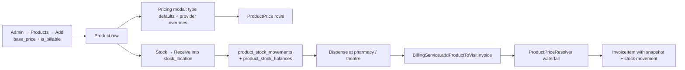
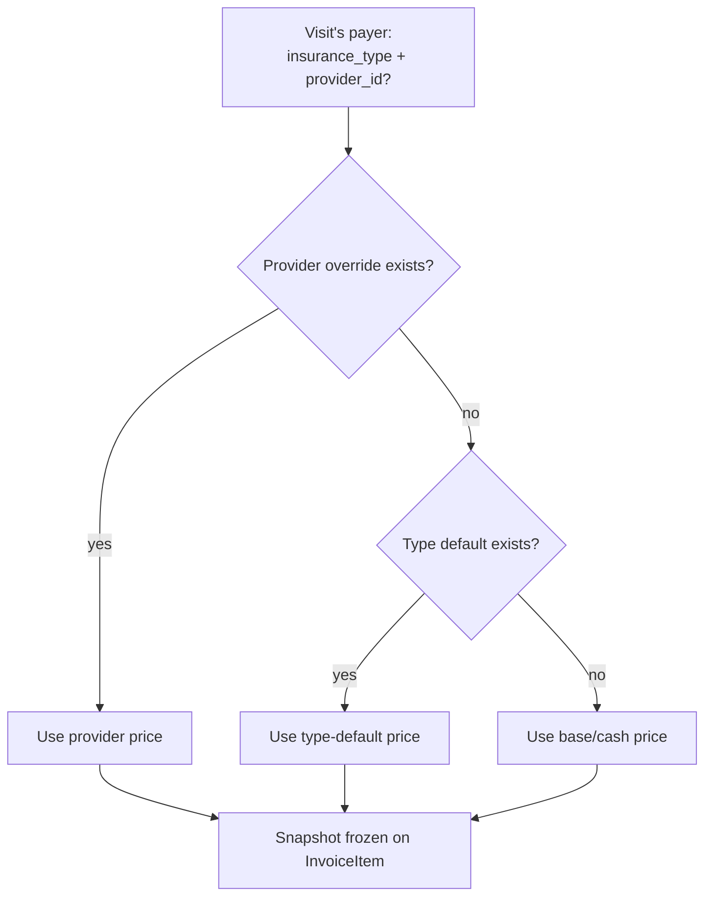

# UHMS — Products & Services Domain Analysis

> Scope: full architectural review of the **Service Catalogue** and **Product Catalogue** sub‑systems of UHMS, including data model, pricing engine, billing wiring, workflows, gaps, and prioritised improvements.
>
> Audience: engineering, product, clinical operations, and finance leads.

---

## 1. Executive Summary

Products and Services are the **financial heart of UHMS**. Every clinical encounter is monetised by emitting one or more `invoice_items`, and every `invoice_item` is sourced from either:

- a **`service_catalog`** entry (a clinical/administrative service: consultation, lab test, procedure, imaging, surgery, admission day…), **or**
- a **`product`** entry (a physical inventory item: drug, consumable, reagent, supply).

Together they form the **revenue catalogue** of the hospital. Without them:

- No invoice can be generated → no revenue capture.
- Insurance providers cannot be billed at negotiated rates.
- Pharmacy / dispensary cannot deplete stock against patient encounters.
- Theatre, lab, and imaging cannot bill procedures with their consumable bill of materials.
- Reporting (department revenue, payer mix, gross margins) collapses.

The two catalogues mirror each other on the **pricing axis** (the `*_prices` tables and resolution waterfall) but diverge on responsibilities — products additionally carry **stock**, **departments-served**, and **consumable‑of‑service** relationships.

---

## 2. Domain Overview

| Aspect | Services (`service_catalog`) | Products (`products`) |
|---|---|---|
| Nature | Intangible / labour offering | Physical inventory item |
| Primary table | `service_catalog` | `products` |
| Pricing table | `service_prices` | `product_prices` |
| Billable always? | Yes (no `is_billable` flag) | Optional (`is_billable` boolean) |
| Stock? | No | Yes — `product_stock_balances`, `product_stock_movements` |
| Dept linkage | `department_id` (1‑to‑1) + `specialties` (m2m) | `product_department` pivot (m2m) |
| Categories | `category` string + `category_options` JSON | `product_type` enum (drug, consumable, reagent, supply) |
| Created via | Admin → Services | Admin → Products |
| Invoice FK | `invoice_items.service_catalog_id` | `invoice_items.product_id` |
| Permission | `services.manage` (single) | `product.view`, `product.create`, `product.edit`, `product.pricing.manage`, `stock.*` (granular) |

Conceptually:

- **A Service is *sold***: e.g. *"GP Consultation – GH₵80"*.
- **A Product is *dispensed***: e.g. *"Amoxicillin 500 mg cap × 21"* — depletes stock AND generates an invoice line.
- **A Service can *consume* Products** via `service_consumables` (a procedure may include a default bill of materials of gauze, sutures, etc., automatically billed when the procedure is performed).

---

## 3. Module Inventory — Services

### 3.1 Database

| Table | Role |
|---|---|
| `service_catalog` | Master record. Columns: `name`, `code`, `category`, `price` (cash base), `department_id`, `department_type`, `is_active`. Legacy: `nhis_price`, `is_nhis_covered` (deprecated by `service_prices`). |
| `service_prices` | Insurance-aware pricing rows. UNIQUE (`service_catalog_id`, `insurance_type`, `insurance_provider_id`). Provider null ⇒ type default. |
| `service_consumables` | Default consumables: links `service_catalog → product` with `default_quantity`. Auto‑billed during procedure / consultation. |
| `service_catalog_specialty` (pivot) | Many-to-many to `specialties`. |

### 3.2 Models

| File | Purpose |
|---|---|
| [app/Models/ServiceCatalog.php](app/Models/ServiceCatalog.php) | Eloquent model. Method `getPriceForInsurance(?InsuranceType, ?int $providerId)` returns the best matching `ServicePrice` row or falls back to base `price`. `prices()` HasMany. `consumables()` HasMany. |
| [app/Models/ServicePrice.php](app/Models/ServicePrice.php) | Pivot-like row: `service_catalog_id`, `insurance_type`, `insurance_provider_id`, `price`, `is_active`. |
| [app/Models/ServiceConsumable.php](app/Models/ServiceConsumable.php) | `service_catalog_id` + `product_id` + `default_quantity` (decimal 8,4). |

### 3.3 Services (PHP layer)

| File | Purpose |
|---|---|
| [app/Services/ServicePriceResolver.php](app/Services/ServicePriceResolver.php) | Pure resolver. `resolveForVisit(ServiceCatalog, Visit)` and `resolveForInsurance(...)`. Returns `[price, source, price_row_id]`. |
| [app/Services/ServicePricingService.php](app/Services/ServicePricingService.php) | Thin orchestration wrapper. `resolvePriceForVisit()` returns full pricing snapshot (cash + insurance + label). |
| [app/Services/ServiceConsumableService.php](app/Services/ServiceConsumableService.php) | Maintains default consumables list. |
| [app/Services/BillingService.php](app/Services/BillingService.php) | Method `addItemToVisitInvoice(Visit, ServiceCatalog, ...)` creates the `InvoiceItem`, freezes the cash + insurance snapshots, and triggers any default-consumable lines. |

### 3.4 HTTP

| File | Endpoints |
|---|---|
| [app/Http/Controllers/Admin/ServiceCatalogController.php](app/Http/Controllers/Admin/ServiceCatalogController.php) | `index`, `store`, `update`, `toggle`, **`storePrices`** (bulk upsert of type defaults + provider overrides — single form), **`deletePrice`** (single trash button). |
| [routes/web.php](routes/web.php) | Prefix `admin/services` gated by `can:services.manage`. |

### 3.5 Views

| File | Purpose |
|---|---|
| [resources/views/admin/services/index.blade.php](resources/views/admin/services/index.blade.php) | Master list + `pricesModal-{id}` per row: single modal, single form, two sections (compact 4‑col type grid + dynamic provider rows). **Reference UI** that products now mirror. |

### 3.6 Permissions

- `services.manage` — single coarse permission (read + write + price management). Held by Admin, Super Admin, and Hospital Administrator.

---

## 4. Module Inventory — Products

### 4.1 Database

| Table | Role |
|---|---|
| `products` | Master record. Columns: `name`, `code`, `product_type` enum, `unit`, `reorder_level`, `default_cost`, **`base_price`**, **`is_billable`**, `is_active`. |
| `product_prices` | Insurance-aware pricing rows. UNIQUE (`product_id`, `insurance_type`, `insurance_provider_id`). Mirrors `service_prices`. |
| `product_department` (pivot) | Many-to-many to `departments` with `is_active`. |
| `stock_locations` | Storeroom definitions (Main Store + department stores). |
| `product_stock_balances` | Per (`product_id`, `stock_location_id`) on-hand qty. |
| `product_stock_movements` | Ledger: receive, transfer, adjust, dispense, return. Immutable, append-only. |

### 4.2 Models

| File | Purpose |
|---|---|
| [app/Models/Product.php](app/Models/Product.php) | `prices()`, `departments()`, `stockBalances()`, `stockMovements()`, `consumableOf()`. Scopes: `billable()`, `forDepartment()`. |
| [app/Models/ProductPrice.php](app/Models/ProductPrice.php) | Identical shape to `ServicePrice`. |
| [app/Models/ProductStockBalance.php](app/Models/ProductStockBalance.php) | On-hand qty per location. |
| [app/Models/ProductStockMovement.php](app/Models/ProductStockMovement.php) | Movement ledger. |
| [app/Models/StockLocation.php](app/Models/StockLocation.php) | Storeroom. |

### 4.3 Services

| File | Purpose |
|---|---|
| [app/Services/ProductService.php](app/Services/ProductService.php) | CRUD façade. Handles `base_price` + `is_billable` + department sync. |
| [app/Services/ProductPriceResolver.php](app/Services/ProductPriceResolver.php) | Mirrors `ServicePriceResolver`. Same waterfall. |
| [app/Services/ProductPricingService.php](app/Services/ProductPricingService.php) | Returns full pricing snapshot with `pricing_source_label`. |
| [app/Services/ProductStockService.php](app/Services/ProductStockService.php) | `receive`, `transfer`, `adjust`, `dispenseFor`, `returnFrom`. Writes both `product_stock_movements` AND updates `product_stock_balances` atomically. |
| [app/Services/BillingService.php](app/Services/BillingService.php) | Method `addProductToVisitInvoice(Visit, Product, qty, …)` mirrors `addItemToVisitInvoice` for services. Guards `is_billable`, freezes pricing snapshot, sets `product_id` (and `service_catalog_id = null`). |

### 4.4 HTTP

| File | Endpoints |
|---|---|
| [app/Http/Controllers/Admin/ProductController.php](app/Http/Controllers/Admin/ProductController.php) | `index`, `show`, `store`, `update`, `toggle`, `forDepartment` (AJAX). |
| [app/Http/Controllers/Admin/ProductPricingController.php](app/Http/Controllers/Admin/ProductPricingController.php) | `updateBasePrice`, **`storePrices`** (NEW — bulk), **`deletePrice`** (NEW — single), legacy granular endpoints retained for backward compatibility. |
| [app/Http/Controllers/Admin/ProductStockController.php](app/Http/Controllers/Admin/ProductStockController.php) | `balances`, `ledger`, `receiveForm`/`receive`, `transferForm`/`transfer`, `adjustForm`/`adjust`. |
| [app/Http/Controllers/Admin/StockLocationController.php](app/Http/Controllers/Admin/StockLocationController.php) | CRUD for storerooms. |
| [routes/web.php](routes/web.php) | Prefix `admin/products`, `admin/stock-locations`, `admin/product-stock`. Granular `can:` middleware per action. |

### 4.5 Views

| File | Purpose |
|---|---|
| [resources/views/admin/products/index.blade.php](resources/views/admin/products/index.blade.php) | Master list. **Now includes** `productPricesModal-{id}` per row, button-triggered, services-style. |
| [resources/views/admin/products/_prices_modal.blade.php](resources/views/admin/products/_prices_modal.blade.php) | **NEW** — services-parity modal partial: base-price + billable toggle, compact 4-col type grid, dynamic provider rows, single form POST. |
| [resources/views/admin/products/_edit_modal.blade.php](resources/views/admin/products/_edit_modal.blade.php) | Per-row edit form. |
| [resources/views/admin/products/_form_fields.blade.php](resources/views/admin/products/_form_fields.blade.php) | Shared add/edit fields; carries `base_price` + `is_billable`. |
| [resources/views/admin/products/show.blade.php](resources/views/admin/products/show.blade.php) | Tabbed page (Details / Stock / **Pricing**). Pricing tab is now **identical in design** to the services modal — compact 4-col grid + dynamic provider rows, single form save. |

### 4.6 Permissions

| Permission | Held by |
|---|---|
| `product.view` | All clinical/store roles |
| `product.create`, `product.edit` | Store Keeper, Pharmacy Manager, Admin |
| `product.pricing.manage` | Store Keeper, Admin, Super Admin |
| `stock.view`, `stock.adjust`, `stock_location.manage` | Store roles |

---

## 5. Cross‑Cutting Concerns

### 5.1 `invoice_items` — the joining seam

```
invoice_items
├── service_catalog_id  (nullable)  ─── service-based line
├── product_id          (nullable)  ─── product-based line
├── source              (string)    ─── consultation_service | investigation_service |
│                                      procedure_service | pharmacy_product | ward_consumable
├── description, qty, unit_price
├── cash_price          (frozen snapshot)
├── insurance_price     (frozen snapshot)
├── insurance_covered   (informational only — does NOT reduce patient_payable)
├── selected_price      (the one used)
├── pricing_source_label
└── patient_payable     = selected_price * qty - discount
```

**Invariant:** exactly one of `service_catalog_id` / `product_id` is non-null per row.

### 5.2 Pricing resolution waterfall (identical for both)

```
provider-specific price (product/service + insurance_type + provider_id)
        └─ if none → insurance-type default (product/service + insurance_type, provider_id IS NULL)
                └─ if none → base/cash price (products.base_price | service_catalog.price)
                        └─ if products.is_billable = false → not billed at all
```

### 5.3 Service → Product bridge

`service_consumables` lets a `service_catalog` row declare a **bill of materials**.
When `BillingService::addItemToVisitInvoice(service)` runs:
1. The service's own line is created.
2. Each `ServiceConsumable` triggers `addProductToVisitInvoice(product, default_quantity)`.
3. Stock is deducted (when the dispense workflow runs).

This is how *"Wound dressing"* automatically pulls *gauze*, *gloves*, *suture*, etc.

---

## 6. Workflows

### 6.1 Service creation → billing

```mermaid
flowchart LR
  A[Admin → Services → Add] --> B[ServiceCatalog row created]
  B --> C[Pricing modal: type defaults + provider overrides]
  C --> D[ServicePrice rows upserted]
  D --> E[Encounter occurs (visit)]
  E --> F[BillingService.addItemToVisitInvoice]
  F --> G[ServicePriceResolver waterfall]
  G --> H[InvoiceItem written with snapshot]
  H --> I[Default consumables → addProductToVisitInvoice]
```

### 6.2 Product creation → stock → billing



### 6.3 Insurance pricing waterfall



---

## 7. Gaps Analysis

| # | Gap | Severity | Notes |
|---|---|---|---|
| G1 | ~~Product pricing UI inconsistent with services (separate forms, collapsible cards, no compact grid)~~ | ~~High~~ | **Fixed in this iteration** — `_prices_modal.blade.php` + redesigned Pricing tab now mirror services 1:1. |
| G2 | Legacy `service_catalog.nhis_price` and `is_nhis_covered` columns persist | Medium | `service_prices` makes them obsolete. Plan a migration to deprecate + drop. |
| G3 | No **audit log** for price changes | High | Finance teams need *who changed what when*. Spatie `activitylog` is already a dependency — add `LogsActivity` trait to `ServicePrice` + `ProductPrice`. |
| G4 | No **effective_from / effective_until** on prices | Medium | A negotiated rate change cannot be back-dated/future-dated. Currently the UI overwrites in place. |
| G5 | No **price-change approval workflow** | Medium | Anyone with `product.pricing.manage` can change prices instantly. Consider a draft → approve pattern for high-impact rates. |
| G6 | Services have **no `is_billable` flag** (always billed) | Low | Most services are inherently billable, but some admin services (e.g. *registration-only*) might not be. Mirror products' flag. |
| G7 | `service_catalog.price` is **NOT NULL**; `products.base_price` IS nullable | Low | Inconsistency. Decide on a uniform contract. |
| G8 | `service_consumables.default_quantity` is **decimal(10,4)** but `invoice_items.qty` is integer | High | Fractional dispense quantities (e.g. 0.5 vial) cannot flow into the invoice. Either round at billing time or change `qty` to decimal. |
| G9 | No **bulk import** (CSV/Excel) for either products or services | Medium | maatwebsite/excel is already in `composer.json` — add an importer. |
| G10 | No **version history** of price changes | Medium | Related to G3+G4 but stronger: a full snapshot table (`product_price_versions`). |
| G11 | Permission models are **asymmetric** (`services.manage` is coarse; products are granular) | Low | Either split services into `service.view / .edit / .pricing.manage` or keep both coarse — pick one. |
| G12 | Products pricing modal lacks **AJAX search** when there are many providers (>50) | Low | Current `<select>` becomes unwieldy. Consider Tom-Select / Choices.js. |
| G13 | No **product expiry / batch tracking** | High | Pharmacy needs LOT/expiry to dispense FEFO (first-expiry-first-out). Currently `product_stock_balances` is a flat qty. |
| G14 | No **cost-of-goods-sold (COGS)** snapshot on `invoice_items.product_id` lines | High | `default_cost` exists but is not frozen on dispense → margin reporting is approximate. |
| G15 | `ServiceCatalog.code` and `Product.code` not enforced unique | Low | Risk of duplicate codes from imports. |
| G16 | **No SKU / barcode** support on products | Medium | Required for any future barcode scanner integration. |
| G17 | No **reorder alert** job (`reorder_level` is recorded but nothing notifies when crossed) | Medium | Add a scheduled command + listener. |
| G18 | No **multi-currency** support (all prices implicitly GH₵) | Low | Acceptable for now; document the assumption. |
| G19 | `productPricesModal` is **rendered for every product** on the index page → DOM bloat for large catalogues | Low | Lazy-render via AJAX or use one shared modal that fetches on open. |
| G20 | Insurance providers list **not filtered by type** in the override row | Medium | A user can pick `type=NHIA` + a `PRIVATE` provider. The save will succeed but the data is semantically wrong. Add a JS-side filter. |

---

## 8. Improvement Recommendations (Prioritised)

### Tier 1 — Must (financial integrity)
1. **Audit log** on `ServicePrice` and `ProductPrice` (G3) — minimal effort, huge governance win.
2. **Freeze COGS** on `invoice_items` when a product line is created (G14) — make margin reports exact.
3. **Decimal qty** in `invoice_items` or rounding policy at dispense (G8).
4. **Batch / expiry tracking** for products (G13) — split `product_stock_balances` into `product_stock_batches` keyed by lot + expiry.

### Tier 2 — Should (UX + governance)
5. **Effective-dated prices** (G4) — adds `effective_from`, `effective_until` to both `*_prices` tables; resolver picks the row valid on the visit date.
6. **Bulk import** for both catalogues (G9).
7. **Reorder-level alerts** (G17).
8. **Filter providers by insurance type** in override UI (G20).

### Tier 3 — Nice
9. Drop legacy `nhis_price` / `is_nhis_covered` after data migration (G2).
10. Symmetric permissions (G11).
11. SKU / barcode support (G16).
12. Lazy-load modals on the products index page (G19).

---

## 9. File Reference Table

> Workspace root: `c:\xampp\htdocs\laravel\laravel`

### 9.1 Database

| Path | Role |
|---|---|
| [database/migrations/2026_05_18_000001_add_pricing_to_products.php](database/migrations/2026_05_18_000001_add_pricing_to_products.php) | Adds `base_price`, `is_billable` to `products`. |
| [database/migrations/2026_05_18_000002_create_product_prices_table.php](database/migrations/2026_05_18_000002_create_product_prices_table.php) | Creates `product_prices`. |
| [database/migrations/2026_05_18_000003_add_product_id_to_invoice_items.php](database/migrations/2026_05_18_000003_add_product_id_to_invoice_items.php) | Adds `invoice_items.product_id`. |
| [database/seeders/RoleSeeder.php](database/seeders/RoleSeeder.php) | Adds `product.pricing.manage` permission. |

### 9.2 Models

| Services | Products |
|---|---|
| [app/Models/ServiceCatalog.php](app/Models/ServiceCatalog.php) | [app/Models/Product.php](app/Models/Product.php) |
| [app/Models/ServicePrice.php](app/Models/ServicePrice.php) | [app/Models/ProductPrice.php](app/Models/ProductPrice.php) |
| [app/Models/ServiceConsumable.php](app/Models/ServiceConsumable.php) | [app/Models/ProductStockBalance.php](app/Models/ProductStockBalance.php) |
| | [app/Models/ProductStockMovement.php](app/Models/ProductStockMovement.php) |
| | [app/Models/StockLocation.php](app/Models/StockLocation.php) |
| [app/Models/InvoiceItem.php](app/Models/InvoiceItem.php) — dual FK | |

### 9.3 Service classes

| Services | Products |
|---|---|
| [app/Services/ServicePriceResolver.php](app/Services/ServicePriceResolver.php) | [app/Services/ProductPriceResolver.php](app/Services/ProductPriceResolver.php) |
| [app/Services/ServicePricingService.php](app/Services/ServicePricingService.php) | [app/Services/ProductPricingService.php](app/Services/ProductPricingService.php) |
| [app/Services/ServiceConsumableService.php](app/Services/ServiceConsumableService.php) | [app/Services/ProductService.php](app/Services/ProductService.php) |
| | [app/Services/ProductStockService.php](app/Services/ProductStockService.php) |
| [app/Services/BillingService.php](app/Services/BillingService.php) — `addItemToVisitInvoice` + `addProductToVisitInvoice` | |

### 9.4 Controllers

| Services | Products |
|---|---|
| [app/Http/Controllers/Admin/ServiceCatalogController.php](app/Http/Controllers/Admin/ServiceCatalogController.php) | [app/Http/Controllers/Admin/ProductController.php](app/Http/Controllers/Admin/ProductController.php) |
| | [app/Http/Controllers/Admin/ProductPricingController.php](app/Http/Controllers/Admin/ProductPricingController.php) |
| | [app/Http/Controllers/Admin/ProductStockController.php](app/Http/Controllers/Admin/ProductStockController.php) |
| | [app/Http/Controllers/Admin/StockLocationController.php](app/Http/Controllers/Admin/StockLocationController.php) |

### 9.5 Views

| Services | Products |
|---|---|
| [resources/views/admin/services/index.blade.php](resources/views/admin/services/index.blade.php) | [resources/views/admin/products/index.blade.php](resources/views/admin/products/index.blade.php) |
| | [resources/views/admin/products/show.blade.php](resources/views/admin/products/show.blade.php) |
| | [resources/views/admin/products/_prices_modal.blade.php](resources/views/admin/products/_prices_modal.blade.php) |
| | [resources/views/admin/products/_edit_modal.blade.php](resources/views/admin/products/_edit_modal.blade.php) |
| | [resources/views/admin/products/_form_fields.blade.php](resources/views/admin/products/_form_fields.blade.php) |

### 9.6 Enums

| Path | Role |
|---|---|
| [app/Enums/InsuranceType.php](app/Enums/InsuranceType.php) | SELF / NHIA / PRIVATE / CORPORATE with `label()` + `color()`. |
| [app/Enums/ProductType.php](app/Enums/ProductType.php) | drug / consumable / reagent / supply / equipment. |

### 9.7 Routes

| Group | Path |
|---|---|
| Services | [routes/web.php](routes/web.php) — `admin/services/*` (gated `can:services.manage`) |
| Products | [routes/web.php](routes/web.php) — `admin/products/*`, `admin/stock-locations/*`, `admin/product-stock/*` (granular `can:product.*` + `can:stock.*`) |

---

## 10. UI Parity Note (this iteration)

Before this change, the **product pricing UI** used:
- Two separate **collapsible cards** (Type / Provider) each with its own table and per-row inline-edit forms.
- Three separate POST endpoints (`type.store`, `provider.store`, `base.update`) requiring three round-trips.

After this change, the product pricing UI is **visually and behaviourally identical to the services modal**:
- A single modal (`#productPricesModal-{id}`) on the index page **or** a single page section on `show.blade.php`.
- One **compact 4-column grid** for type defaults (one column per `InsuranceType` case, with a coloured badge and a price input).
- One **dynamic-row block** for provider overrides with an *Add Provider Override* button.
- **One** POST to `admin.products.pricing.store` upserts everything in one transaction.
- Existing granular endpoints are kept for backward compatibility and any external integrations.

The resolver, snapshot freezing, billing wiring, and permissions are unchanged — only the UI surface and the bulk-upsert endpoint are new.

---

*Document generated as part of the UHMS Product Pricing harmonisation effort.*
