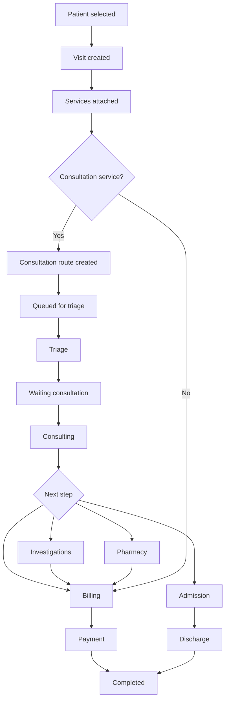
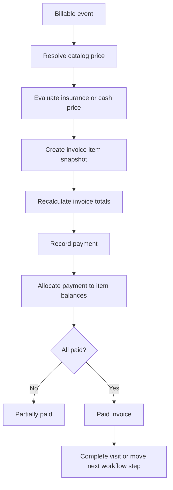

# UHMS Full Project Analysis

Date: 2026-05-24  
Project path: `C:\xampp\htdocs\laravel\laravel`  
Scope: architecture, workflows, gaps, shortcomings, improvement plan, and live design review.

## 1. Executive Summary

UHMS is a large Laravel 12 healthcare management system with broad functional coverage: patients, visits, triage, consultations, billing, payments, insurance and NHIS claims, lab and analyzer integrations, pharmacy, inventory, admissions, HR, payroll, reports, notifications, audit logs, and module-based navigation.

The project is materially more advanced than a prototype. It has a real domain model, many service classes, status enums, permission gates, seeders, a design-system CSS layer, audit logging, queues of clinical work, and a hybrid Laravel Blade/Inertia bridge that allows legacy pages to behave like an SPA.

The main weakness is not feature quantity. The main weakness is consistency. Some workflows have been modernized into services and enums, while other screens still bypass those services, duplicate state, or rely on legacy fields. The UI also carries template residue and JavaScript dependency problems that can produce blank or partially broken Inertia-wrapped pages.

Overall verdict:

- Product depth: high.
- Technical consistency: medium.
- Test health: weak at the moment.
- UI maturity: mixed; strong operational tables, weak dashboard density and legacy asset reliability.
- Immediate production readiness: not yet, mostly because of test failures, JavaScript runtime errors, direct exception leaks, and module enforcement gaps.

## 2. Evidence Snapshot

The analysis was based on code inspection, framework inventory, build/test runs, and Browser plugin review of the live application.

Observed stack:

- Backend: Laravel 12.56.0, PHP 8.2.
- Frontend: Blade plus Vue 3/Inertia bridge, Vite 6, PWA build tooling.
- Database: MySQL in the configured local environment; tests use SQLite.
- Major packages: Spatie Permission, Spatie Activitylog, DomPDF, Laravel Excel, Inertia Laravel, Breeze.

Approximate project scale:

- 458 registered routes.
- 106 Eloquent models.
- 70 controllers.
- 66 service classes.
- 160 migrations.
- 476 Blade views.
- 28 PHP test files.
- 22 seeders.
- `routes/web.php` is about 865 lines.

Build and test results:

- `npm run build` completed successfully.
- Vite emitted a warning that `../img/bg/card-bg-02.png` did not resolve at build time.
- `php artisan test` completed with 132 passing tests and 40 failing tests.
- `vendor/bin/pint --test` was attempted but did not complete within the timeout used during analysis.

Browser review:

- Login page loaded and allowed admin login with seeded credentials.
- Admin dashboard and patient list were reviewed at `http://127.0.0.1:8000`.
- Runtime browser console showed JavaScript dependency errors around jQuery, DataTables, Chart, Select2, daterangepicker, and datetimepicker.
- A blank-white post-login state was observed before reload, consistent with a loading or legacy-script race in the Inertia app shell.

## 3. Current Architecture

### 3.1 Backend Structure

The backend follows a conventional Laravel application layout, but the domain surface is large. Important areas include:

- `app/Models`: domain entities such as patients, visits, invoices, invoice items, claims, lab requests, pharmacy inventory, admissions, staff, and modules.
- `app/Services`: business logic for visits, billing, payments, insurance, queues, claims, reports, modules, appointments, investigation requests, admissions, pharmacy, inventory, and more.
- `app/Http/Controllers`: admin, doctor, lab, pharmacy, theatre, billing, auth, and staff-facing controllers.
- `app/Enums`: important workflow enums such as visit, appointment, procedure, stock transfer, and stock requisition statuses.
- `resources/views`: the bulk of the UI remains Blade-based.
- `resources/js`: Inertia/Vue entry points and the legacy Blade wrapper.

This is the right broad shape for a hospital system. The issue is that some modules are service-oriented while others still contain workflow logic directly in controllers or views.

### 3.2 Hybrid Blade/Inertia Shell

The project uses a bridge middleware:

- `app/Http/Middleware/ConvertBladeViewsToInertia.php`
- `resources/js/Pages/Legacy/BladePage.vue`
- `resources/js/inertia.js`

The bridge wraps Blade HTML into an Inertia page and then re-injects legacy HTML, styles, and scripts. This is a practical migration strategy, because it lets old Blade pages remain functional while selected pages move to Inertia.

Strengths:

- It avoids a full rewrite.
- It centralizes link and form interception.
- It supports legacy scripts that are still needed by existing pages.
- It makes gradual Vue/Inertia migration possible.

Shortcomings:

- It is fragile when legacy scripts assume global jQuery or plugin load order.
- It ships large Blade HTML strings through Inertia.
- Inline scripts can run more than once or run before dependencies are ready.
- The Inertia app shell and classic Blade layout do not load exactly the same CSS stack.
- A blank loading state can occur if the app shell keeps `html.uhms-loading` active while legacy content fails to mount cleanly.

### 3.3 Layout and Asset Split

The classic layout loads the shared design-system CSS:

- `resources/views/layouts/app.blade.php`
- `resources/views/layout/partials/head-css.blade.php`

The Inertia root layout:

- `resources/views/app.blade.php`

does not appear to load `build/css/uhms-design-system.css` in the same way. This matters because legacy Blade pages inside Inertia should inherit the same visual baseline as classic Blade pages.

The project also globally loads many template plugins. That is convenient, but it creates reliability and performance risk:

- DataTables.
- Select2.
- Chart.
- daterangepicker.
- datetimepicker.
- ApexCharts and other dashboard assets.
- template-specific scripts.

The browser console confirms these are not always available in the order expected by page scripts.

## 4. Major Strengths

### 4.1 Strong Functional Coverage

The app covers many real hospital workflows, not just simple CRUD. The breadth includes:

- Patient registration and patient records.
- Visit scheduling and check-in.
- Triage and consultation queues.
- Multi-department consultation routing.
- Billing, invoicing, discounts, payment allocation, and receipts.
- Insurance eligibility and claims.
- Lab requests and analyzer integration.
- Pharmacy dispensing and stock workflows.
- Admissions and ward management.
- HR and payroll.
- Reporting.
- Notifications and audit logging.
- Feature/module visibility through a module registry.

That breadth is a major asset. Many systems never get past patient CRUD plus billing.

### 4.2 Meaningful Service Layer

Several workflows are placed in service classes instead of being scattered entirely across controllers. Good examples include:

- `VisitWorkflowService`
- `VisitService`
- `BillingService`
- `PaymentService`
- `InsuranceService`
- `QueueService`
- `ModuleService`
- `ReportService`
- `InvestigationRequestService`

This gives the project a path toward cleaner domain boundaries.

### 4.3 Visit Workflow Is Becoming Explicit

`VisitWorkflowService` defines clear transitions such as:

- initialize visit.
- queue for triage.
- confirm.
- check in.
- mark rescheduled.
- mark no-show.
- cancel.
- move to billing.
- complete after payment.
- start consultation.

The `VisitStatus` enum also documents a broad clinical path from scheduling through triage, consultation, investigation, pharmacy, billing, admission, discharge, completion, cancellation, and emergency handling.

This is the right direction for a hospital workflow engine.

### 4.4 Billing Has a Canonical Line-Item Path

`BillingService::addItemToVisitInvoice()` records invoice items with pricing snapshots and supports insurance-related fields. This is much stronger than computing billable services only at display time.

Payment allocation also has a mature concept: payments are distributed to outstanding invoice items, not just applied as a loose invoice-level total.

### 4.5 Existing Design Rules

`docs/UHMS_DESIGN_RULES.md` is useful and practical. It already defines several good principles:

- 8px cards.
- consistent page headers.
- restrained button use.
- table headers.
- billing/accounting separation.
- open cashier shift workflow.
- dense calendar and queue surfaces.
- shared CSS rules for old and new pages.

This document should become the design source of truth, but the current UI does not yet consistently meet it.

## 5. Critical Gaps and Shortcomings

### 5.1 Test Suite Is Not Healthy

The current test result is the clearest project health signal:

- 132 tests passed.
- 40 tests failed.

Major failure areas:

- Billing service tests.
- Billing feature tests.
- Visit service tests.
- Visit management tests.
- Workflow JSON response tests.
- HR workflow tests.
- NHIS claim workflow tests.
- Report tests.
- User management tests.
- Consultation department filter tests.

The failures are not one isolated bug. They indicate that test expectations, fixtures, and current workflow behavior have drifted apart.

Important examples:

- `BillingService::createInvoice()` has a legacy path that creates invoice items without setting `unit_price`, while the schema still requires it.
- `PaymentService` requires outstanding invoice items before accepting a payment, so tests that create only an invoice header fail.
- Patient service tests expect patient numbers beginning with `PT`, but current patient numbering uses a UHMS-style pattern.
- Workflow JSON tests expect routes and responses that no longer line up with current controller behavior.

Recommendation:

Treat test repair as a first-class stabilization sprint, not a cleanup task.

### 5.2 JavaScript Asset Reliability Is a Production Risk

Browser console errors included:

- `jQuery is not defined`
- `$ is not defined`
- `Chart is not defined`
- DataTables errors.
- daterangepicker errors.
- datetimepicker requiring jQuery first.

This is especially serious because many Blade pages depend on these globals. The Inertia bridge can only work reliably if script loading order is deterministic.

Likely causes:

- Legacy page scripts execute before required globals are available.
- Some scripts are loaded in the classic layout but not consistently available in the Inertia layout.
- Plugin bundles are loaded globally but still race with dynamically injected page scripts.
- Inline scripts are not idempotent after Inertia navigation.

Impact:

- Blank or partially broken pages.
- Broken filters, tables, charts, date pickers, and select fields.
- Poor operator trust because screens may work after reload but fail after navigation.

### 5.3 Module System Mostly Hides, It Does Not Enforce

The project has:

- `ModuleService`
- `EnsureModuleEnabled`
- `ModuleSeeder`
- sidebar module metadata

But route-level enforcement appears incomplete. Sidebar items are hidden when a module is disabled, but direct URLs are likely still reachable for many modules because the middleware is not broadly applied to route groups.

There is also a fail-open behavior in `ModuleService::enabled()` for unknown slugs. That can be useful during development, but it is risky as the module system matures.

Recommendation:

- Apply `module:<slug>` middleware to feature route groups.
- Decide whether unknown slugs should fail closed in production.
- Add tests proving disabled modules return 404 or 503 for direct URLs.
- Keep menu hiding as a convenience, not the security boundary.

### 5.4 Some Controllers Still Bypass Workflow Services

`VisitWorkflowService` is a good central workflow service, but not every controller uses it consistently.

Example:

- `TriageController` updates visit status from waiting to triage directly rather than routing all transitions through `VisitWorkflowService`.

Impact:

- Status logs can drift.
- Rules can differ by entry point.
- New status transitions become harder to audit.
- Tests need to cover more behavioral paths.

Recommendation:

Make `VisitWorkflowService` the only normal path for visit state transitions, then treat direct status updates as exceptions that need comments and tests.

### 5.5 Billing Has Two Active Paths

The canonical path is strong:

- visit service attached.
- invoice created or reused.
- invoice item created with pricing snapshot.
- payment allocated to outstanding item balances.

But the legacy `createInvoice()` path still exists and is failing tests because it does not fully align with current schema and item requirements.

Recommendation:

- Either modernize `createInvoice()` to use the same item creation helper as `addItemToVisitInvoice()`, or reduce it to a thin compatibility wrapper.
- Add tests for invoice creation with cash, insurance, discount, and manual line-item cases.
- Make sure `unit_price`, `cash_price`, `selected_price`, `total_price`, and coverage fields are populated consistently.

### 5.6 Documentation Has Drifted

There are many useful docs, but several are stale or contradictory.

Examples:

- Root `PROJECT_ANALYSIS.md` describes a Vue/TypeScript/Pinia/Django REST architecture, which does not match this Laravel project.
- `docs/INERTIA_FULL_RELOAD_ANALYSIS.md` says forms are default-off in the Inertia bridge, but current `BladePage.vue` intercepts forms by default unless opted out.
- `docs/UHMS_MANUAL_ALIGNMENT_REPORT.md` says `VisitService::attachServices()` no longer writes to `visit_services`, but current code still creates or updates `VisitServiceItem` rows.
- `docs/UHMS_Full_Project_Analysis_Report.md` is broadly useful but stale in areas where services have since been added or changed.

Impact:

- New developers will trust the wrong source.
- Future fixes may repeat old assumptions.
- Product and technical decisions become harder to trace.

Recommendation:

- Mark stale docs as archived or superseded.
- Keep one current architecture document.
- Keep one current workflow document.
- Keep one current design document.
- Add a short "last verified" section to each living document.

### 5.7 Route File Is Too Large

`routes/web.php` is about 865 lines. For a system with this many modules, that creates friction.

Problems:

- Harder to see module boundaries.
- Harder to apply middleware consistently.
- Harder to review route changes.
- Higher chance of duplicate naming or access-control drift.

Recommendation:

Split routes by module:

- `routes/admin/patients.php`
- `routes/admin/visits.php`
- `routes/admin/billing.php`
- `routes/admin/pharmacy.php`
- `routes/admin/lab.php`
- `routes/admin/reports.php`
- `routes/admin/hr.php`
- `routes/admin/settings.php`

Then load them from a small central admin route file.

### 5.8 Inline Validation Is Still Common

The project has many Form Request classes, but controller-level `$request->validate()` calls remain common.

This is not automatically wrong, but in a large healthcare system it becomes inconsistent:

- Authorization logic can be missed.
- Validation messages drift.
- Reuse becomes harder.
- Tests become more repetitive.

Recommendation:

Use Form Requests for high-risk workflows:

- patient creation and updates.
- visit creation and transitions.
- triage submission.
- consultation updates.
- invoice creation.
- payment recording.
- claim creation and review.
- user management.

### 5.9 Some Status Values and Labels Are Inconsistent

Examples:

- `StaffDashboardController` counts `in_consultation`, but the current visit enum uses `consulting`.
- `VisitStatus::COMPLETED` label is `Complet Consultation`, which appears to be a typo.

These are small individually, but they reduce trust in dashboard numbers and workflow labels.

Recommendation:

- Replace raw status strings with enum values.
- Add static analysis or tests for dashboard stats.
- Fix user-facing labels.

### 5.10 Security Hardening Is Incomplete

Existing security headers are a good start:

- nosniff.
- same-origin frame options.
- referrer policy.
- permissions policy.
- HSTS for secure requests.

Gaps:

- No clear Content Security Policy.
- Some controller exception paths expose raw exception messages.
- Module disabling may not block direct URL access.
- Production configuration must ensure `APP_DEBUG=false`.
- Healthcare data requires strong audit, retention, backup, and access review practices.

Specific concern:

- `Admin\VisitController` returns a `debug` exception message in JSON on failure and flashes raw exception text on redirect. That should not reach production users.

Recommendation:

- Log detailed exceptions server-side.
- Return generic user-safe errors.
- Add CSP in report-only mode first, then enforce.
- Add security tests around disabled modules and unauthorized access.

## 6. Workflow Analysis

### 6.1 Patient Registration Workflow

Current flow:

1. User creates a patient.
2. Patient number is generated by configured pattern.
3. Patient record becomes available to visits, billing, reports, insurance, and admissions.

Strengths:

- Dedicated patient number generator exists.
- Patient model is central and reused broadly.
- Patient list supports filters and visible patient status.

Gaps:

- Patient numbering expectations are inconsistent between tests and current config.
- Existing data appears to contain multiple historical number formats.
- Some UI columns wrap poorly when numbers are long.

Improvements:

- Decide the official patient number format.
- Add migration-safe handling for historical formats.
- Update tests and docs to match the current format.
- Add uniqueness and display tests for long IDs.

### 6.2 Visit Creation and Routing Workflow

Current intended flow:

Strengths:

- `VisitWorkflowService` exists and models key status transitions.
- `VisitService::attachServices()` creates invoice items and consultation routes.
- Queue service integration exists.
- Visit status enum contains most states needed by a hospital.

Gaps:

- Controllers still perform some transitions directly.
- `visit_services` is still populated while invoice items are described as authoritative.
- Visit workflow tests are failing, suggesting behavior and expectations are not aligned.
- Some statuses are raw strings in controllers/dashboards.

Improvements:

- Centralize transitions through `VisitWorkflowService`.
- Define whether `visit_services` is a live assignment table, audit table, or legacy fallback.
- Rename or document `VisitServiceItem` as an assignment snapshot if it remains active.
- Add a workflow test matrix for each allowed transition.

### 6.3 Triage Workflow

Current flow:

1. Visit enters waiting or triage state.
2. Triage screen opens.
3. Vitals and notes are recorded.
4. Visit moves to waiting consultation, emergency, inpatient, or another configured next state.

Strengths:

- Triage has its own controller and service handoff.
- Visit status enum supports triage and emergency scenarios.
- Queue handling exists.

Gaps:

- Triage controller directly updates visit status in at least one path.
- Validation appears inline.
- Workflow tests are failing around visit management.

Improvements:

- Move status update into `VisitWorkflowService`.
- Add `StoreTriageRequest`.
- Add tests for normal, emergency, inpatient, and blocked transitions.

### 6.4 Consultation Workflow

Strengths:

- Multi-route consultation concepts exist.
- Consultation departments and routes are modeled.
- Doctor dashboards use several enum-backed status filters.

Gaps:

- `ConsultationDepartmentFilterTest` is failing.
- Some dashboard assignment logic may not fully reflect multi-route consultation state.
- Legacy views are large and script-heavy.

Improvements:

- Make consultation route status the source for department-specific queues.
- Keep visit status as the patient-level macro state.
- Add tests for multi-department referral and route completion.
- Consider converting the consultation workbench to a true Inertia page.

### 6.5 Billing and Payment Workflow

Current intended flow:

Strengths:

- Invoice item snapshots are the right model.
- Payment allocation is more reliable than loose payment totals.
- Discounts are permission-aware.
- Receipt and print views exist.

Gaps:

- Legacy invoice creation path is not aligned with schema.
- Payment tests create invoices without payable items.
- Some workflow tests expect old route behavior.
- Billing and accounting boundaries need continued tightening.

Improvements:

- Normalize all invoice item creation through one helper.
- Make invoice header-only payment impossible by design or explicitly supported with a migration.
- Add factories for invoice plus items.
- Add clear statuses for unpaid, partially paid, paid, refunded, voided, and written off.

### 6.6 Insurance and Claims Workflow

Strengths:

- Insurance service and claim service exist.
- Coverage fields and claim line items are modeled.
- NHIS workflow has dedicated feature tests.

Gaps:

- NHIS claim workflow tests are failing.
- Coverage and claim behavior may be split across visit service, billing service, and claim service.
- Documentation around insurance lifecycle should be made current.

Improvements:

- Define one canonical insurance eligibility check.
- Define one canonical claim generation path from invoice items.
- Add tests for cash patient, insured patient, expired insurance, partial coverage, and claim rejection.

### 6.7 Lab and Investigation Workflow

Strengths:

- Lab request models and analyzer integration exist.
- Investigation request service can add billable items.
- Lab dashboard routes and views exist.

Gaps:

- Naming across lab, investigation, analyzer, and billing should be checked for consistency.
- JavaScript asset failures can break filters and tables used by lab workflows.

Improvements:

- Make accepted lab requests produce invoice items through the canonical billing helper.
- Add tests for order, sample collection, result entry, result verification, and billing.
- Convert high-use lab queues to true Inertia pages or make legacy scripts idempotent.

### 6.8 Pharmacy and Inventory Workflow

Strengths:

- Pharmacy, inventory, procurement, stock transfer, and stock requisition services exist.
- Low-stock and expired-stock dashboard widgets exist.
- Procedure and theatre workflows are modeled with enums and services.

Gaps:

- Dashboard visual density makes pharmacy warnings less scannable.
- Billing integration must be verified for every dispensing path.
- Stock movement tests should prove auditability.

Improvements:

- Add stock ledger consistency tests.
- Ensure every dispensing event has a linked invoice item or documented exception.
- Improve dashboard cards for stock exceptions and quick triage.

### 6.9 Admissions and Ward Workflow

Strengths:

- Admission service exists.
- Admission-related routes and views are present.
- Visit status enum supports admitting, admitted, discharging, and discharged.

Gaps:

- Sidebar has both "Admissions Requests" and "Admissions Board" pointing users toward similar areas, which can confuse navigation.
- Admission workflows need clear connection to visit completion and billing closure.

Improvements:

- Clarify admissions navigation labels.
- Add workflow tests for admission request, admission, ward transfer, discharge, and final billing.

### 6.10 Reports Workflow

Strengths:

- Report service exists.
- Many report routes and views exist.
- PDF/export dependencies are present.

Gaps:

- Several report tests are failing.
- Some report tests are slow, around 9-12 seconds each during the run.
- Report query performance may become an issue as data grows.

Improvements:

- Add query indexes for common report filters.
- Use summary tables or cached aggregates for expensive dashboard/report metrics.
- Separate report query objects from controller rendering.
- Add performance budgets to report tests.

## 7. Design and UX Analysis

### 7.1 Overall Design Direction

The design should feel like an operational hospital tool: dense, legible, calm, fast, and predictable. The project is partly there. Tables and forms often contain useful operational data, but dashboards and global template elements still feel generic.

Current design strengths:

- The visual language is mostly consistent with Bootstrap-based admin tooling.
- Tables are data-rich.
- Many pages use familiar healthcare admin patterns.
- The login page is clean and branded.
- Design rules already exist.

Current design weaknesses:

- Dashboard cards are too large and leave too much empty space.
- Template residue remains, including a floating theme customizer and "Buy Product" language.
- Some buttons have cramped icon/text alignment.
- Sidebar is long and can feel overwhelming.
- Some table columns wrap awkwardly.
- JavaScript failures reduce perceived quality even when the layout itself is acceptable.

### 7.2 Login Page

Observed strengths:

- Clear UHMS branding.
- Simple form.
- Credential fields and forgot password link are easy to identify.
- Background is calm.

Observed shortcomings:

- The logo is very large relative to the form.
- The remember-me checkbox is visually small and faint.
- The page feels like a customized template rather than a deeply tailored hospital login.

Recommended improvements:

- Reduce logo dominance slightly.
- Improve checkbox visibility and focus state.
- Add subtle facility identity only if needed, such as hospital name or environment indicator.
- Keep the page simple; do not turn it into a marketing landing page.

### 7.3 Admin Dashboard

Observed strengths:

- Important actions are present: new patient, new visit, new appointment.
- Key metrics are visible.
- There are widgets for stock and pharmacy exceptions.
- Date context is shown.

Observed shortcomings:

- Cards are too tall and sparse for a hospital operations dashboard.
- The first metric area shows large decorative blank space.
- Charts fail when `Chart` is unavailable.
- Some action buttons have cramped icon/text alignment.
- Theme customizer residue is visible.
- Dashboard feels more like a template admin page than a shift command center.

Recommended redesign:

- Make the dashboard denser and more operational.
- Use compact metric strips instead of oversized cards.
- Put today's queue, triage, consultation, billing, lab, pharmacy, and admissions exceptions above decorative chart sections.
- Remove template customizer from production UI.
- Use one chart library loaded deterministically or replace charts with simpler operational summaries.
- Make role-specific dashboards more different; doctors, nurses, cashiers, lab staff, and pharmacists need different first-screen priorities.

### 7.4 Sidebar and Navigation

Observed strengths:

- Most modules are discoverable.
- Module-aware sidebar hiding exists.
- Icons help scanning.

Observed shortcomings:

- Sidebar is long.
- Some labels appear duplicative or ambiguous.
- "Settings" appears both as a parent and child label.
- Some modules are administrative while others are daily clinical work, but they live in one long tree.

Recommended improvements:

- Group by daily workflow first: Front Desk, Clinical, Billing, Lab, Pharmacy, Admissions.
- Put back-office modules lower: HR, Payroll, Accounts, Reports, Settings.
- Rename ambiguous items.
- Avoid parent and child having the same label.
- Consider favorites or role-based priority ordering.

### 7.5 Patient List

Observed strengths:

- Strong operational table.
- Useful filters.
- Patient count is visible.
- Status and visit data are visible.

Observed shortcomings:

- At 1280px width, the actions column can be cut off.
- Long patient IDs wrap awkwardly.
- Date-of-birth content stacks vertically.
- Dense filters consume space and could be better organized.

Recommended improvements:

- Add responsive column priorities.
- Keep patient ID and action controls non-wrapping.
- Use horizontal scroll with a visible affordance or a sticky action column.
- Collapse secondary filters behind a filter drawer or advanced filter row.
- Add saved filters for common front-desk workflows.

### 7.6 Forms

Strengths:

- Many workflows already use expected form controls.
- Validation exists.
- Modal and confirm patterns are present.

Shortcomings:

- Form validation is split between Form Requests and inline controller validation.
- Legacy select/date plugins can fail after Inertia navigation.
- Some form flows depend on inline scripts.

Recommended improvements:

- Standardize form layout patterns.
- Move high-risk validation into Form Requests.
- Replace fragile plugin initialization with idempotent initializers.
- For new pages, use true Vue/Inertia forms instead of script-injected Blade forms.

### 7.7 Accessibility and Responsive Behavior

Key risks:

- Small checkboxes.
- Icon/text buttons with cramped spacing.
- Tables with clipped action columns.
- Dynamic content hidden by loading class.
- Plugin widgets may not have consistent keyboard behavior.

Recommended improvements:

- Add focus-visible states to all interactive elements.
- Verify keyboard navigation on login, patient search, visit creation, billing payment, and consultation screens.
- Add table responsive rules.
- Use `aria-label` for icon-only actions.
- Test at mobile, tablet, and 1280px desktop widths.

## 8. Data and Model Analysis

### 8.1 Good Data Decisions

- Visit statuses are enumerated.
- Appointment and stock statuses are enumerated.
- Invoice items act as pricing snapshots.
- Payment allocation is item-aware.
- Activity logging is present.
- Patient number generation is centralized.
- Seeders define core and optional modules.

### 8.2 Data Risks

- Multiple patient number formats appear to exist historically.
- `visit_services` is still written but documented elsewhere as legacy.
- Invoice item schema and legacy creation path disagree.
- Some status values are hard-coded strings.
- Migrations are numerous and may contain historical duplicates or overlapping changes.

### 8.3 Data Recommendations

- Publish a canonical data dictionary.
- Mark legacy tables and fields explicitly.
- Add model factories for major workflows.
- Add database constraints where business invariants are critical.
- Use enum casts wherever possible for status fields.
- Add migration cleanup planning before production hardening.

## 9. Security and Privacy Analysis

### 9.1 Strengths

- Security headers middleware exists.
- Spatie permissions provide a strong RBAC base.
- Audit/activity logging package is installed.
- Authentication scaffolding exists.

### 9.2 Gaps

- Raw exception messages can reach users in visit creation failures.
- Module disabling is not consistently route-enforced.
- No clear CSP is enforced.
- JavaScript plugin sprawl increases XSS hardening complexity.
- Healthcare data requires formal access, backup, retention, and audit processes beyond code.

### 9.3 Recommendations

Immediate:

- Remove user-facing raw exception details.
- Confirm `APP_DEBUG=false` in production.
- Apply module middleware to direct routes.
- Add tests for unauthorized and disabled-module access.

Next:

- Add CSP in report-only mode.
- Review all file upload and public storage routes.
- Add audit review screens for sensitive patient record access.
- Add backup and restore drills.

## 10. Performance Analysis

### 10.1 Strengths

- Services use eager loading in several places.
- Dashboard and reports appear to have dedicated service/query logic.
- Vite production build succeeds.

### 10.2 Risks

- Large Blade pages are transferred inside Inertia props.
- Many legacy scripts load globally.
- Report tests are slow.
- Dashboard may execute many queries.
- `routes/web.php` size makes route caching and maintenance harder to reason about.
- Public build assets and resource plugins increase project weight.

### 10.3 Recommendations

- Profile dashboard and report queries with realistic data volume.
- Cache stable aggregates.
- Lazy-load heavy plugins only on pages that need them.
- Convert high-traffic pages to true Inertia pages.
- Split route files by module.
- Add performance checks for the slowest report endpoints.

## 11. Testing and Quality Plan

### 11.1 Immediate Test Repair

Priority failures to fix first:

1. Billing item creation and `unit_price` compatibility.
2. Payment allocation fixture setup.
3. Patient number expectation mismatch.
4. Visit workflow status expectations.
5. Workflow JSON route and response expectations.
6. HR and report feature failures.
7. User management create/update failures.

### 11.2 Test Coverage Gaps

Add or strengthen tests for:

- Disabled modules cannot be accessed directly.
- Visit status transitions use the central workflow service.
- Triage transitions.
- Consultation route assignment and completion.
- Invoice item snapshots.
- Payment allocation and partial payments.
- Insurance coverage and claim generation.
- Stock movement audit.
- Report query filters.
- Browser smoke tests for login, dashboard, patient list, visit creation, invoice payment.

### 11.3 Quality Gates

Recommended quality gates before production:

- `php artisan test` green.
- `npm run build` green with no unresolved asset warnings.
- Pint green.
- Browser smoke tests green for core workflows.
- No console errors on dashboard, patients, visit creation, billing, consultation, lab, and pharmacy pages.
- `APP_DEBUG=false` verified in production.

## 12. Prioritized Improvement Roadmap

### P0: Stabilization

These items block confidence:

- Fix legacy JavaScript dependency order in the Inertia shell.
- Fix blank loading state after login/navigation.
- Remove raw exception details from user responses.
- Fix failing billing tests by aligning legacy invoice creation with current invoice item schema.
- Fix payment tests and fixtures to include payable invoice items.
- Decide and document official patient number format.
- Align visit workflow tests with current statuses or correct the implementation where tests reveal real regressions.
- Apply module middleware to protected route groups.
- Remove production-visible template customizer and template sales language.

### P1: Workflow Consistency

These items reduce long-term bugs:

- Route all visit transitions through `VisitWorkflowService`.
- Replace raw status strings with enum values.
- Define `visit_services` as assignment snapshot, audit artifact, or deprecated table.
- Split admin routes by module.
- Move high-risk inline validation into Form Requests.
- Add factories for patient, visit, invoice, invoice item, payment, claim, lab request, pharmacy stock, and admission workflows.
- Make role dashboards use workflow services instead of direct ad hoc counts.

### P2: Design System and UX Upgrade

These items improve operator experience:

- Redesign dashboard as an operational command surface.
- Standardize page headers, filters, table actions, and empty states.
- Improve patient table responsiveness.
- Add sticky action columns or explicit overflow behavior.
- Remove generic template artifacts.
- Convert the highest-use screens to true Inertia pages.
- Ensure classic Blade and Inertia layouts share the same design-system CSS.

### P3: Production Hardening

These items strengthen operations:

- Add CSP.
- Add audit views for patient data access.
- Add backup/restore runbooks.
- Add monitoring for queue failures, failed jobs, and critical errors.
- Add report performance budgets.
- Add deployment checklist and environment validation command.

## 13. Suggested Target Architecture

The strongest path is not a rewrite. The project should keep its Laravel service foundation and modernize incrementally.

Recommended target:

- Laravel remains the backend and workflow authority.
- Services own business transitions.
- Controllers become thin request/response adapters.
- Blade remains acceptable for low-change admin pages.
- True Inertia/Vue pages are used for high-interaction workbenches:
  - dashboard.
  - visit creation.
  - triage.
  - consultation.
  - billing payment.
  - patient search.
  - lab queue.
  - pharmacy dispensing.
- Module middleware enforces access.
- Shared design-system CSS applies to both Blade and Inertia.
- Browser smoke tests protect the hybrid shell.

## 14. Recommended Workflow Ownership

| Workflow | Current owner | Recommended owner |
| --- | --- | --- |
| Patient number generation | `PatientIdGeneratorService` | Keep |
| Visit status changes | Mixed services/controllers | `VisitWorkflowService` only |
| Visit service attachment | `VisitService` | Keep, clarify `visit_services` role |
| Invoice item creation | Mixed canonical/legacy billing paths | One billing item helper |
| Payment allocation | `PaymentService` | Keep |
| Insurance eligibility | `InsuranceService` plus billing paths | One eligibility path |
| Module visibility | Sidebar builder | Sidebar plus route middleware |
| Dashboard metrics | Controllers and queries | Role dashboard services |
| Reports | `ReportService` | Keep, optimize and test |

## 15. Documentation Cleanup Plan

Recommended documentation structure:

- `docs/ARCHITECTURE.md`: current backend/frontend/module architecture.
- `docs/WORKFLOWS.md`: patient, visit, triage, consultation, billing, claim, pharmacy, lab, admission.
- `docs/DESIGN_SYSTEM.md`: update from `UHMS_DESIGN_RULES.md`.
- `docs/TESTING.md`: test commands, factories, known fixtures, quality gates.
- `docs/DEPLOYMENT.md`: production env, queue, scheduler, storage, backup, cache, permissions.

Docs to review or supersede:

- `PROJECT_ANALYSIS.md`
- `docs/UHMS_Full_Project_Analysis_Report.md`
- `docs/INERTIA_FULL_RELOAD_ANALYSIS.md`
- `docs/UHMS_MANUAL_ALIGNMENT_REPORT.md`

Each living doc should include:

- owner.
- last verified date.
- supported Laravel/app version.
- clear note if superseded.

## 16. Final Assessment

UHMS has the bones of a serious healthcare operations platform. The domain coverage is broad, and several core services show strong architectural intent. The biggest opportunity is to turn that intent into consistency.

The project should not chase new features first. It should stabilize what already exists:

- make tests green.
- make browser navigation reliable.
- make workflow transitions centralized.
- make billing paths consistent.
- make module access enforceable.
- clean the dashboard and navigation into a focused hospital operations UI.

Once those are done, the project will feel less like a large inherited admin template and more like a dependable clinical operations system.

