# UHMS User Manual

Current system state as of May 29, 2026.

This manual is workflow-first. Each section walks you through what to do, in what order, and which screen to use. It is illustrated with screenshots from the running system and includes flow diagrams for the most important processes.

> **Revision Note (2026-05-29).** This manual has been updated to reflect the redesigned UHMS workflows, including Emergency Case Management, Medication Administration / MAR, Theatre Room Management, Patient Folder Merge, Unified Product Stock, Notifications, Logs / Audit Trail, and the enhanced Consultation Summary. The new and updated workflows are described in detail in [Appendix M — Workflow Update (May 2026)](#appendix-m--workflow-update-may-2026). Some screenshots may predate the latest interface changes and should be regenerated; see [Regenerating screenshots](#regenerating-screenshots).
>
> - **One visit = one main invoice.** Every billable activity (consultation, investigation, pharmacy, ward, procedure) adds an item to the same visit invoice.
> - **Every visit starts at triage.** Triage completion moves the visit from `TRIAGE` to `WAITING_CONSULTATION`.
> - **Doctors must click `Start Consultation`** to move the visit from `WAITING_CONSULTATION` to `CONSULTING` before clinical forms become editable.
> - **Stock movements are the source of truth.** Product/drug quantity is never edited directly; current stock = total IN movements − total OUT movements. Prescribing does not reduce stock — dispensing does.
> - **Insurance covered is not a payment.** Discounts are entered manually by authorized users and never auto-calculated from insurance.
> - **NHIS is just one insurance type.** It is not given special handling outside of normal insurance configuration.
> - **Investigation Catalogue replaces the old "Lab Test Catalogue"** concept; investigation departments include Lab, X-ray, Scan, CT-scan, Ultrasound, ECG, and any other investigation-type department.
>
> **Screenshot note:** Screenshots are generated from the running UHMS app using the Playwright capture script. If the UI changes, rerun `npm run screenshots` to refresh them. See [Regenerating screenshots](#regenerating-screenshots) at the end of this manual.

## Table of Contents

- [1. Purpose and Audience](#1-purpose-and-audience)
- [2. Getting Started](#2-getting-started)
- [3. Roles and Typical Responsibilities](#3-roles-and-typical-responsibilities)
- [4. Main Navigation Areas](#4-main-navigation-areas)
- [5. Standard Page Controls](#5-standard-page-controls)
- [A. End-to-End Patient Journey](#a-end-to-end-patient-journey)
- [B. Role Day Journeys](#b-role-day-journeys)
- [6. Patient Registration and Management](#6-patient-registration-and-management)
- [7. Appointments](#7-appointments)
- [8. Visits / OPD Workflow](#8-visits--opd-workflow)
- [9. Queue Management](#9-queue-management)
- [10. Triage and Vitals](#10-triage-and-vitals)
- [11. Consultations](#11-consultations)
- [12. Investigations](#12-investigations)
- [13. Pharmacy](#13-pharmacy)
- [14. Billing and Payments](#14-billing-and-payments)
- [15. Claims and Insurance](#15-claims-and-insurance)
- [16. Ward and Inpatient](#16-ward-and-inpatient)
- [17. Procedures](#17-procedures)
- [18. Store and Procurement](#18-store-and-procurement)
- [19. Accounts and Finance](#19-accounts-and-finance)
- [20. HR and Payroll](#20-hr-and-payroll)
- [21. Reports](#21-reports)
- [22. Administration](#22-administration)
- [23. Settings and Modules](#23-settings-and-modules)
- [24. Notifications](#24-notifications)
- [25. Profile and Password](#25-profile-and-password)
- [26. Recommended Operational Workflows](#26-recommended-operational-workflows)
- [27. Troubleshooting](#27-troubleshooting)
- [28. Current Implementation Notes](#28-current-implementation-notes)
- [29. Quick Reference by Department](#29-quick-reference-by-department)
- [Appendix M — Workflow Update (May 2026)](#appendix-m--workflow-update-may-2026)
  - [M.1 Patient Folder Merge](#m1-patient-folder-merge)
  - [M.2 Emergency Case Management](#m2-emergency-case-management)
  - [M.3 Emergency as a Consultation Session](#m3-emergency-as-a-consultation-session)
  - [M.4 Emergency Triage and Vitals](#m4-emergency-triage-and-vitals)
  - [M.5 Bay / Bed and Team Assignment](#m5-bay--bed-and-team-assignment)
  - [M.6 Admission Medication Administration / MAR](#m6-admission-medication-administration--mar)
  - [M.7 Emergency Medication / MAR](#m7-emergency-medication--mar)
  - [M.8 Clinical Tasks and Reminders](#m8-clinical-tasks-and-reminders)
  - [M.9 MAR Chart](#m9-mar-chart)
  - [M.10 Consultation Workflow Updates](#m10-consultation-workflow-updates)
  - [M.11 Consultation Summary (Document View)](#m11-consultation-summary-document-view)
  - [M.12 Investigations (Consultation & Emergency)](#m12-investigations-consultation--emergency)
  - [M.13 Procedures and Theatre](#m13-procedures-and-theatre)
  - [M.14 Theatre Rooms Management](#m14-theatre-rooms-management)
  - [M.15 Pharmacy — Bill Before Dispense](#m15-pharmacy--bill-before-dispense)
  - [M.16 Ward / Emergency / Investigation / Procedure Consumables](#m16-ward--emergency--investigation--procedure-consumables)
  - [M.17 Unified Product Stock & Stock Balance Matrix](#m17-unified-product-stock--stock-balance-matrix)
  - [M.18 Insurance Type-based Claims & NHIA/NHIS](#m18-insurance-type-based-claims--nhianhis)
  - [M.19 Billing Updates](#m19-billing-updates)
  - [M.20 Notifications](#m20-notifications)
  - [M.21 Logs / Audit Trail](#m21-logs--audit-trail)
  - [M.22 New / Updated Reports](#m22-new--updated-reports)

## 1. Purpose and Audience

UHMS is a hospital management system for patient registration, OPD visits, appointments, triage, consultation, investigations, prescriptions, billing, pharmacy dispensing, insurance claims, wards, inventory, HR, reports, and administration.

This manual is intended for the staff who actually use the system every day:

- Reception, registration, and front-desk staff
- Nurses and triage personnel
- Doctors and clinicians
- Investigation/laboratory staff and analyzer operators
- Pharmacy staff and dispensers
- Cashiers, accountants, and claims officers
- Store and procurement staff
- HR officers and payroll processors
- Administrators, supervisors, and module owners

What appears on your screen depends on three things:

1. Your **role** (for example, Doctor, Nurse, Cashier).
2. Your **permissions**, which an administrator can adjust per role.
3. Which **modules** are enabled in Settings > Modules.

If a step in this manual mentions a menu item you cannot see, that almost always means your role is missing the relevant permission or the module is disabled.

### 1.1 The big picture

A UHMS encounter typically moves through this lifecycle:

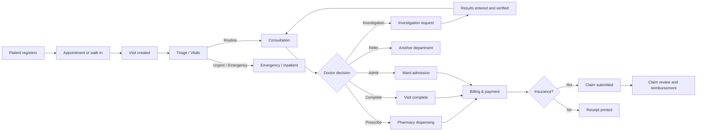
```mermaid
flowchart LR
  A[Patient registers] --> B[Appointment or walk-in]
  B --> C[Visit created]
  C --> D[Triage / Vitals]
  D -->|Routine| E[Consultation]
  D -->|Urgent / Emergency| F[Emergency / Inpatient]
  E --> G{Doctor decision}
  G -->|Prescribe| H[Pharmacy dispensing]
  G -->|Investigation| I[Investigation request]
  G -->|Refer| J[Another department]
  G -->|Admit| K[Ward admission]
  G -->|Complete| L[Visit complete]
  I --> M[Results entered and verified]
  M --> E
  H --> N[Billing & payment]
  L --> N
  K --> N
  N --> O{Insurance?}
  O -->|Yes| P[Claim submitted]
  O -->|No| Q[Receipt printed]
  P --> R[Claim review and reimbursement]
```

The lifecycle above is the backbone of nearly every operational workflow in this manual. When in doubt, locate where a patient currently is on this diagram and the next step is usually obvious.

## 2. Getting Started

### 2.1 Login

1. Open the UHMS application URL.
2. Enter your email and password.
3. Select Login.
4. The system redirects you to the correct dashboard for your role.


The login screen is the entry point for all staff. Users must authenticate before accessing patient, clinical, financial, or administrative pages.

### 2.2 Dashboards

UHMS routes users to a dashboard based on role:

| Role group | Dashboard behavior |
| --- | --- |
| Super Admin, Admin | Admin dashboard |
| Doctor | Doctor dashboard |
| Nurse, Receptionist, Pharmacist, Lab Technician, Accountant, Cashier, HR Manager, Store Manager | Staff dashboard |
| Other authenticated users | Admin dashboard fallback |

### 2.3 Logging out

Use the user menu in the top-right header and select Log Out. Logout is intentionally handled as a normal secure browser request, not an SPA background action.

### 2.4 Navigation

Use the left sidebar to move through the system. The menu is permission-aware:

- If you do not have permission for a feature, it may not appear.
- If an optional module is disabled, its menu items may not appear.
- Some menu groups expand to show sub-pages.
- Most internal navigation now uses the SPA bridge, so pages should open without full browser reloads.

### 2.5 Progressive Web App behavior

UHMS includes PWA basics:

1. The app exposes a web app manifest.
2. Supported browsers can offer installation to desktop or mobile home screen.
3. Static assets are cached by a service worker.
4. If the network is unavailable, the offline page explains that the system cannot continue until connection is restored.

Important: UHMS is an operational clinical system. Patient, billing, and authenticated pages are not designed to be fully used offline. Reconnect before entering or saving clinical, financial, or administrative data.

## 3. Roles and Typical Responsibilities

| Role | Typical access |
| --- | --- |
| Super Admin | Full system access, modules, settings, users, roles, all workflows |
| Admin | Full operational access, settings, users, roles, all workflows |
| Doctor | Consultations, patient viewing, visits, prescriptions, investigation requests, procedures, wards where permitted |
| Nurse | Triage, vitals, queues, prescriptions view, ward/bed visibility |
| Receptionist | Patient registration, visits, appointments, queue management, invoice viewing |
| Lab Technician | Investigation requests, result entry, test catalog, analyzers |
| Pharmacist | Prescriptions, dispensing, drug catalog, drug stock, stock transfers |
| Accountant | Invoices, payments, service catalog, reports, claims, accounts, cashier handover |
| Claims Officer | Claims, invoices, claim review/export, reports |
| Store Keeper | Suppliers, purchase orders, stock transfers, pharmacy stock |
| HR Manager | Employees, attendance, leave, payroll, HR reports |

Permission assignments may be changed by administrators in Roles & Permissions.


The dashboard gives administrators a quick view of operational totals, shortcuts, and the role-aware sidebar menu.

### 3.1 Permission and module visibility model

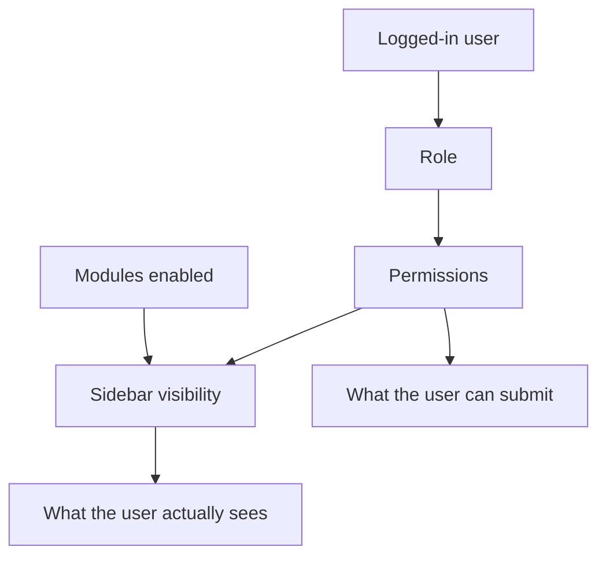
```mermaid
flowchart TB
  U[Logged-in user] --> R[Role]
  R --> P[Permissions]
  M[Modules enabled] --> V[Sidebar visibility]
  P --> V
  V --> S[What the user actually sees]
  P --> X[What the user can submit]
```

Three quick rules to remember:

1. Role grants permissions, not menus directly.
2. The sidebar hides anything the user has no permission for or that belongs to a disabled module.
3. The server still enforces permissions on every action, so a user who manipulates the URL still cannot perform an action they lack permission for.

## 4. Main Navigation Areas

### 4.1 Main Menu

- Dashboard

Use this to return to your role-aware dashboard.

### 4.2 Patient Services

- Patients
- Appointments
  - All Appointments
  - Calendar View
  - Schedule New
- Visits / OPD
- Queue
  - Manage Queue
  - Queue Board
- Triage

### 4.3 Clinical

- Consultations
- Vitals
- Medical Patterns
- Procedures
  - Procedure Catalog
  - Scheduled Procedures
- ICD-10 Codes

### 4.4 Ward / Inpatient

- Admissions
- Bed Map
- Wards
- Bed Management

### 4.5 Pharmacy

- Prescriptions
- Dispensing
- Drug Catalog
- Drug Stock

### 4.6 Investigations

- Investigation Requests
- Investigation Results
- Test Catalog
- Investigation Items
- Investigation Stock
- Analyzers
- Analyzer Messages

Some backend route names still use `lab`, but the user-facing workflow should be treated as Investigations.

### 4.7 Billing

- Invoices
- Payments
- Service Catalog
- Specialties

### 4.8 Claims & Insurance

- Claims
- New Claim
- Insurance Providers

### 4.9 Store & Procurement

- Suppliers
- Purchase Orders
- Stock Transfers

### 4.10 Accounts & Finance

- Account Categories
- Expenses
- Income
- Daily Collection
- Reconciliation
- Cashier Handover

### 4.11 HR & Payroll

- Employees
- Attendance
- Leave Requests
- Payroll

### 4.12 Reports

- Financial Reports
  - Income Report
  - Daily Collection
  - NHIS Report
  - Claims Report
  - Patient Statement
- Clinical Reports
  - Patient Report
  - Visit Report
  - Consultation Stats
  - Admissions Report
  - Discharges Report
  - Investigation Revenue
- Pharmacy & HR
  - Pharmacy Sales
  - Sales Summary
  - Stock Valuation
  - Expired Stock
  - Leave Report
  - Payroll Report

### 4.13 Administration

- Users
  - All Users
  - Add User
- Roles & Permissions
- Departments
- Designations

### 4.14 Notifications

- Notifications list
- Recent notifications in the header dropdown
- Mark single notification as read
- Mark all notifications as read

### 4.15 Settings

- Organization
- Invoice Settings
- Payment Methods
- Activity Log
- Modules

## 5. Standard Page Controls

Most list pages follow the same pattern:

1. Use filters to narrow records by date, status, department, staff member, or search text.
2. Use action buttons or row menus to view, edit, approve, process, cancel, print, or export records.
3. Status badges show the current workflow state.
4. Success and error alerts appear near the top of the page after actions.
5. Some actions update the page inline without forcing a full reload.

### 5.1 Common UI elements

| Element | Purpose | Tip |
| --- | --- | --- |
| Search box | Free-text search over the list | Hit Enter to apply; clear it to reset |
| Filter row | Narrow by status, date, department, role, etc. | Combine filters to drill down quickly |
| Status badge | Current workflow state of the record | Color reflects severity / progression |
| Row action menu | Per-row operations (View, Edit, Cancel, etc.) | Available actions vary by status and permission |
| Bulk actions | Apply one operation to multiple records | Tick checkboxes first |
| Toast / alert | Confirmation or error messages | Most actions show a toast in the top-right |
| Print / PDF link | Open a printable document | Opens in a new tab and bypasses the SPA |

### 5.2 Uniform screen design

UHMS screens now follow a shared design system so staff do not have to relearn controls from module to module.

1. Page titles appear in a consistent header with the main action on the right.
2. Search and filter controls use visible labels, compact spacing, and short actions such as Filter and Clear.
3. Tables use compact headers, row hover states, workflow badges, and right-aligned money columns.
4. Action buttons use familiar Tabler icons and short text; row-specific actions stay inside the row action menu.
5. The shared styling is loaded once through the application layouts, including older template pages, so the visual cleanup stays lightweight and fast.

### 5.3 What to do if a button is missing

1. Confirm you have permission for that action.
2. Confirm the related module is enabled (Settings > Modules).
3. Confirm the record's current status allows that action (e.g., you cannot "approve" a draft that has not been submitted yet).
4. Refresh the page to clear stale state.

## A. End-to-End Patient Journey

This section combines every other module into one continuous example, from arrival to final settlement. Use it as a reference when training new staff.

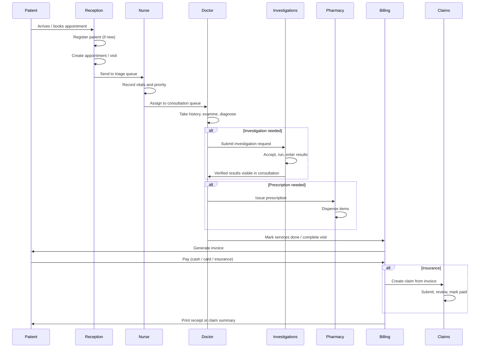
```mermaid
sequenceDiagram
  participant P as Patient
  participant R as Reception
  participant N as Nurse
  participant D as Doctor
  participant L as Investigations
  participant Ph as Pharmacy
  participant B as Billing
  participant C as Claims
  P->>R: Arrives / books appointment
  R->>R: Register patient (if new)
  R->>R: Create appointment / visit
  R->>N: Send to triage queue
  N->>N: Record vitals and priority
  N->>D: Assign to consultation queue
  D->>D: Take history, examine, diagnose
  alt Investigation needed
    D->>L: Submit investigation request
    L->>L: Accept, run, enter results
    L->>D: Verified results visible in consultation
  end
  alt Prescription needed
    D->>Ph: Issue prescription
    Ph->>Ph: Dispense items
  end
  D->>B: Mark services done / complete visit
  B->>P: Generate invoice
  P->>B: Pay (cash / card / insurance)
  alt Insurance
    B->>C: Create claim from invoice
    C->>C: Submit, review, mark paid
  end
  B->>P: Print receipt or claim summary
```

The rest of this manual zooms into each step of the diagram above.

## B. Role Day Journeys

Quick day-in-the-life walkthroughs by role. Each one points back to the detailed sections later in the manual.

### B.1 Receptionist

1. Open Dashboard, review today's appointments.
2. Patient arrives:
   - Existing patient: search Patients > open profile.
   - New patient: Patients > Create.
3. If they had a booking: Appointments > All Appointments > Check In, which creates the visit automatically.
4. If walk-in: Visits / OPD > Create Visit.
5. Confirm payable services are correctly attached to the visit.
6. Send patient to triage queue.
7. Throughout the day, manage the queue board, confirm and reschedule appointments, and answer billing queries.

### B.2 Triage nurse

1. Open Triage from the sidebar.
2. Open the next visit awaiting triage.
3. Record vitals and triage score.
4. Set priority (Routine, Urgent, Emergency).
5. Assign to a consultation department or move to emergency.
6. Repeat for the queue.

### B.3 Doctor

1. Open Consultations to see today's assigned patients.
2. Open a visit to enter the consultation workspace.
3. Record complaints, examine, add diagnoses.
4. As needed: request investigations, prescribe, schedule procedures, refer, or admit.
5. Use Medical Patterns to speed up repetitive consultations.
6. Complete the visit when care is done; the system queues billing automatically.

### B.4 Investigation/Lab technician

1. Open Investigation Requests.
2. Accept new pending requests.
3. Run the test on the analyzer or manually.
4. Enter results per request item; mark abnormal where applicable.
5. Verify results.
6. Use Analyzer Messages to reprocess any instrument message that failed.

### B.5 Pharmacist / dispenser

1. Open Pharmacy > Dispensing.
2. Open the next prescription.
3. Confirm stock and dispense item by item, or use batch dispense.
4. Update stock through Pharmacy > Drug Stock as supplies arrive.
5. Watch stock alerts daily.

### B.6 Cashier / accountant

1. Open shift via Accounts > Cashier Handover.
2. Open Billing > Receive Payments to collect outstanding invoices from the cashier queue.
3. Use Billing > Invoices when you need to review or create a specific invoice.
4. Record payments and print receipts.
5. End of shift: close handover, supervisor verifies.
6. Review Daily Collection and Reconciliation.

### B.7 Claims officer

1. Open Claims > New Claim or create from a settled invoice.
2. Add and validate items.
3. Submit the claim.
4. Review tabs: pending, submitted, paid, appealed.
5. Export reports for the insurer when needed.

### B.8 Store keeper

1. Suppliers: add or update partners.
2. Purchase Orders: create, submit, approve, receive.
3. Stock Transfers between pharmacy/investigation locations.

### B.9 HR officer

1. Employees: maintain profiles.
2. Attendance: enter daily attendance.
3. Leave: review and approve requests.
4. Payroll: process, approve, mark paid.

### B.10 Administrator

1. Users and Roles: provision new staff.
2. Departments and Designations: keep the org structure current.
3. Modules: enable / disable optional features.
4. Activity Log: review what happened.
5. Settings: organization, invoice, payment methods.

## 6. Patient Registration and Management


The Patients page is the main register for searching, reviewing, and opening patient records.

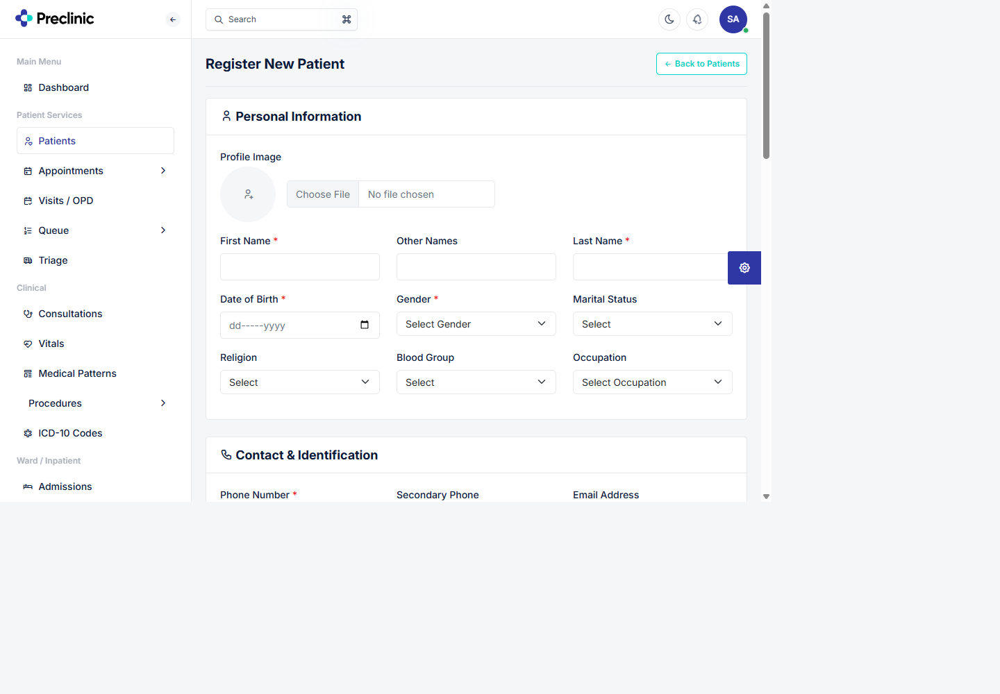

The Add Patient form captures demographics, contact, and identifying information needed downstream by visits, billing, claims, and reports.

### 6.1 Add a patient

1. Go to Patient Services > Patients.
2. Select Create or Add Patient.
3. Enter demographic and contact details.
4. Save the record.
5. Open the patient profile to review details.

### 6.2 Update patient information

1. Open the patient profile.
2. Select Edit.
3. Update the required fields.
4. Save changes.

### 6.3 Manage patient insurance

1. Open the patient profile.
2. Use the insurance section to add an insurance provider, tier, policy/member information, and validity dates.
3. Mark one policy as primary when appropriate.
4. Update or remove expired insurance records as needed.

### 6.4 Manage emergency contacts

1. Open the patient profile.
2. Use the emergency contacts section.
3. Add, edit, or remove contact records.

## 7. Appointments

The Appointments module covers booking, calendar, check-in, and lifecycle of every scheduled visit.

### Appointment lifecycle

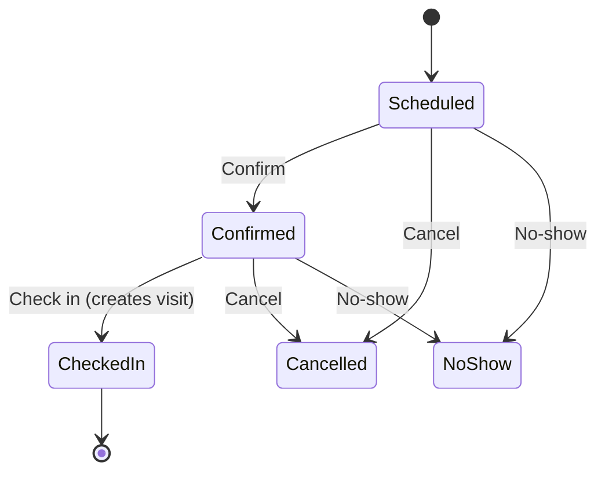
```mermaid
stateDiagram-v2
  [*] --> Scheduled
  Scheduled --> Confirmed: Confirm
  Confirmed --> CheckedIn: Check in (creates visit)
  Scheduled --> Cancelled: Cancel
  Confirmed --> Cancelled: Cancel
  Scheduled --> NoShow: No-show
  Confirmed --> NoShow: No-show
  CheckedIn --> [*]
```

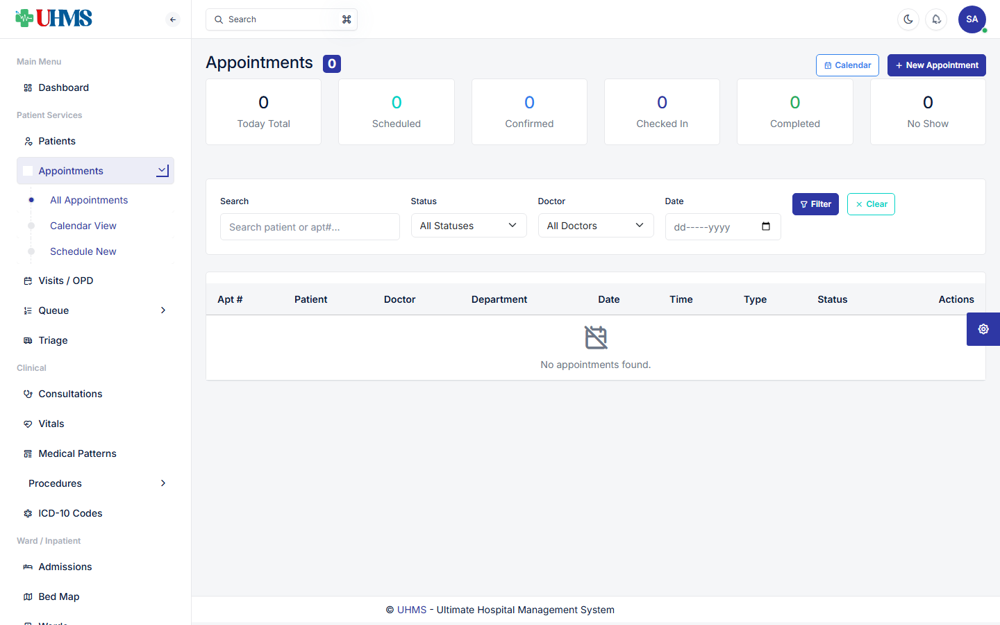

The All Appointments list shows status badges, doctor, department, and quick actions like Confirm, Check In, No Show, Cancel.

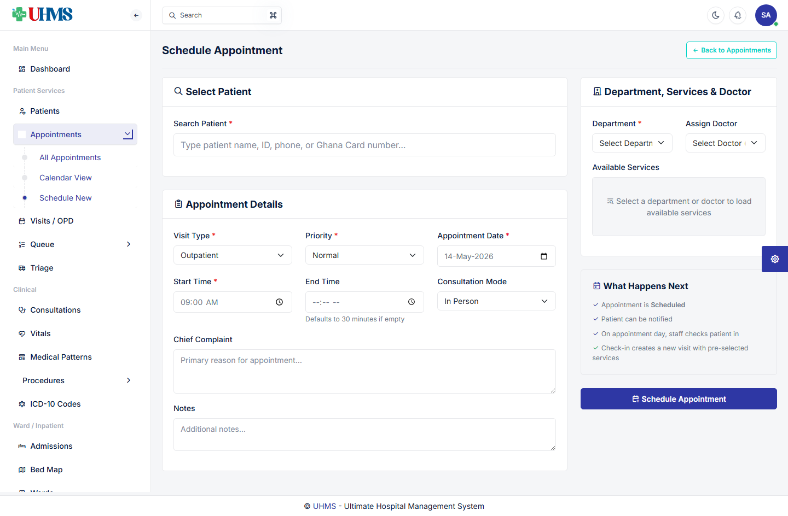

The Schedule New form lets you pick patient, doctor, department, slot, visit type, reason, and any pre-attached services.

### 7.1 View appointments

1. Go to Patient Services > Appointments > All Appointments.
2. Review appointment statistics and the appointment list.
3. Filter by status, doctor, date, or search text.
4. Open an appointment to view details.

### 7.2 Use the calendar view

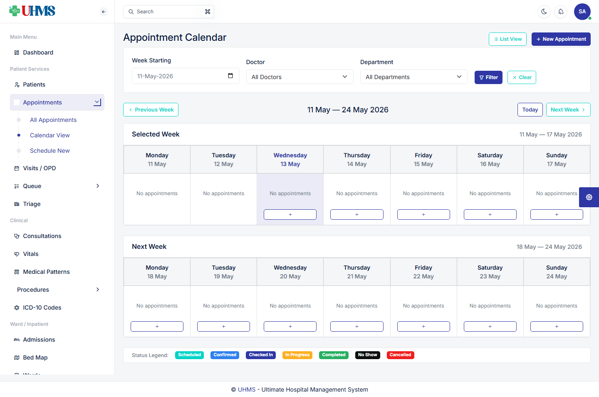

The appointment calendar groups bookings by day and supports week navigation, doctor filters, and department filters. It shows the selected week first and the next week directly below it, so schedulers can see two weeks at a time without changing screens.

1. Go to Patient Services > Appointments > Calendar View.
2. Choose a week start date.
3. Optionally filter by doctor or department.
4. Review both the selected week and the next week before booking or moving an appointment.
5. Use Previous Week, Today, or Next Week to move through the calendar.
6. Select an appointment card to open the appointment.
7. Use the plus button on future dates to schedule a new appointment for that date.

### 7.3 Schedule an appointment

1. Go to Patient Services > Appointments > Schedule New.
2. Select or search for the patient.
3. Select department, doctor, date, time, visit type, and reason.
4. Add services where applicable.
5. Save the appointment.

### 7.4 Confirm or update appointment status

1. Open All Appointments.
2. Use the row action menu.
3. Choose Confirm, Check In, No Show, Cancel, Edit, or View Details depending on the current status and permissions.
4. Inline actions should return confirmation feedback without a full page reload.

### 7.5 Check in an appointment

1. Locate a confirmed appointment.
2. Select Check In.
3. UHMS creates a visit linked to the appointment.
4. Open the created visit when prompted.

## 8. Visits / OPD Workflow

A visit is the central operational record connecting patient, services, departments, billing, and clinical data.

**Single-invoice rule.** Every visit has exactly one main invoice. All billable activity during the visit — consultation services, investigation items, dispensed pharmacy items, ward charges, procedures, scans, x-rays — adds items to this same invoice. UHMS does not create multiple active invoices for one visit.

**Insurance and Cash and Carry.** Cash and Carry is always available, even when the patient has insurance. When the patient's default insurance is invalid, expired, exhausted, or missing, UHMS automatically selects Cash and Carry. The user can switch to another valid insurance, or add/edit/renew insurance directly from the visit creation page. Cash and Carry uses the service base price; insurance uses the resolved insurance price.

### Visit lifecycle

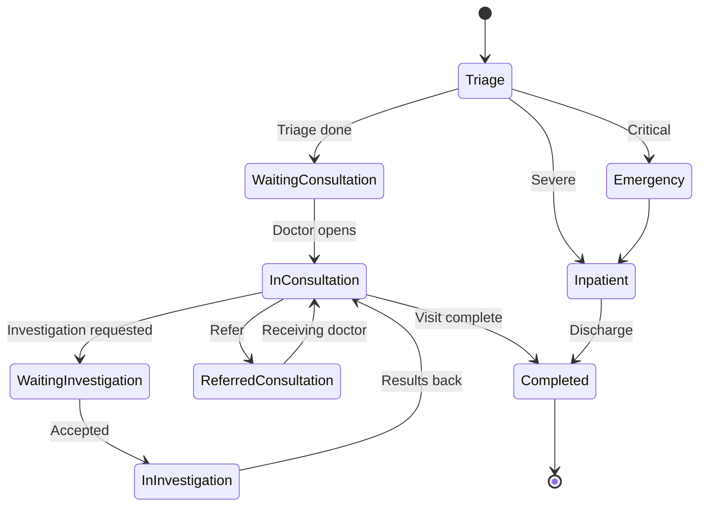
```mermaid
stateDiagram-v2
  [*] --> Triage
  Triage --> WaitingConsultation: Triage done
  Triage --> Emergency: Critical
  Triage --> Inpatient: Severe
  WaitingConsultation --> InConsultation: Doctor opens
  InConsultation --> WaitingInvestigation: Investigation requested
  WaitingInvestigation --> InInvestigation: Accepted
  InInvestigation --> InConsultation: Results back
  InConsultation --> ReferredConsultation: Refer
  ReferredConsultation --> InConsultation: Receiving doctor
  InConsultation --> Completed: Visit complete
  Emergency --> Inpatient
  Inpatient --> Completed: Discharge
  Completed --> [*]
```

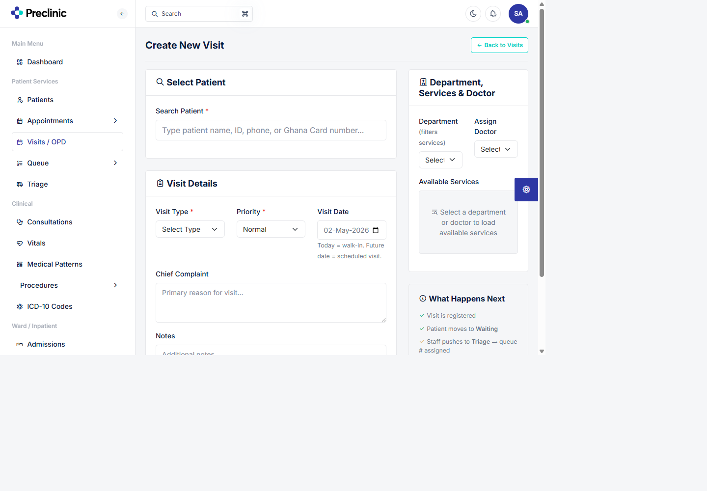

The Create Visit form supports walk-in registration with patient search, department/doctor pick, service selection, insurance, and priority.

### 8.1 Create a walk-in visit

1. Go to Patient Services > Visits / OPD.
2. Select Create Visit.
3. Search for or select the patient.
4. Choose insurance or Cash and Carry. If the default insurance is invalid, Cash and Carry is auto-selected.
5. Choose visit type, department, doctor, services, and priority where applicable.
6. Save the visit. UHMS:
   - creates the visit and a unique visit number,
   - creates the single main invoice for the visit,
   - adds the selected services as invoice items, and
   - sends the patient to triage automatically.

The Selected Services table on the visit creation page is simplified: service, price, action, and an overall total. The visit invoice and its items are the authoritative record of billable services — there is no separate `visit_services` display.

### 8.2 View visits


The Visits / OPD page shows visit status, patient details, linked appointment information, and workflow actions.

1. Go to Visits / OPD.
2. By default, the list focuses on today's visits unless search or date filters are used.
3. Filter by date range, doctor, status, or search text.
4. Open a visit to review patient, services, department, doctor, billing, and workflow details.

### 8.3 Transition a visit

Users with transition permission can move visits through workflow states. The standard sequence is:

1. `TRIAGE` — set automatically on visit creation.
2. `WAITING_CONSULTATION` — set automatically when the triage user saves vitals.
3. `CONSULTING` — set when the doctor clicks **Start Consultation** (see [Section 11](#11-consultations)).
4. Investigation, referral, admission, or completion — depending on doctor decision and downstream workflow.

Clinical forms remain disabled until the doctor has started consultation.

## 9. Queue Management

The queue ties triage, departments, and consultations together so staff always see who is next.

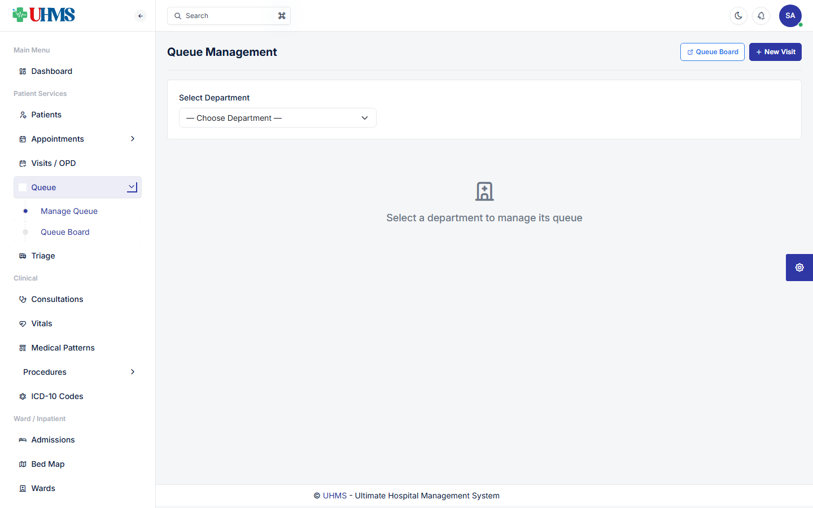

Manage Queue is for staff who control flow: call next, complete, skip, or requeue patients.

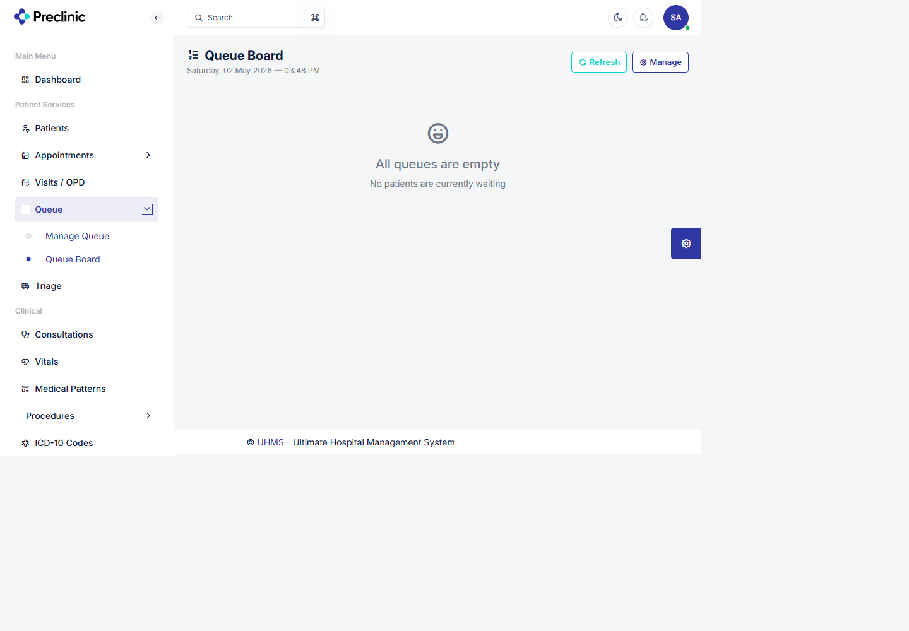

Queue Board is a public-display friendly view for waiting rooms and department screens.

### 9.1 Manage queue

1. Go to Patient Services > Queue > Manage Queue.
2. Review waiting patients and service queues.
3. Call next, complete, skip, or requeue patients as needed.

### 9.2 Queue board

1. Go to Patient Services > Queue > Queue Board.
2. Use this display for waiting room or department queue visibility.

## 10. Triage and Vitals

Triage is the first clinical touchpoint after registration. It computes urgency and routes the patient.

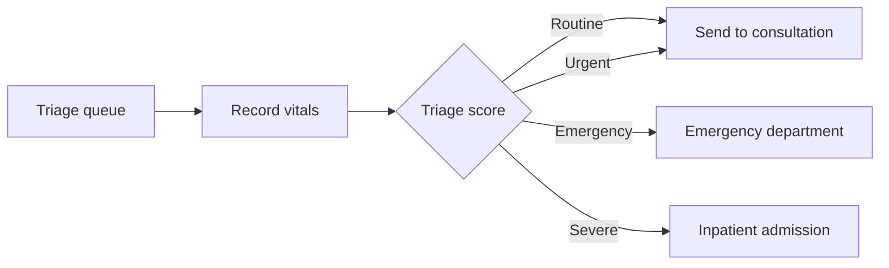
```mermaid
flowchart LR
  T[Triage queue] --> V[Record vitals]
  V --> S{Triage score}
  S -->|Routine| C[Send to consultation]
  S -->|Urgent| C
  S -->|Emergency| E[Emergency department]
  S -->|Severe| I[Inpatient admission]
```

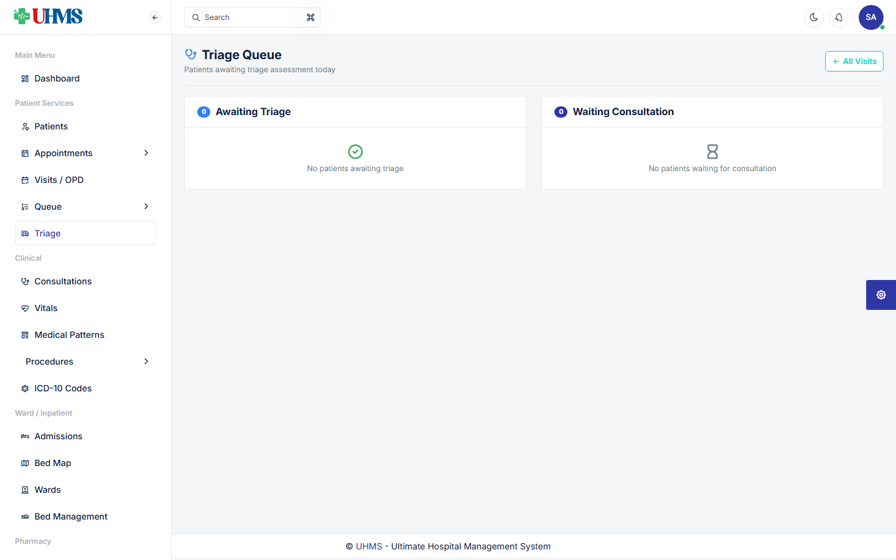

The triage queue shows visits awaiting assessment, with patient, time waiting, and priority cues.

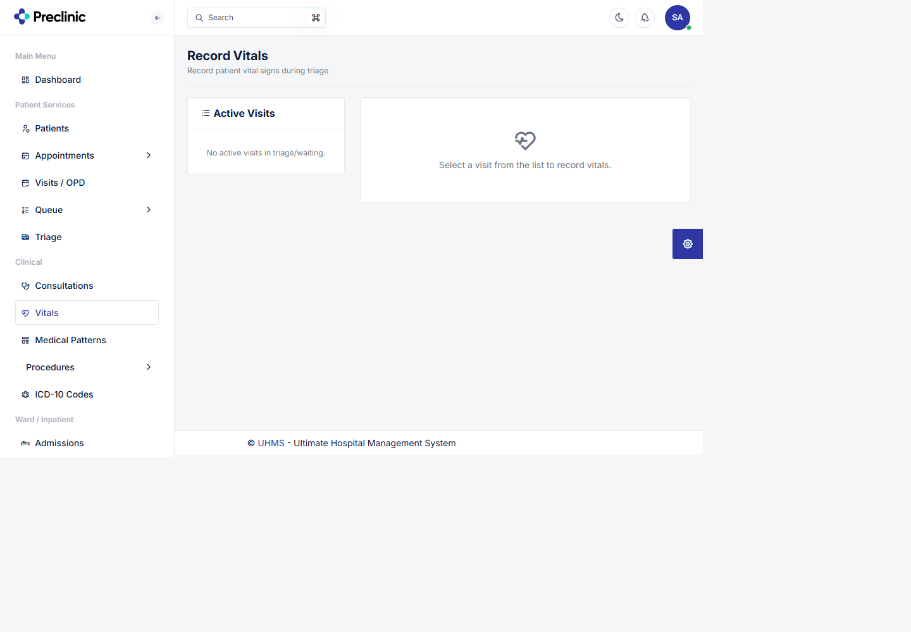

The vitals form captures temperature, blood pressure, pulse, respiration, oxygen saturation and other measurements.

### 10.1 Open triage queue

1. Go to Patient Services > Triage.
2. Review patients awaiting triage.
3. Open a patient for assessment.

### 10.2 Record vitals

1. Open the visit's triage or vitals screen.
2. Enter temperature, blood pressure, pulse, respiratory rate, oxygen saturation, weight, height, and other available fields.
3. Select or confirm priority where required.
4. Save the triage record. UHMS:
   - calculates the triage score,
   - changes the visit status from `TRIAGE` to `WAITING_CONSULTATION`, and
   - adds the patient to the consultation queue.

The triage score may help identify routine, urgent, emergency, or inpatient cases.

### 10.3 Send patient onward

After triage, the patient appears in the doctor's consultation queue automatically. Emergency or severe cases may be routed directly to the emergency department or to inpatient admission. The exact available actions depend on visit status and staff permissions.

## 11. Consultations

The consultation workspace is where doctors record their work for a visit. It is the system's clinical heart.

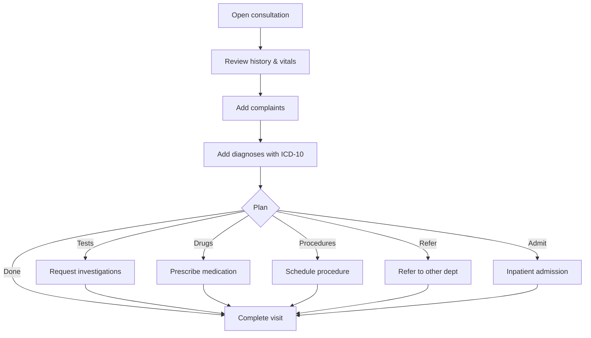
```mermaid
flowchart TD
  Open[Open consultation] --> Hist[Review history & vitals]
  Hist --> Comp[Add complaints]
  Comp --> Diag[Add diagnoses with ICD-10]
  Diag --> Branch{Plan}
  Branch -->|Tests| Inv[Request investigations]
  Branch -->|Drugs| Rx[Prescribe medication]
  Branch -->|Procedures| Proc[Schedule procedure]
  Branch -->|Refer| Ref[Refer to other dept]
  Branch -->|Admit| Adm[Inpatient admission]
  Branch -->|Done| Com[Complete visit]
  Inv --> Com
  Rx --> Com
  Proc --> Com
  Ref --> Com
  Adm --> Com
```

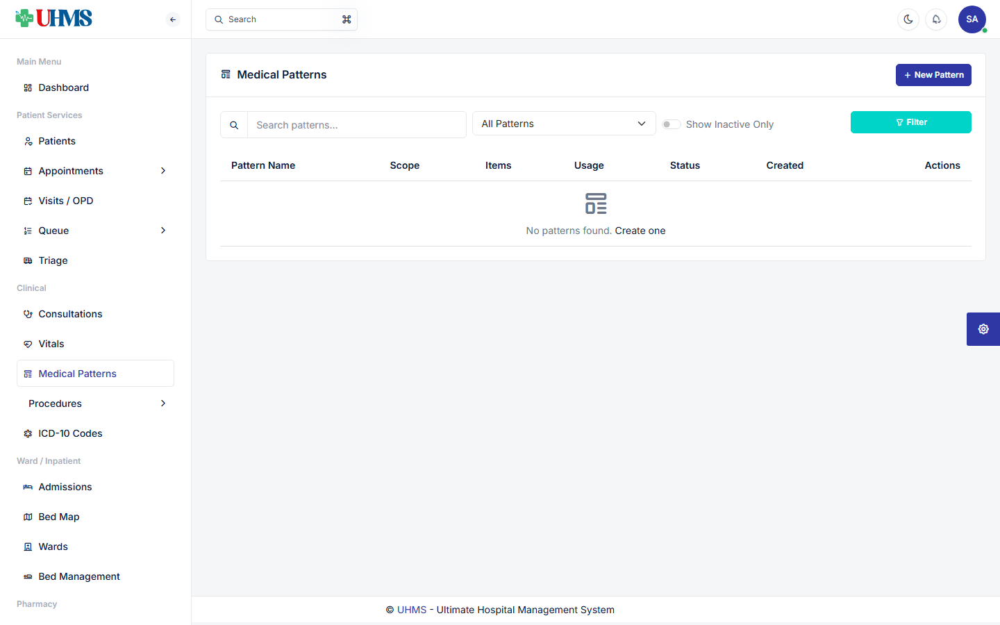

Medical Patterns store reusable bundles (complaints + diagnoses + treatments + prescriptions + investigations) that doctors can apply with one click.

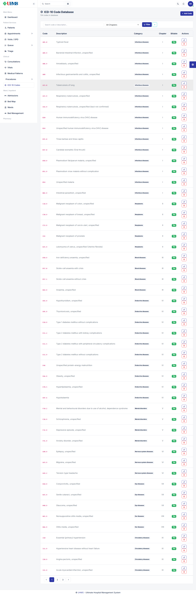

ICD-10 search is integrated into diagnoses for accurate clinical coding.

### 11.1 Open consultation list


The consultation list helps clinicians find consultable visits and filter by visit type, date, assignment, or patient search.

1. Go to Clinical > Consultations.
2. By default, the list focuses on today's outpatient consultable visits.
3. Filter by search text, visit type, date range, or My Patients.
4. Open a visit to enter the consultation workspace.

### 11.2 Consultation workspace

The consultation page is an SPA-like clinical workspace. It typically shows:

- Patient header
- Vitals panel
- Triage score
- Current visit status
- Insurance summary
- Previous visits panel
- Consultation tabs: complaints, history, diagnosis, investigations, prescriptions, treatment, notes

Saving within a tab does not reload the whole page or reset the active tab.

### 11.2.1 Start Consultation (required gate)

Before entering any clinical information, the doctor must click **Start Consultation**.

- This changes the visit status from `WAITING_CONSULTATION` to `CONSULTING`.
- Clinical forms (complaints, diagnoses, prescriptions, investigation requests, treatment, notes) remain **disabled** until consultation has started.
- If the visit is already in consultation, the button shows **Continue Consultation** instead.

### 11.3 Add complaints

1. Open a consultation.
2. Add presenting complaints.
3. Save each complaint.
4. Remove incorrect entries when needed.

### 11.4 Add diagnoses

1. Open the diagnosis section.
2. Add diagnosis details. UHMS supports provisional, final, and primary diagnoses.
3. The first diagnosis is set as primary by default; the doctor may later mark another diagnosis as primary.
4. Use ICD-10 search/coding if available.
5. Save changes.

### 11.5 Add treatment notes

1. Use the treatment section.
2. Enter treatment plan, advice, procedures, or notes.
3. Save the treatment item.

### 11.6 Create prescription

1. Open the prescription section.
2. Add one or more drug items.
3. Enter dosage, frequency, duration, and instructions.
4. Save the prescription. The prescription is linked to the patient visit and prescribing doctor. The list updates without a full page reload.
5. Pharmacy users can later dispense it.

**Important:** Saving a prescription does **not** reduce stock. Stock is only reduced when pharmacy dispenses the drug.

### 11.7 Request investigations

1. Open the Investigations tab.
2. Select the target investigation department (Lab, X-ray, Scan, CT-scan, Ultrasound, ECG, or any configured investigation-type department).
3. Select one or more services under that department.
4. Add clinical information and urgency.
5. Submit the request. It appears on the correct investigation department request page.

Requested investigations on the consultation page are grouped by department, and the doctor can view available results directly from the Investigations tab.

**Doctors cannot delete an investigation item after results have been entered for it.**

### 11.8 Refer a patient

1. Use the referral action in the consultation workflow.
2. Select the receiving department.
3. Enter referral reason or notes.
4. Submit. The visit is routed for follow-up according to workflow rules.

### 11.9 Medical patterns

Medical patterns allow doctors to reuse common sets of complaints, diagnoses, treatments, prescriptions, or investigation plans.

Common actions:

1. Open Clinical > Medical Patterns.
2. Create a pattern manually or save one from a consultation record.
3. Apply a pattern during a future consultation.
4. Toggle active status when a pattern should no longer be suggested.

## 12. Investigations

The Investigations module covers the full lifecycle of test requests from the moment a doctor orders them until results are verified and printed.

**Investigations are not limited to Lab.** Investigation departments may include Lab, X-ray, Scan, CT-scan, Ultrasound, ECG, and any other configured investigation-type department. Some backend route names still use `lab`, but the user-facing workflow is **Investigations**.

### Investigation Catalogue (replaces "Lab Test Catalogue")

The old "Lab Test Catalogue" concept is replaced with the **Investigation Catalogue**, which is based on services from investigation-type departments. The system does not create catalogue tests detached from services.

Correct structure:

```text
Investigation Service
    → Optional Headers / Categories
    → Criteria
```

A criterion may belong to a header/category or stand alone. Authorized users configure headers and criteria when an investigation service is selected.

Example for Full Blood Count:

```text
Service: Full Blood Count

Header: Red Cell Indices
  - Hemoglobin
  - RBC
  - HCT

Header: White Cell Count
  - WBC

General
  - ESR
```

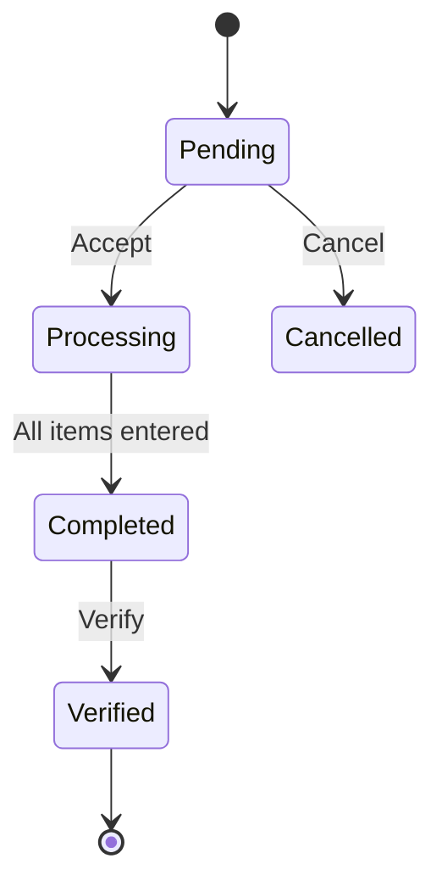
```mermaid
stateDiagram-v2
  [*] --> Pending
  Pending --> Processing: Accept
  Pending --> Cancelled: Cancel
  Processing --> Completed: All items entered
  Completed --> Verified: Verify
  Verified --> [*]
```

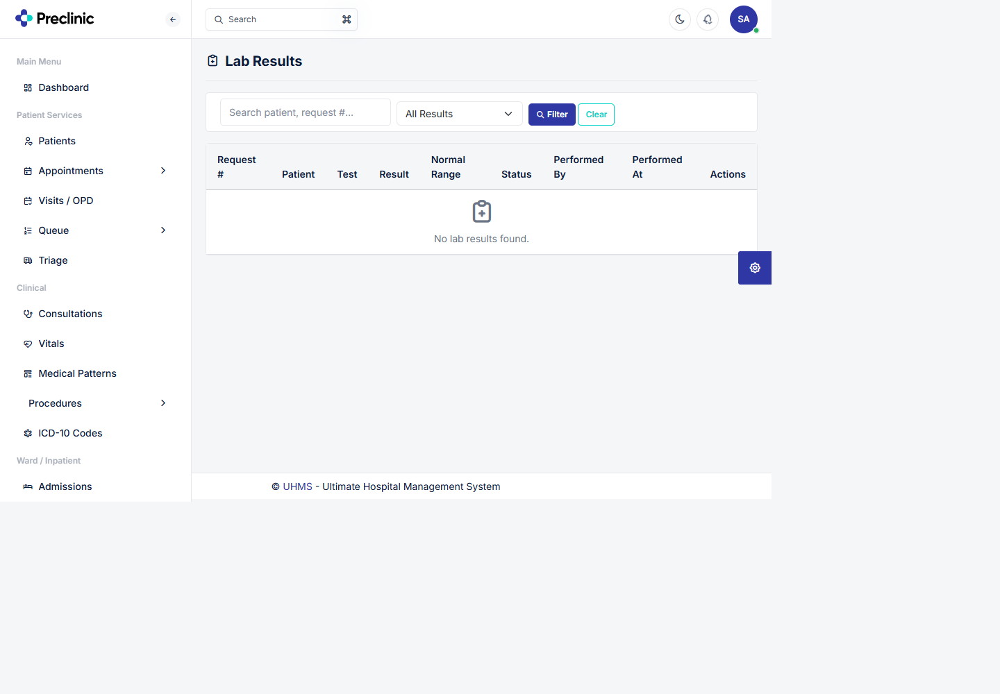

Investigation Results lists all entered results, supports filtering, and lets authorized staff verify entries.

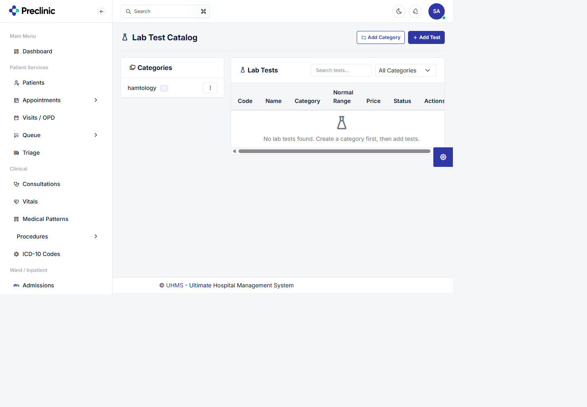

The Investigation Catalogue manages investigation services and their headers/criteria. Each service is owned by an investigation-type department; criteria carry units and reference ranges.

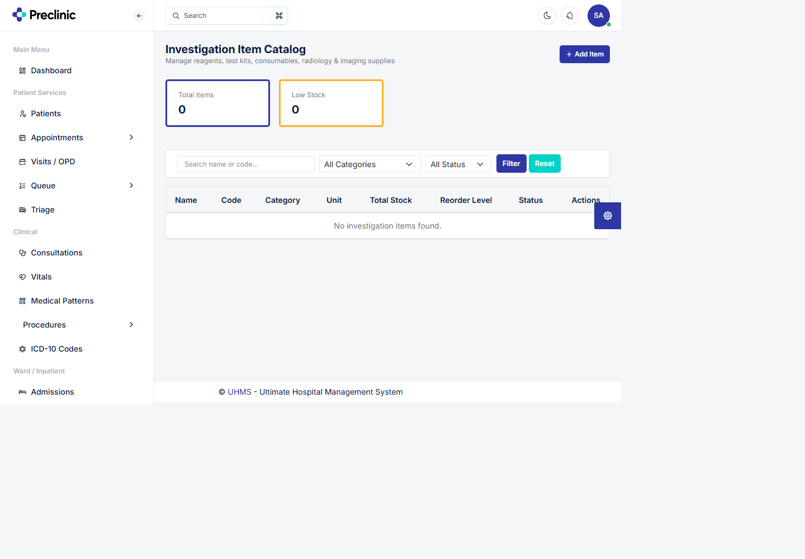

Investigation Items is the catalog of consumables and reagents.

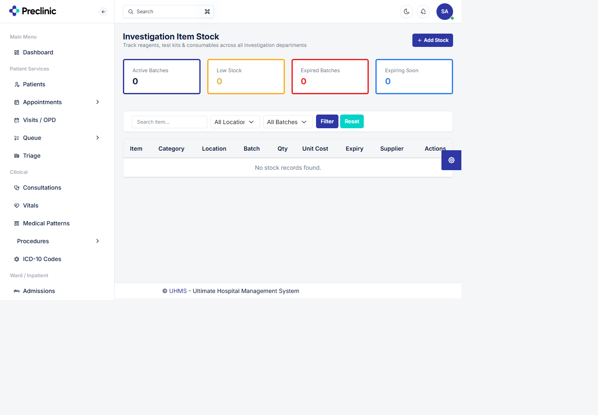

Investigation Stock tracks reagent and consumable inventory per investigation department.

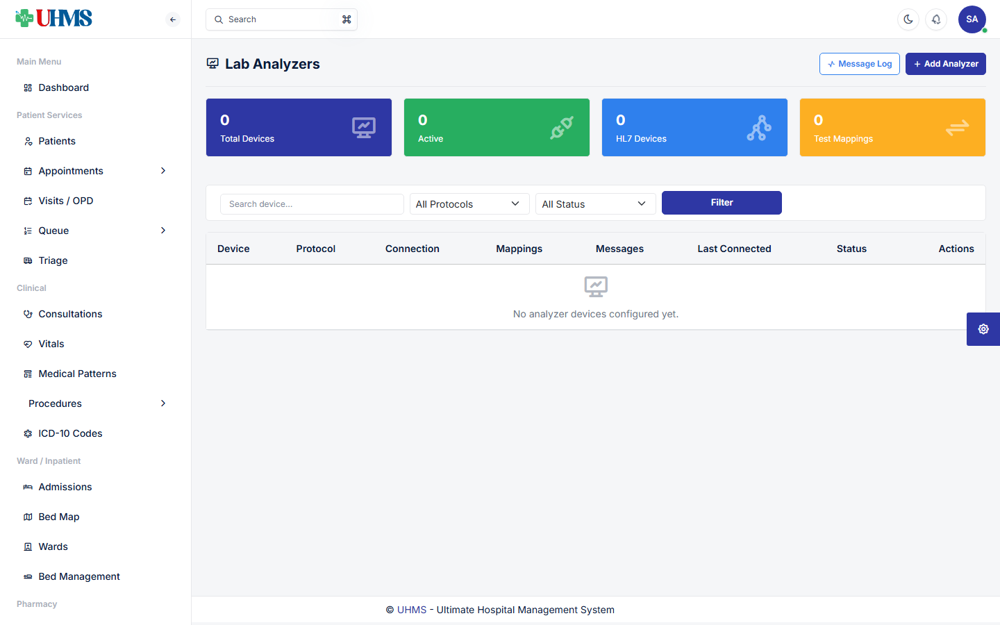

Analyzer integration manages connected lab instruments, mappings, and message diagnostics.

### 12.1 View investigation requests


Investigation staff use this queue to filter, accept, process, and track requests from consultations.

1. Go to Investigations > Investigation Requests.
2. Filter by status, urgency, department, date range, or search text.
3. Open a request to process it.

### 12.2 Accept a request

Investigation staff must explicitly select which requested items they intend to perform before accepting.

1. Open a pending request.
2. Select the items to perform.
3. Select Accept.
4. The request and the selected items move into processing status.

**Billing rule:** Only accepted selected items are added to the visit invoice. Unselected items are not billed.

### 12.3 Enter results

1. Open a processing request.
2. For each request item, the result form loads the configured headers and criteria from the Investigation Catalogue.
3. Enter values against each criterion. Depending on result type, enter parameter values, rich text, or upload a file result.
4. Mark abnormal results where applicable.
5. Save.
6. When all request items are completed, the request status becomes completed.

Once results have been entered for an investigation item, the doctor cannot delete that item from the consultation.

### 12.3.1 View result

After results are entered, a **View Result** button appears. The result view shows patient information, visit information, investigation service, result values, units, reference ranges, and status.

Doctors can view results directly from Consultation → Investigations tab.

### 12.4 Verify and print results

1. Open an entered result.
2. Authorized users select **Verify**.
3. The result status becomes Verified and the Print button becomes available.
4. **Only verified results should be printed** unless system settings allow otherwise.

A printed result includes: hospital information, patient details, visit details, investigation service, result values, units, reference ranges, performed by, verified by, and date/time.

### 12.5 Test catalog (Investigation Catalogue maintenance)

Use Test Catalog to maintain the Investigation Catalogue: investigation services, headers/categories, and criteria.

Typical actions:

1. Add or update categories/headers under an investigation service.
2. Add or update criteria (with units and reference ranges).
3. Toggle services or criteria active/inactive.
4. View services grouped by department.

Do not create catalogue tests that are detached from services.

### 12.6 Investigation items and stock

Use Investigation Items and Investigation Stock for consumables or stock items used by investigation departments.

Typical actions:

1. Maintain item catalog.
2. Add or update stock.
3. Search items.
4. Check available stock.

### 12.7 Analyzer integration

Analyzer tools are for configuring lab instruments and checking diagnostic messages.

Typical actions:

1. Go to Investigations > Analyzers.
2. Add or update analyzers.
3. Configure mappings.
4. View diagnostics or analyzer messages.
5. Reprocess messages if needed.

## 13. Pharmacy

The Pharmacy module handles prescriptions, dispensing, drug catalog, and stock.

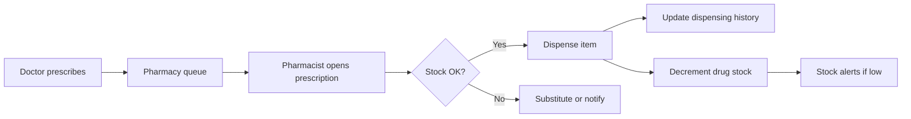
```mermaid
flowchart LR
  Doc[Doctor prescribes] --> Q[Pharmacy queue]
  Q --> Disp[Pharmacist opens prescription]
  Disp --> Stock{Stock OK?}
  Stock -->|Yes| D[Dispense item]
  Stock -->|No| Sub[Substitute or notify]
  D --> Hist[Update dispensing history]
  D --> Inv[Decrement drug stock]
  Inv --> Alerts[Stock alerts if low]
```

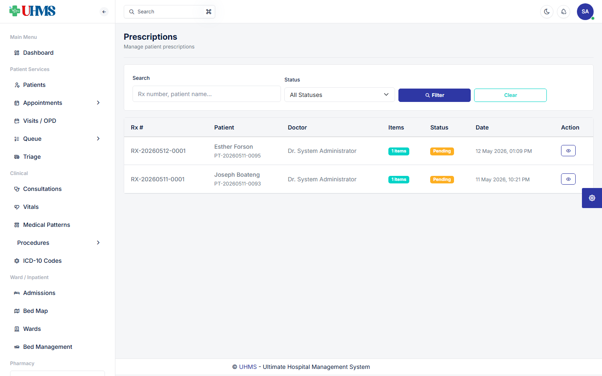

The Prescriptions list shows every prescription created in consultations and their dispensing status.

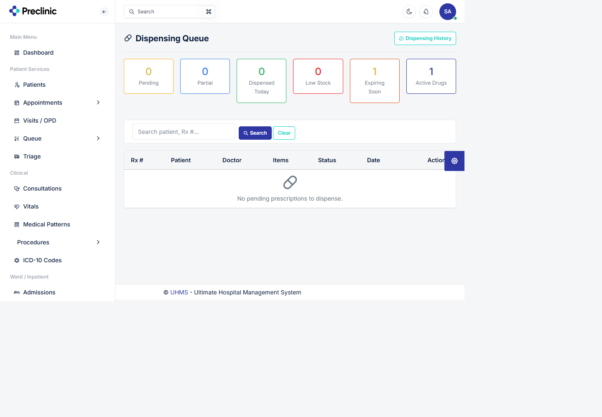

The Dispensing screen is the pharmacist's main workspace for fulfilling prescriptions.

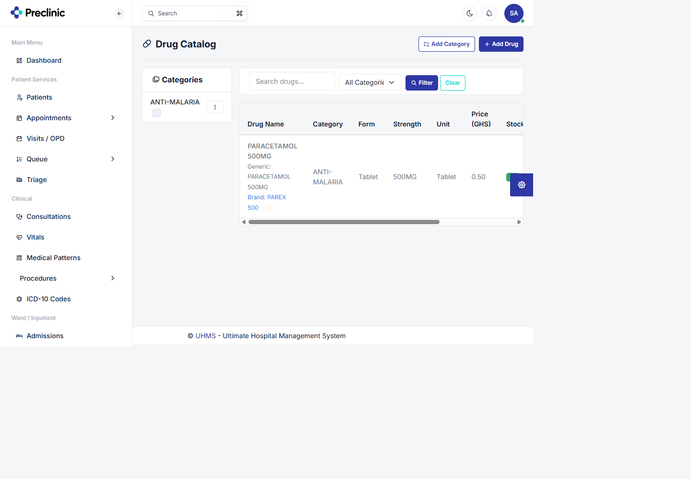

Drug Catalog manages drugs, dosage forms, strengths, and categories.

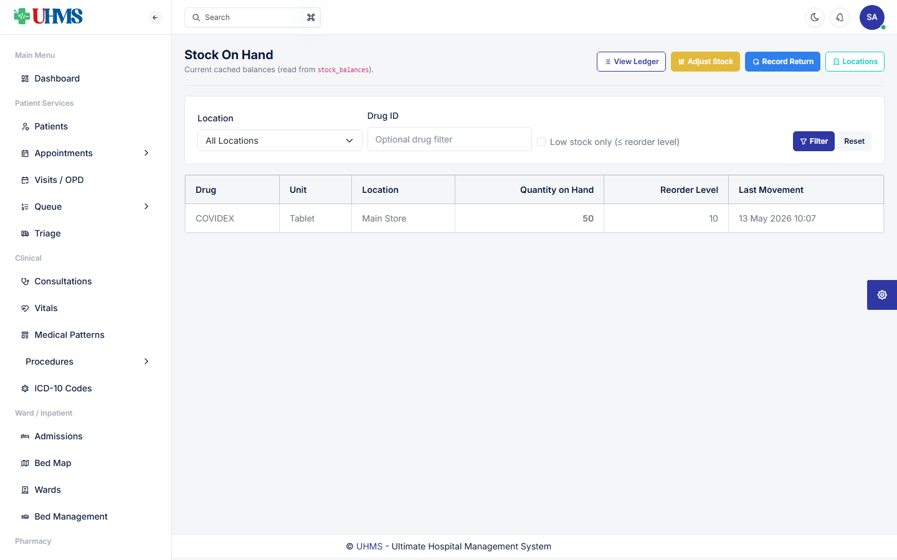

Drug Stock tracks batches, quantities, and expiry; the alerts section highlights low and expired stock.

### 13.1 View prescriptions

1. Go to Pharmacy > Prescriptions.
2. Open a prescription to review prescribed items.
3. Cancel prescriptions if permitted and clinically appropriate.

### 13.2 Dispense medication

1. Go to Pharmacy > Dispensing.
2. Open a prescription.
3. Dispense individual items or use batch dispensing.
4. Confirm quantities and instructions.
5. Save the dispensing. UHMS:
   - adds the dispensed drug as an item on the visit's main invoice,
   - creates a `PHARMACY_DISPENSED` OUT stock movement that reduces stock through the ledger, and
   - updates the prescription/dispensing status.

**Stock rules:**

- Prescribing does **not** reduce stock.
- Dispensing **does** reduce stock (through a stock movement, never by editing quantity directly).
- Payment does **not** affect stock.
- Only dispensed drugs are billed — prescriptions that are never dispensed produce no invoice line.

### 13.3 Drug catalog

Use Drug Catalog to manage drugs, categories, strengths, dosage forms, and active status.

Typical actions:

1. Add a drug.
2. Update a drug.
3. Toggle active/inactive.
4. Search drugs.
5. Review drug history.

### 13.4 Drug stock

Drug Stock shows current quantity by location and stock alerts. Current stock is computed from the stock movement ledger — see [Section 18](#18-store-and-procurement) for the full inventory model.

Typical actions:

1. Review current stock per location.
2. Review low stock and expiry alerts.
3. Initiate transfers, returns, adjustments, damaged or expired removals from the inventory pages — each creates a new stock movement rather than overwriting quantity.

## 14. Billing and Payments

Billing turns clinical activity into invoice items, payments, allocations, and (where applicable) insurance claims.

### Single visit invoice model

```text
One Visit = One Main Invoice
```

All billable activities during the visit add items to **the same** invoice:

- consultation service
- investigation item (only for accepted selected items)
- pharmacy item (only for dispensed drugs)
- ward charge
- procedure
- scan, x-ray, etc.

UHMS does not create multiple active invoices for one visit. The visit's main invoice is created automatically when the visit is created (see [Section 8.1](#81-create-a-walk-in-visit)); subsequent departments add items to it.

### Invoice item fields and formulas

Each invoice item stores a pricing snapshot:

- `cash_price`
- `insurance_price`
- `selected_price`
- `quantity`
- `discount_amount`
- `insurance_covered`
- `patient_payable`
- `paid_amount`
- `balance`
- `payment_status`

Cash and Carry:

```text
selected_price  = cash_price
patient_payable = (selected_price * quantity) - discount_amount
```

Insurance:

```text
selected_price    = resolved insurance price
insurance_covered = cash_price - insurance_price
patient_payable   = (selected_price * quantity) - discount_amount
```

Both modes:

```text
balance = patient_payable - paid_amount

payment_status =
    PAID            if paid_amount >= patient_payable
    PARTIALLY_PAID  if 0 < paid_amount < patient_payable
    UNPAID          if paid_amount = 0
```

Rules:

- `insurance_covered` is **not** a payment.
- `discount_amount` is entered manually by authorized users; it is never auto-calculated from insurance.
- `paid_amount` only comes from actual payments.

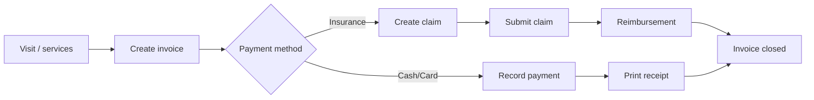
```mermaid
flowchart LR
  V[Visit / services] --> Inv[Create invoice]
  Inv --> Pay{Payment method}
  Pay -->|Cash/Card| Rec[Record payment]
  Pay -->|Insurance| Cl[Create claim]
  Rec --> Rcpt[Print receipt]
  Cl --> Sub[Submit claim]
  Sub --> Reim[Reimbursement]
  Reim --> Closed[Invoice closed]
  Rcpt --> Closed
```


The Invoices page centralizes billing status, outstanding balances, payments, and invoice actions.

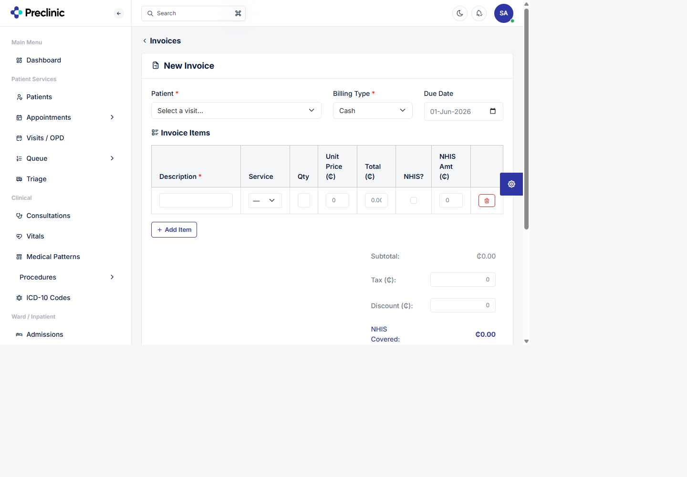

The Create Invoice form pulls billable items from a selected visit and lets the cashier add or adjust lines.

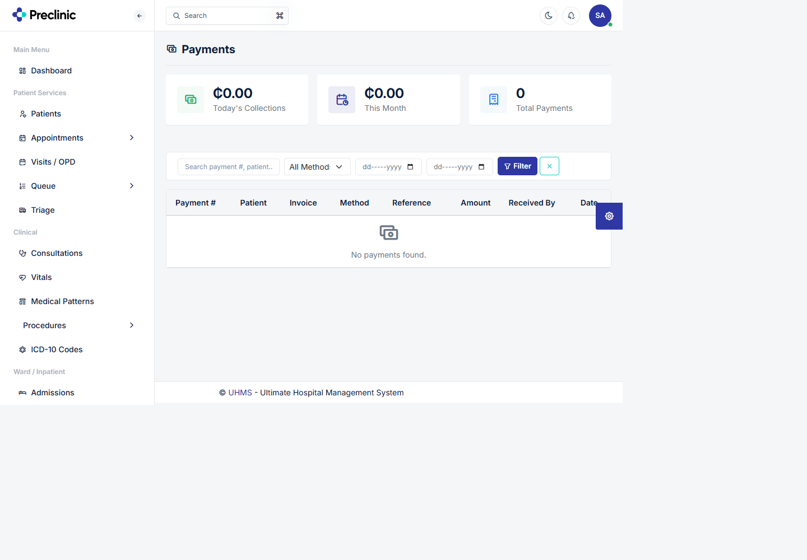

The Payments list records all transactions; receipts are printable per payment.

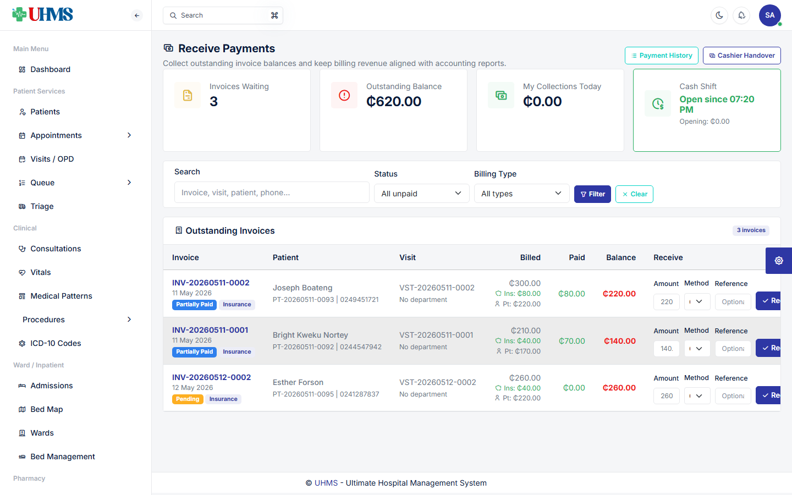

The Receive Payments page is the cashier-focused queue for unpaid and partially paid invoices.

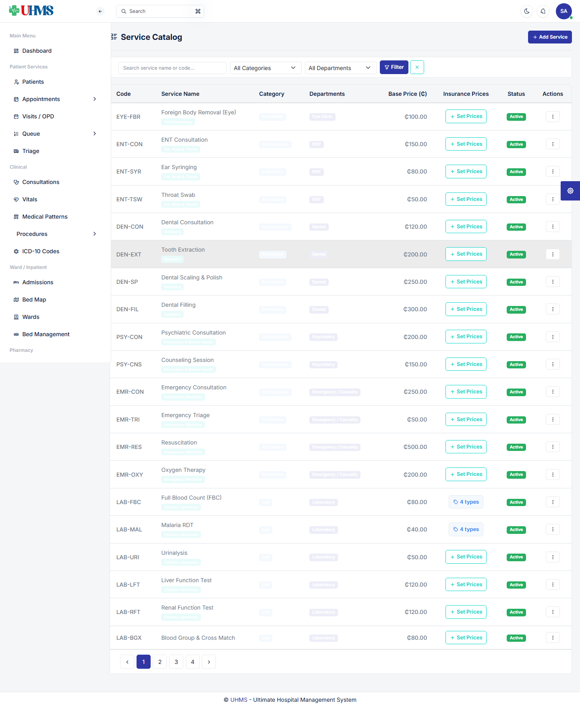

The Service Catalog defines billable services and price tiers (cash vs. insurance).

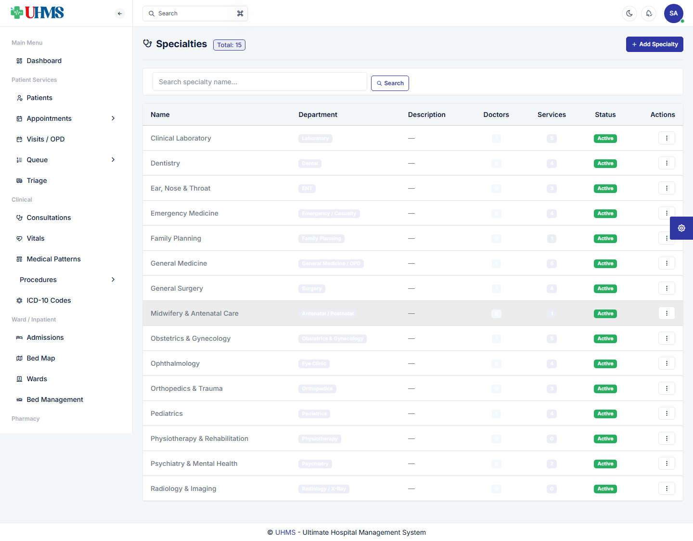

Specialties group services and departments by clinical discipline.

### 14.1 View invoices


The Invoices page centralizes billing status, outstanding balances, payments, and invoice actions.

1. Go to Billing > Invoices.
2. Filter by status, billing type, or search text.
3. Open an invoice to review items, patient, visit, payments, and totals.

### 14.2 Create or open the visit invoice

In the updated workflow, the visit's main invoice is created automatically when the visit is created. The Create Invoice form is mainly used for:

1. Reviewing or adjusting invoice items on the existing visit invoice.
2. Adding billable items that other departments did not auto-add.
3. Creating a one-off non-visit invoice where your facility policy allows it.

Steps:

1. Go to Billing > Invoices and open the visit's existing invoice (preferred), or use Create only when no visit invoice exists.
2. Review pre-populated items from visit services, accepted investigations, and dispensed pharmacy items.
3. Add or update items.
4. Save.

### 14.2.1 Apply a manual discount

Discounts are entered manually on the Invoice View page, per invoice item, by authorized users.

Rules:

- Discount cannot be negative.
- Discount cannot exceed `selected_price * quantity`.
- Discount is **not** the same as insurance covered.
- Discount is **never** auto-calculated.
- Applying a discount recalculates `patient_payable`, `balance`, `payment_status`, and the invoice totals.

Apply discounts through the Apply Discount action or the discount input on the invoice item row.

### 14.3 Receive payments as cashier

1. Go to Billing > Receive Payments.
2. Review the summary cards: invoices waiting, outstanding balance, collections today, and cash shift state.
3. Search or filter the unpaid invoice queue by patient, invoice, visit, status, or billing type.
4. Enter the amount to collect. The form defaults to the remaining balance.
5. Choose the payment method and enter a transaction reference when available.
6. Select Receive. UHMS updates the invoice balance, records the payment, and keeps the payment visible in Payment History and Daily Collection.

Cash is disabled when the cashier has no open shift. Open the shift from Accounts > Cashier Handover before accepting cash. Mobile money, card, bank transfer, cheque, and similar non-cash payments can still be recorded according to your facility policy. NHIS is not treated as a manual cashier collection method; it belongs in the claims workflow.

### 14.4 Record payment and payment allocation

Patients can pay while the visit is still ongoing. A single payment can clear:

- the full invoice,
- selected invoice items, or
- part of selected invoice items.

Payment allocation lets UHMS track which invoice lines are UNPAID, PARTIALLY_PAID, or PAID:

```text
Consultation Fee  — PAID
Full Blood Count  — PAID
Pharmacy Drugs    — PARTIALLY PAID
X-Ray             — UNPAID
```

Steps:

1. Open the invoice.
2. Use the payment form.
3. Enter amount, payment method, reference, and (where applicable) the items to allocate against.
4. Save the payment.
5. UHMS updates each affected item's `paid_amount`, `balance`, and `payment_status`, then the invoice totals.

**Payments never affect stock.**

### 14.5 Print invoice or receipt

1. Open the invoice or payment.
2. Use Print Invoice or Receipt actions where available.
3. Print/PDF links intentionally bypass SPA interception and open normally.

### 14.6 Service catalog and specialties

Use Service Catalog to maintain billable services and prices. Use Specialties to maintain clinical specialty groupings used in services, appointments, and departments.

### 14.7 Billing and accounting coherence

Patient money collected against invoices is stored as payments. Manual income and expenses are stored separately as financial entries. This keeps reports, handover, and reconciliation from counting the same revenue twice.

Use this rule of thumb:

| Situation | Use |
| --- | --- |
| Patient pays an invoice | Billing > Receive Payments or the invoice payment form |
| Cashier wants to see what they collected today | Billing > Payment History or Accounts > Daily Collection |
| Accountant records non-patient income | Accounts > Income |
| Accountant records operational expenses | Accounts > Expenses |
| Supervisor checks payment totals against shift cash | Accounts > Cashier Handover and Reconciliation |

## 15. Claims and Insurance

Claims modules handles insurer-funded patient care, from provider setup through to reimbursement.

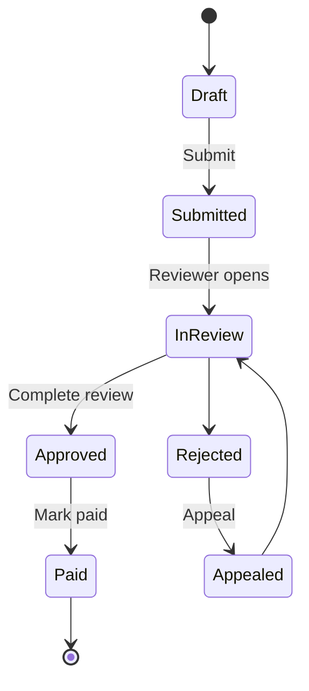
```mermaid
stateDiagram-v2
  [*] --> Draft
  Draft --> Submitted: Submit
  Submitted --> InReview: Reviewer opens
  InReview --> Approved: Complete review
  InReview --> Rejected
  Approved --> Paid: Mark paid
  Rejected --> Appealed: Appeal
  Appealed --> InReview
  Paid --> [*]
```

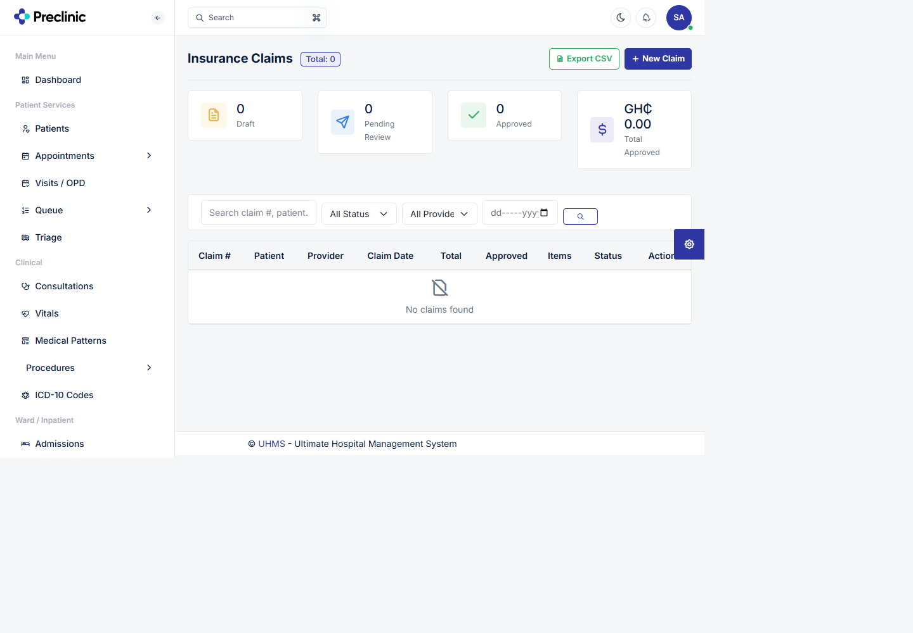

The Claims list lets officers filter by status, insurer, and patient and act per row.

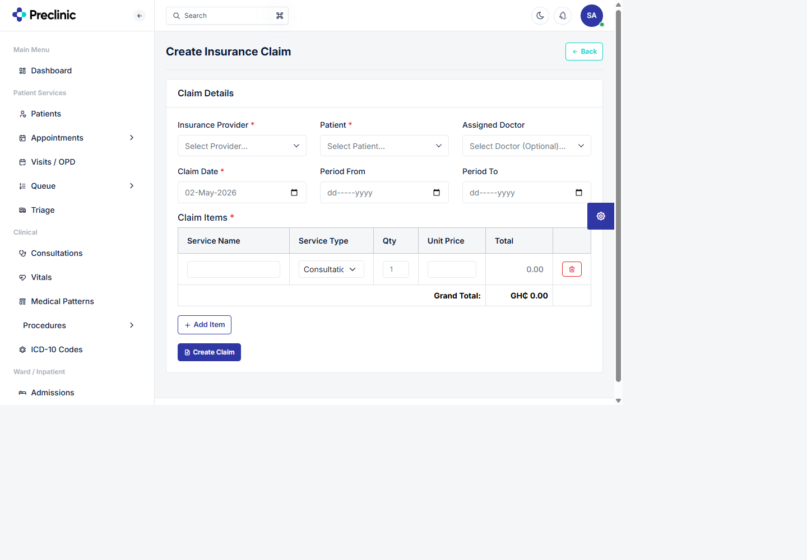

The New Claim form binds patient, insurer, and invoice into a submittable claim.

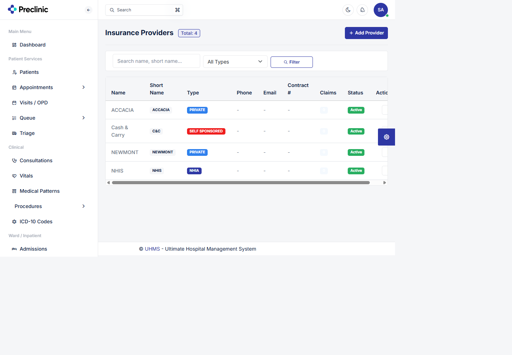

Insurance Providers maintains insurers and their tier structure.

> **NHIS is just one insurance type.** UHMS does not give NHIS special handling outside normal insurance configuration. Insurance pricing is applied consistently across all departments through the configured provider/tier, and the resolved insurance price feeds into the invoice item `selected_price` and `insurance_covered` fields (see [Section 14](#14-billing-and-payments)).

### 15.1 Insurance providers and tiers

1. Go to Claims & Insurance > Insurance Providers.
2. Add providers.
3. Manage tiers under each provider.
4. Toggle provider status if needed.

### 15.2 Create claim

1. Go to Claims & Insurance > New Claim.
2. Select patient, provider, invoice, or visit context as required.
3. Add claim items.
4. Save the claim.

### 15.3 Create claim from invoice

1. Open or locate an eligible invoice.
2. Use claim creation from invoice where available.
3. Review claim items before submitting.

### 15.4 Submit and review claim

1. Open a claim.
2. Submit the claim when ready.
3. Claim reviewers can open the review screen.
4. Review individual items.
5. Complete review.
6. Mark paid when reimbursement is received.
7. Appeal if applicable.

### 15.5 Export claims

Users with export permission can export claim data from the claims list.

## 16. Ward and Inpatient

The Ward module manages admissions, beds, rounds, and discharge.

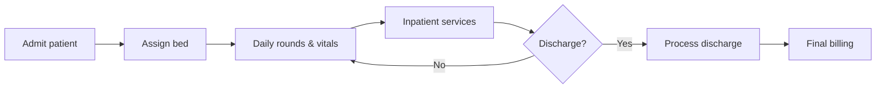
```mermaid
flowchart LR
  A[Admit patient] --> B[Assign bed]
  B --> R[Daily rounds & vitals]
  R --> S[Inpatient services]
  S --> D{Discharge?}
  D -->|Yes| Out[Process discharge]
  D -->|No| R
  Out --> Bill[Final billing]
```

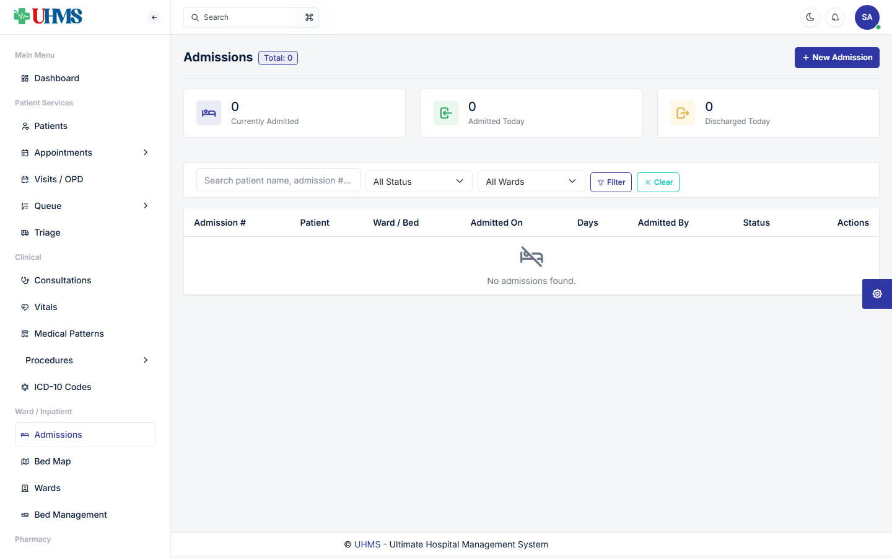

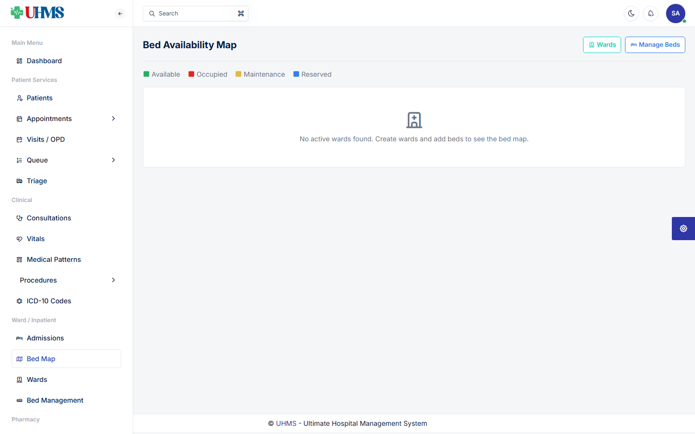

The Bed Map visualizes bed occupancy across wards.

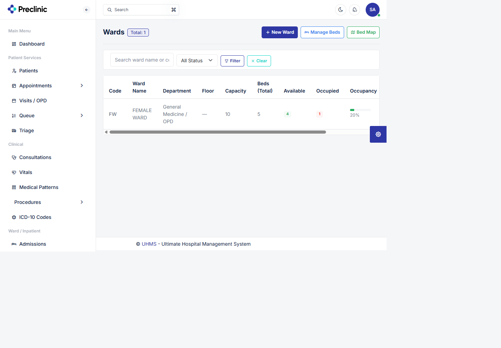

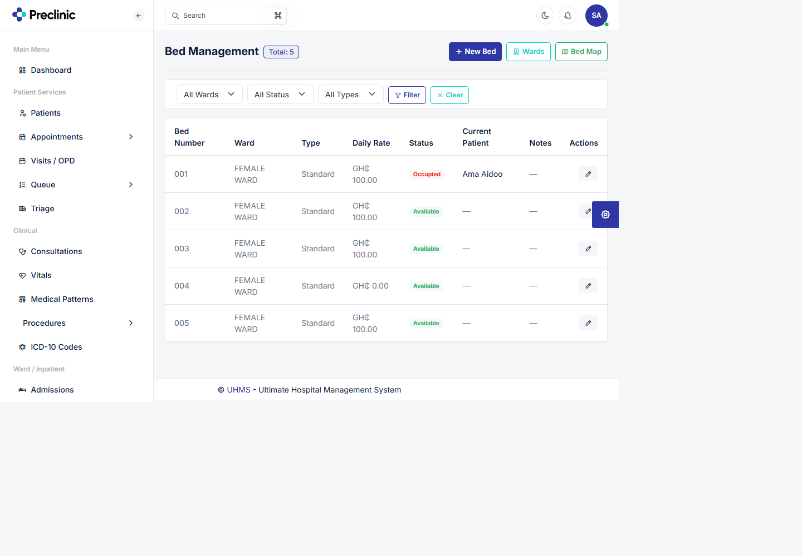

### 16.1 Admissions

1. Go to Ward / Inpatient > Admissions.
2. Select Create Admission when permitted.
3. Choose patient, ward, bed, admitting diagnosis, and admission details.
4. Save admission.
5. Open admission to review inpatient details.

### 16.2 Admission rounds, vitals, and services

From an admission record, permitted users can:

1. Add ward rounds.
2. Record inpatient vitals.
3. Add inpatient services.

### 16.3 Discharge

1. Open the admission.
2. Select Discharge.
3. Enter discharge details.
4. Process discharge.

### 16.4 Bed map and bed management

1. Use Bed Map to view bed occupancy.
2. Use Wards to manage wards.
3. Use Bed Management to add or update beds.

## 17. Procedures

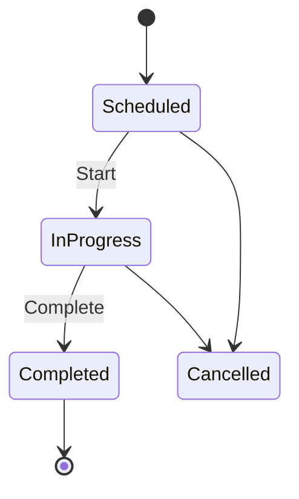
```mermaid
stateDiagram-v2
  [*] --> Scheduled
  Scheduled --> InProgress: Start
  InProgress --> Completed: Complete
  Scheduled --> Cancelled
  InProgress --> Cancelled
  Completed --> [*]
```

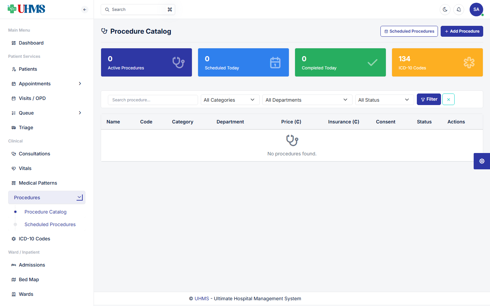

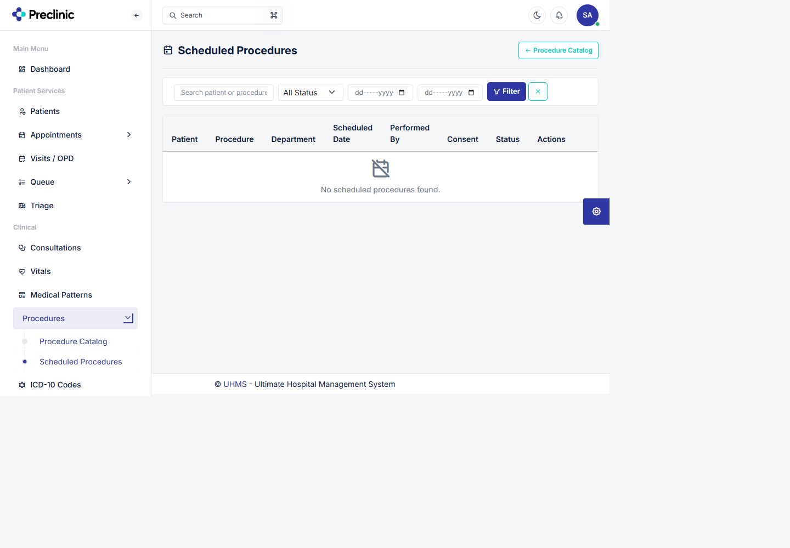

### 17.1 Procedure catalog

1. Go to Clinical > Procedures > Procedure Catalog.
2. Add, update, or toggle procedures.

### 17.2 Schedule procedure

1. Go to Clinical > Procedures > Scheduled Procedures.
2. Select Schedule.
3. Enter patient, procedure, date/time, and assigned staff details.
4. Save.

### 17.3 Start, complete, or cancel procedure

Use actions on scheduled procedures to move them through their workflow.

## 18. Store and Procurement

Procurement keeps both pharmacy and investigation stock supplied.

### Stock movement ledger model

UHMS uses a **stock movement ledger** as the source of truth. Product/drug quantity is never overwritten directly.

```text
stock_movements = source of truth
stock_balances  = fast current stock cache

Current Stock = Total IN movements - Total OUT movements
```

Movement types:

- `OPENING_STOCK`
- `PURCHASE_RECEIVED`
- `PHARMACY_DISPENSED`
- `TRANSFER_IN` / `TRANSFER_OUT`
- `RETURN_IN` / `RETURN_OUT`
- `ADJUSTMENT_IN` / `ADJUSTMENT_OUT`
- `DAMAGED`
- `EXPIRED`
- `REVERSAL_IN` / `REVERSAL_OUT`

**Do not delete old stock movements.** Correct mistakes with reversal movements (`REVERSAL_IN`/`REVERSAL_OUT`) or adjustments instead.

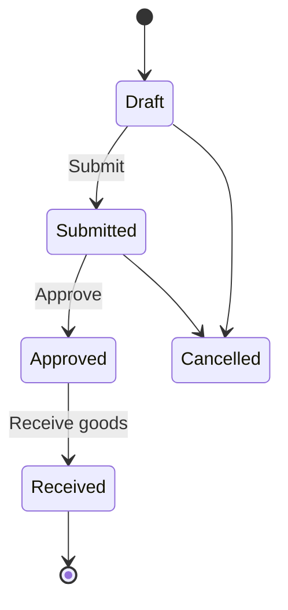
```mermaid
stateDiagram-v2
  [*] --> Draft
  Draft --> Submitted: Submit
  Submitted --> Approved: Approve
  Approved --> Received: Receive goods
  Submitted --> Cancelled
  Draft --> Cancelled
  Received --> [*]
```

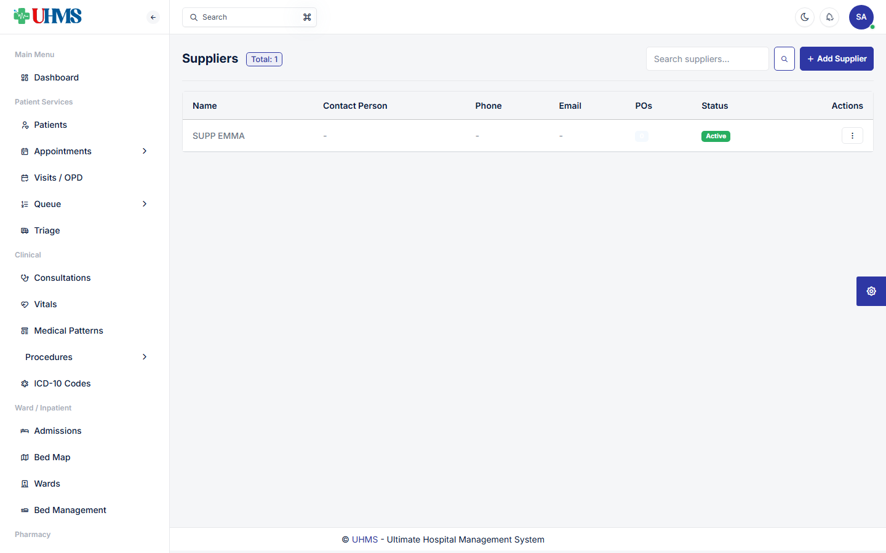

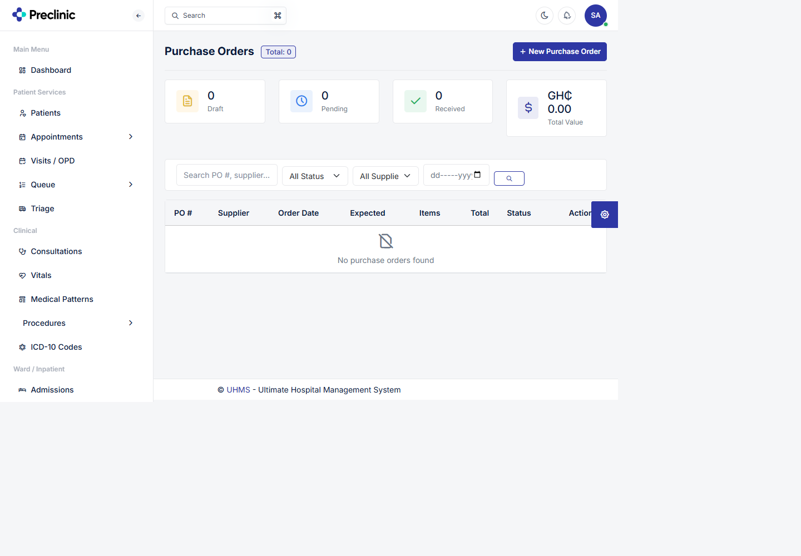


### 18.1 Suppliers

1. Go to Store & Procurement > Suppliers.
2. Add or update supplier information.
3. Toggle supplier active status where needed.

### 18.2 Purchase orders

Creating a purchase order does **not** automatically increase stock. Stock increases only when items are marked received — receiving creates `PURCHASE_RECEIVED` IN stock movements.

Purchase order statuses: pending, partially received, received, cancelled.

Steps:

1. Go to Purchase Orders.
2. Create a purchase order and add items.
3. Submit for approval.
4. Approver reviews and approves.
5. When goods arrive, receive them — fully or partially. Each receiving action creates `PURCHASE_RECEIVED` movements and updates stock balances.
6. Cancel the PO if necessary.

If saving a PO fails with “at least one item is required,” confirm the selected items are being sent to the backend.

### 18.3 Stock transfers

A completed transfer creates **two** stock movements linked to the same transfer record:

1. `TRANSFER_OUT` from the source location.
2. `TRANSFER_IN` into the destination location.

Rules:

- Source and destination must be different.
- Quantity must be greater than zero.
- Source must have enough stock.

Steps:

1. Go to Stock Transfers.
2. Create a transfer.
3. Select source and destination locations (e.g. Main Store → Pharmacy).
4. Add drug stock or investigation stock items with quantities.
5. Submit, approve, complete, or cancel according to workflow.

### 18.4 Stock returns

Returns are recorded as new stock movements; original movements are never deleted.

- `RETURN_IN` (direction IN) — stock comes back into a location.
- `RETURN_OUT` (direction OUT) — stock leaves a location, e.g. return to supplier.

### 18.5 Stock adjustments, damaged, and expired stock

Use adjustments when physical count differs from the system:

- `ADJUSTMENT_IN` or `ADJUSTMENT_OUT` — requires product/drug, location, type, quantity, reason, and an authorized user.

Damaged and expired stock are removed through dedicated OUT movements:

- `DAMAGED` (direction OUT)
- `EXPIRED` (direction OUT)

Corrections to earlier movements use reversal movements:

- Over-received 20 of 100 → `REVERSAL_OUT 20`.
- Wrongly dispensed 4 of 10 → `REVERSAL_IN 4`.

## 19. Accounts and Finance


```mermaid
flowchart TB
  Cat[Account categories] --> E[Expense entry]
  Cat --> I[Income entry]
  E --> Ap[Approve]
  I --> Ap
  Ap --> DC[Daily collection]
  Pay[Payments] --> DC
  DC --> H[Cashier handover]
  H --> Verify[Supervisor verify]
```


### 19.1 Account categories

Use Account Categories to classify income and expenses.

### 19.2 Expenses and income

1. Go to Expenses or Income.
2. Create an entry.
3. Enter category, amount, date, description, and supporting details.
4. Save entry.
5. Approve entries if you have approval permission.

Do not use manual income entries for patient invoice payments. Patient collections should be recorded through Billing so invoice balances, receipts, daily collections, and cashier shift totals stay aligned.

### 19.3 Daily collection

Use Daily Collection to review payments and collected revenue for a day or period. Patient payment totals come from Billing payments, while manual financial entries remain labeled separately.

### 19.4 Reconciliation

Use Reconciliation to compare expected collections with actual payments or handover records.

### 19.5 Cashier handover

1. Open Cashier Handover.
2. Open a cashier shift.
3. Collect cash payments only while the shift is open.
4. Close the shift at the end of the period and enter the actual cash counted.
5. A supervisor or authorized user verifies the shift.

## 20. HR and Payroll


```mermaid
flowchart LR
  Emp[Employees] --> Att[Attendance]
  Emp --> Lv[Leave requests]
  Lv --> Apr[Approve / Reject]
  Att --> Pay[Process payroll]
  Apr --> Pay
  Pay --> AppPay[Approve payroll]
  AppPay --> Mark[Mark paid]
  Mark --> Slip[Payslips]
```


### 20.1 Employees

1. Go to HR & Payroll > Employees.
2. Add employee records.
3. Open employee profiles to view or edit details.

### 20.2 Attendance

1. Go to Attendance.
2. Record attendance.
3. Review attendance summary.

### 20.3 Leave requests

1. Go to Leave Requests.
2. Create a leave request.
3. Approvers can approve or reject requests.

### 20.4 Payroll

1. Go to Payroll.
2. Process payroll.
3. Approve payroll when ready.
4. Mark payroll as paid.
5. Open payslips where available.

## 21. Reports

Reports aggregate operational and financial data into views you can review on screen or print.


### 21.1 Financial reports

Use Financial Reports for:

- Income Report
- Daily Collection
- NHIS Report
- Claims Report
- Patient Statement

### 21.2 Clinical reports

Use Clinical Reports for:

- Patient Report
- Visit Report
- Consultation Stats
- Admissions Report
- Discharges Report
- Investigation Revenue

### 21.3 Pharmacy and HR reports

Use Pharmacy & HR reports for:

- Pharmacy Sales
- Sales Summary
- Stock Valuation
- Expired Stock
- Leave Report
- Payroll Report

### 21.4 Printable documents

The system also supports printable clinical and operational documents such as consultation records, investigation reports, prescriptions, invoices, receipts, and patient statements where routes and permissions allow.

## 22. Administration


### 22.1 Users

1. Go to Administration > Users.
2. View all users.
3. Add a user.
4. Edit user details.
5. Toggle user active status.

### 22.2 Roles and permissions

1. Go to Administration > Roles & Permissions.
2. Create or update roles.
3. Open role permissions.
4. Assign permissions carefully.
5. Save changes.

Note: Removing permissions immediately changes what affected users can access.

### 22.3 Departments

Use Departments to manage clinical and operational departments.

Key department behavior:

- Active departments appear in relevant dropdowns.
- Departments that accept investigation requests appear in consultation investigation workflows.
- Department settings may affect routing and service availability.

### 22.4 Designations

Use Designations to manage staff job titles and classifications.

## 23. Settings and Modules


### 23.1 Organization settings

Use Organization settings to manage hospital or facility identity and organization-level information.

### 23.2 Invoice settings

Use Invoice Settings to configure invoice display, numbering, or related billing presentation settings where available.

### 23.3 Payment methods

Use Payment Methods to configure available payment options.

### 23.4 Activity log

Use Activity Log to review significant system actions.

### 23.5 Modules management


Administrators use Modules Management to control which optional feature groups are available in the sidebar and protected routes.

Modules control which optional feature groups are shown and available in navigation.

Core modules cannot be disabled:

- Authentication
- Users & Roles
- Patients
- Visits
- Triage
- Consultation
- Departments
- Services
- Billing
- Settings

Optional modules can be enabled or disabled:

- Insurance
- Claims, depends on Insurance
- Pharmacy
- Inventory/Store
- Investigations
- Analyzer, depends on Investigations
- HR
- Payroll, depends on HR
- Reports
- Medical Patterns
- Notifications

To manage modules:

1. Go to Settings > Modules.
2. Review enabled/disabled status.
3. Toggle a non-core module.
4. If disabling a module, disable dependent modules first.
5. If enabling a dependent module, enable its parent module first.
6. Flush module cache if menu visibility does not update as expected.

### 23.5.1 Safe fallback behavior

Disabling an optional module must not break the core visit workflow. Examples:

- **Insurance disabled** \u2192 Cash and Carry is used everywhere; insurance selection UI is hidden.
- **Pharmacy disabled** \u2192 prescriptions can still be recorded during consultation, but dispensing is unavailable and no `PHARMACY_DISPENSED` movements are created.
- **Analyzer disabled** \u2192 investigation results are entered manually using the Investigation Catalogue criteria.
- **Claims disabled** \u2192 invoices still record payments; no claim is created or submitted.

## 24. Notifications


Notifications alert users about clinical events, billing actions, claim status changes, stock alerts, and system messages.

### 24.1 Header notification dropdown

The header shows recent notifications and an unread badge.

Common actions:

1. Open the notification bell.
2. Select a notification to view related content.
3. Use Mark all read to clear unread notifications.

### 24.2 Notifications page

Go to Notifications to view a full list of notifications.

## 25. Profile and Password


All authenticated users can access their profile.

Typical actions:

1. Open the user menu in the header.
2. Select My Profile.
3. Update profile details.
4. Change password from the password section.

## 26. Recommended Operational Workflows

### 26.1 Standard OPD walk-in flow

1. Reception registers or finds patient.
2. Reception creates visit.
3. Patient is queued for triage.
4. Nurse records vitals and triage details.
5. Patient is assigned to consultation.
6. Doctor performs consultation.
7. Doctor may prescribe medication, request investigations, refer, admit, or complete visit.
8. Billing creates or reviews invoice.
9. Patient pays or invoice is routed for insurance/claims.
10. Pharmacy dispenses prescribed drugs if applicable.
11. Investigation department processes requests if applicable.
12. Visit is completed after care and billing workflow are done.

### 26.2 Appointment-to-visit flow

1. Reception schedules appointment.
2. Staff confirms appointment.
3. Patient arrives.
4. Staff checks in appointment.
5. UHMS creates linked visit.
6. Visit continues through triage, consultation, billing, and any downstream workflows.

### 26.3 Consultation-to-investigation flow

1. Doctor opens consultation.
2. Doctor selects target investigation department.
3. Doctor selects tests/items and submits request.
4. Investigation staff accepts request.
5. Results are entered and optionally verified.
6. Doctor reviews completed results from the consultation or patient history.

### 26.4 Prescription-to-dispensing flow

1. Doctor creates prescription during consultation.
2. Pharmacist opens dispensing queue.
3. Pharmacist reviews prescription items.
4. Pharmacist dispenses individual items or batch dispenses.
5. Stock records and dispensing history are updated according to configured workflow.

### 26.5 Invoice-to-payment flow

1. Accountant or cashier creates invoice or opens an existing invoice.
2. User records payment.
3. UHMS updates invoice status.
4. Receipt can be opened or printed.
5. Fully paid visits may move toward completion depending on workflow rules.

### 26.6 Insurance claim flow

1. Patient has insurance configured.
2. Invoice is created for covered services.
3. Claim is created manually or from invoice.
4. Claim is submitted.
5. Claim officer reviews items.
6. Claim is marked paid, appealed, or otherwise followed up.

## 27. Troubleshooting for Users

### 27.1 I cannot see a menu item

Possible reasons:

- Your role lacks the required permission.
- The module is disabled.
- Your user account is inactive.
- The page is restricted to a different role.

Ask an administrator to check Roles & Permissions and Settings > Modules.

### 27.2 Page did not update after an action

1. Check for success or error alerts.
2. Refresh the page if needed.
3. If using the PWA install, confirm network connectivity.
4. Report persistent issues to system support.

### 27.3 Offline message appears

The network is unavailable or the server cannot be reached. Reconnect and refresh before entering or saving data.

### 27.4 A print or PDF link opens outside the SPA flow

This is expected. Print and PDF views use normal browser navigation so they can open printable pages reliably.

### 27.5 Appointment calendar shows no records

1. Check the selected week.
2. Clear doctor and department filters.
3. Confirm appointments exist for that date range.
4. Confirm your role has appointment view permission.

## 28. Current Implementation Notes

- The system uses role and permission based access control.
- Sidebar visibility is controlled by both permissions and module status.
- Most existing Blade pages are served through a legacy Inertia/Vue bridge for SPA-style navigation.
- Some backend routes still use old names such as `lab`, but the user-facing language is Investigation.
- The PWA currently provides install metadata, static asset caching, and an offline information page. It does not provide offline clinical data entry.
- Print, export, and PDF actions may use full-page browser behavior by design.

## 29. Quick Reference by Department

### Reception

- Register patients.
- Schedule appointments.
- Check in appointments.
- Create visits.
- Manage queues.
- View invoices where permitted.

### Nursing

- Manage triage queue.
- Record vitals.
- Update visit priority.
- Assign patients for consultation.
- View ward/bed information where permitted.

### Doctors

- Open consultations.
- Record complaints, diagnoses, treatments, and prescriptions.
- Request investigations.
- Refer patients.
- View patient history.
- Use medical patterns.

### Investigation staff

- View investigation request queue.
- Accept requests.
- Enter and verify results.
- Maintain test catalog and investigation stock where permitted.
- Manage analyzer diagnostics where permitted.

### Pharmacy

- View prescriptions.
- Dispense medications.
- Maintain drug catalog.
- Manage stock and alerts.

### Billing and accounts

- Create invoices.
- Record payments.
- Print invoices and receipts.
- Manage account entries.
- Review daily collection and reconciliation.
- Manage cashier handover.

### Claims

- Manage insurance providers and tiers.
- Create and submit claims.
- Review claim items.
- Mark claims paid or appeal.
- Export claim data.

### Store

- Manage suppliers.
- Create and approve purchase orders.
- Receive purchases.
- Manage stock transfers.

### HR

- Manage employees.
- Record attendance.
- Manage leave.
- Process payroll.

### Administrators

- Manage users and roles.
- Manage departments and designations.
- Configure organization, invoices, and payment methods.
- Review activity logs.
- Enable or disable modules.

## Regenerating screenshots

The screenshots in this manual under `docs/user-manual/screenshots/` are produced by a Playwright-based capture script and should be refreshed whenever the UI changes meaningfully.

### Prerequisites

1. Install Node dependencies: `npm install`.
2. Install the Playwright Chromium browser once: `npx playwright install chromium`.
3. Have UHMS running locally (e.g. `php artisan serve`) and reachable from the URL you pass to the script.
4. Use a non-production database seeded with demo data — never run captures against a database with real patient data.

### Run the capture

```bash
npm run screenshots
```

### Configuration via environment variables

| Variable          | Default                  | Purpose |
| ----------------- | ------------------------ | ------- |
| `UHMS_URL`        | `http://127.0.0.1:8000`  | Base URL of the running app |
| `UHMS_EMAIL`      | `admin@uhms.local`       | Login email used to authenticate |
| `UHMS_PASSWORD`   | `password`               | Login password (do **not** commit real credentials) |
| `UHMS_HEADFUL`    | unset                    | Set to `1` to watch the browser |
| `UHMS_SKIP_LOGIN` | unset                    | Set to `1` to skip the login step (e.g. for public pages only) |

Example:

```powershell
$env:UHMS_URL = "http://127.0.0.1:8000"
$env:UHMS_EMAIL = "admin@uhms.local"
$env:UHMS_PASSWORD = "password"
npm run screenshots
```

### Behavior and rules

- The script tries the documented URL first (e.g. `/visits/create`), then falls back to the actual UHMS route (e.g. `/admin/visits/create`).
- Pages that 404 or redirect to login are logged and skipped — the script does not abort on a missing route.
- Captures use a fixed 1440×900 viewport with `fullPage: true` for consistent output.
- The script never commits credentials. Use environment variables (or a local `.env`-style shell setup) and seed/demo data only.


---

# Appendix M — Workflow Update (May 2026)

This appendix consolidates the workflow changes introduced in the May 2026 release. It complements the numbered sections above; existing instructions remain valid unless explicitly superseded here.

> **Screenshot note.** Several screens covered in this appendix (MAR Chart, Theatre Rooms board, Emergency Case detail, Patient Folder Merge) have been redesigned and the existing screenshots may not reflect the latest layout. Rerun the capture script — see [Regenerating screenshots](#regenerating-screenshots) — to refresh them after the new UI stabilises in your environment.

## M.1 Patient Folder Merge

**Who uses it:** Records officers, ward managers, supervisors with the `patients.merge` permission.

**Where:** Sidebar → Patients → Merge folders (also reachable from an Emergency Case detail when a temporary patient is later identified).

### Use cases

- A temporary emergency patient is later identified as a known patient.
- Duplicate patient folders were created accidentally during registration.

### Step by step

1. Open **Patients → Merge folders**.
2. Search the **main folder** you want to keep.
3. Search the **duplicate / temporary folder** to merge into it.
4. Compare the two folders side by side.
5. For each demographic field (name, DOB, phone, NHIS, etc.) pick the value to keep on the main folder.
6. Click **Preview affected records** to see every visit, invoice, admission, emergency case, claim, prescription, lab result, and document that will be moved.
7. Enter the reason and click **Confirm merge**.
8. The duplicate folder is locked and from now on opening its number redirects to the main folder.

### Rules

- The duplicate folder is **never deleted** — it is locked, flagged `MERGED`, and remains searchable by its old patient number.
- All visits, emergency cases, admissions, invoices, payments, claims, prescriptions, investigations, procedures and documents are moved to the main folder.
- Only users with the `patients.merge` permission can perform a merge.
- A merge cannot be undone from the UI; an administrator with database access is required to reverse it.

### Confirming an emergency patient's identity

From an Emergency Case detail page:

1. Click **Confirm identity**.
2. Search the real patient by name, phone, NHIS or patient number.
3. Review the comparison and confirm.
4. The temporary folder is merged into the real folder; the emergency case, its triage, vitals, MAR doses, investigations and bills move with it.

---

## M.2 Emergency Case Management

UHMS supports three patient pathways:

| Pathway | When to use |
| --- | --- |
| **OPD / Visit** | Routine outpatient care |
| **Admission** | Inpatient care that requires a bed |
| **Emergency** | Urgent or critical care that cannot wait |

**Where:** Sidebar → Emergency.

### Workflow

1. **Create case** → choose an existing patient, or capture an **unknown / temporary patient**.
2. Record **arrival details** (mode of arrival, accompanying persons, presenting complaint).
3. Perform **triage** — see [M.4](#m4-emergency-triage-and-vitals).
4. Assign a **bay / bed** and a **team** — see [M.5](#m5-bay--bed-and-team-assignment).
5. **Start an emergency clinical session**.
6. Record assessment / emergency notes.
7. Request **investigations** and **procedures**.
8. Order / administer **medication** and use the **MAR** — see [M.7](#m7-emergency-medication--mar).
9. Record **consumables** used during care.
10. Review the visit invoice in **Billing**.
11. Record the patient's **disposition** to close the case.

### Case statuses

`ARRIVED → WAITING_TRIAGE → TRIAGED → UNDER_EMERGENCY_CARE → OBSERVATION → READY_FOR_DISPOSITION → DISPOSED`

`CANCELLED` is also possible.

### Disposition options

- Admitted
- Discharged
- Transferred to OPD
- Transferred to Theatre
- Referred out
- Left against medical advice
- Absconded
- Died
- Dead on arrival

> **Important.** Emergency care must not be blocked because payment has not been made. Triage, vitals, medication, investigations and procedures may all be recorded before any bill is settled.

---

## M.3 Emergency as a Consultation Session

When a patient passes through Emergency, UHMS creates an **Emergency Session** under the visit. This session appears alongside other consultation sessions, so the next doctor who sees the patient — whether on the ward, in OPD or in clinic — can read the full emergency history before continuing care.

The Consultation page can therefore display any of:

- Emergency Session
- OPD Session
- Dental Session
- ENT Session
- Admission Review Session

An Emergency Session contains:

- Triage and vitals
- Emergency notes / assessment
- Medications and the MAR for those doses
- Investigations
- Procedures
- Consumables used
- Billing references
- Disposition

This gives a single, continuous clinical history across emergency, outpatient and inpatient care, improves visit previews, supports cleaner claims preparation and provides true continuity of care.

---

## M.4 Emergency Triage and Vitals

**Who uses it:** Triage nurses, emergency nurses.

### Automatic triage suggestion

Triage category is auto-suggested from vitals and red-flag inputs:

- Temperature
- Pulse / heart rate
- Respiratory rate
- Blood pressure
- Oxygen saturation (SpO₂)
- AVPU / consciousness
- Pain score
- Danger signs (severe bleeding, seizure, respiratory distress, trauma)

### Categories

| Code | Meaning |
| --- | --- |
| **RED** | Immediate / resuscitation |
| **ORANGE** | Very urgent |
| **YELLOW** | Urgent |
| **GREEN** | Less urgent |
| **BLACK** | Dead on arrival / expectant |

### Manual override

Authorised users may override the suggested category. A **reason is required** and is stored in the audit log.

### Vitals display

The case detail and ward round screens show:

- Latest vitals as cards
- Vitals history table
- Vitals trend chart
- Who recorded each set, and when

---

## M.5 Bay / Bed and Team Assignment

### Assigning a bay / bed

1. Choose the **emergency ward / unit**.
2. Pick an **available bay or bed**.
3. Confirm assignment.

### Assigning a team

1. Set the **main emergency doctor**.
2. Set the **primary nurse**.
3. Add any number of **contributors** (other doctors, residents, support nurses).

Contributors can add records (notes, medication, procedures) without replacing the main doctor or nurse.

### Bed / bay statuses

`Available | Occupied | Cleaning | Out of service | Reserved`

A bay marked **Occupied** cannot be assigned to another patient until the patient is moved or discharged from it.

---

## M.6 Admission Medication Administration / MAR

**Who uses it:** Ward nurses, doctors, pharmacy.

### Three different steps

| Step | What it means |
| --- | --- |
| **Prescription** | What the doctor ordered |
| **Dispensing** | What pharmacy supplied to the ward |
| **Administration** | What the nurse actually gave to the patient |

### Workflow

1. Doctor prescribes a medication on the consultation / ward round screen.
2. Pharmacy reviews and **dispenses** the prescribed quantity.
3. UHMS generates the administration **schedule** (one row per dose).
4. The clinical tasks board and topbar bell notify the nurse when doses are **DUE** or **OVERDUE**.
5. Nurse records each dose from the MAR Chart.
6. Order progresses until all doses are complete.

### Order statuses

`Pending dispensing | Partially dispensed | Dispensed | Active administration | Completed | Held | Stopped | Cancelled | Expired`

### Dose statuses

`Scheduled | Due | Overdue | Given | Held | Missed | Refused | Skipped | Cancelled`

> **Important.** Nurse administration does **not** reduce stock again if pharmacy already dispensed the medication for that patient. Stock leaves pharmacy on dispense; administration is a clinical action, not a stock movement.

---

## M.7 Emergency Medication / MAR

Emergency supports:

- **STAT** medication (give once, immediately)
- **PRN / SOS** medication (give as needed)
- **Scheduled** medication (e.g., BD × 3 days)
- Immediate administration at the bedside
- Stock sourced directly from the **Emergency stock location**
- A MAR chart per emergency case

### Stock rule

| Source of medication | Stock impact |
| --- | --- |
| Administered from **Emergency stock** | Stock is deducted **once** from Emergency stock at administration. |
| **Dispensed by Pharmacy** for the patient | Stock leaves Pharmacy at dispense; administration does **not** deduct stock again. |

### Notes

- Medication search comes from **Products** (the unified catalogue). There is no separate "drug list".
- Quantity for scheduled orders is computed automatically from frequency × duration. For example: `BD for 5 days = 10 doses`, `TDS for 3 days = 9 doses`.

---

## M.8 Clinical Tasks and Reminders

**Where:** Sidebar → Clinical Tasks (also visible inside Admission and Emergency case detail pages).

Tasks are auto-created and visible to the assigned user, role or department for:

- Medication administration
- Vitals monitoring
- Wound dressing
- Blood sugar / BSL check
- Doctor review
- Investigation follow-up
- Procedure preparation
- General nursing observations

### Statuses

`Scheduled | Due | Overdue | In Progress | Completed | Missed | Held | Refused | Cancelled`

### Due / overdue alerts

- Due tasks appear on the topbar bell and on the clinical tasks board.
- Tasks not actioned within their window become **Overdue** and may be escalated to the charge nurse or department.

---

## M.9 MAR Chart

The **MAR Chart** is a per-patient medication administration grid. It is **not** a statistical chart.

### Layout

- **Rows** = active medications
- **Columns** = scheduled dose times
- **Cells** = dose status (Scheduled, Due, Given, Held, Missed, …)

### How to use a cell

| Cell shows | Action |
| --- | --- |
| **Due** or **Overdue** | Click to open the administration modal and record the dose |
| **Given / Held / Missed / Refused** | Click to view details (who, when, notes) |
| **PRN / SOS row** | Listed separately below the scheduled grid; click **Give now** to record |

### Print

Click **Print MAR** to print the chart for the bedside chart binder.

### Where MAR can be opened

- Admission Board
- Admission detail page
- Emergency Board
- Emergency Case detail page
- Visit preview

A legend at the top of the chart explains the colour codes.

---

## M.10 Consultation Workflow Updates

Consultations follow this clinical order:

1. Vitals / patient summary
2. Complaints
3. History of presenting complaint (HOPC)
4. Examination / physical examination
5. Diagnosis
6. Investigations
7. Treatments / prescriptions
8. Procedures
9. Tasks / follow-up / instructions
10. Notes / summary

### Record ownership

- Records are **grouped by the doctor or user** who entered them.
- Contributors are listed under the main doctor; the main doctor of a session is **not** overwritten when another user adds a record.
- A user can edit only the records their role permits them to edit.

### Emergency Session in Consultation

If the patient passed through Emergency on this visit, the **Emergency Session** appears at the top of the sessions list so the consulting doctor sees emergency history before continuing.

---

## M.11 Consultation Summary (Document View)

The Consultation Summary page is designed like a **readable clinical document**, not a form.

It shows, in order:

- Patient and visit header
- Session details (type, start/end, status)
- Main doctor and contributors
- Complaints
- HOPC
- Examination
- Diagnoses
- Investigations (with results when verified)
- Treatments / prescriptions
- Procedures
- Tasks / follow-up
- Notes
- Record owners and date/time stamps

The page must not hide important information; collapsing blocks are avoided. Use the **Print** button (where shown) to produce a paper-friendly copy.

---

## M.12 Investigations (Consultation & Emergency)

The investigation workflow is the same for consultation, admission and emergency requests:

1. Select the **investigation department** (Lab, X-ray, Scan, CT, Ultrasound, ECG, …).
2. Select the **service / items**.
3. Add a **clinical reason**.
4. Submit the request.
5. The department **accepts** the request.
6. Results are **entered**.
7. Results are **verified** by an authorised user.
8. The requesting doctor sees verified results in the consultation / case.

Emergency requests can additionally be marked **Emergency**, **Urgent** or **Routine** to drive queueing.

Investigations are grouped by department and owner. Consumables used by the investigation department are deducted from that department's stock — see [M.16](#m16-ward--emergency--investigation--procedure-consumables).

---

## M.13 Procedures and Theatre

### Request workflow

1. A doctor requests a procedure from a consultation, admission or emergency case.
2. Theatre / Procedure team **accepts** the request.
3. A **billing item** is created (if applicable).
4. Theatre **schedules** the case — see [M.14](#m14-theatre-rooms-management).
5. **Pre-op** is completed (checklist, consent, fasting).
6. **Anaesthesia note** is recorded.
7. The surgeon enters the **operative note**.
8. **Recovery / post-op** note is recorded.
9. The case is **completed**.

Billing is recorded separately from the clinical procedure section. Cancelling the clinical record does not by itself reverse a posted invoice item.

---

## M.14 Theatre Rooms Management

**Where:** Sidebar → Theatre.

### Theatre rooms

- Create, edit and retire rooms with their type (Major, Minor, Endoscopy, …) and capacity.
- Each room has a status — see below.
- Rooms can be **blocked** for cleaning, maintenance or reservation.

### Boards

| Screen | What it shows |
| --- | --- |
| **Theatre board** | Today's cases per room |
| **Room calendar** | Week / day calendar for each room |

### Scheduling

1. Open a procedure / theatre case.
2. Pick a room and a time slot.
3. UHMS prevents double-booking the same room and time window.
4. A blocked room cannot be scheduled.

Emergency theatre cases follow the same flow but are flagged urgent and can be inserted into the next available slot.

### Theatre case statuses

`Requested → Accepted → Billed → Scheduled → Pre-op → Anaesthesia Ready → In Theatre → In Surgery → Surgery Done → Recovery → Post-op → Completed`

`Cancelled` and `Postponed` are also possible.

### Room statuses

`Available | Occupied | Scheduled | Cleaning | Maintenance | Out of service | Reserved`

### What is captured per case

- Theatre team (surgeon, assistant, anaesthetist, nurse)
- Pre-op checklist
- Anaesthesia note
- Operative note
- Recovery / post-op note
- Consumables used
- Billing items
- Summary visible in the visit preview

---

## M.15 Pharmacy — Bill Before Dispense

The pharmacy now supports billing drugs **before** they are dispensed. This avoids the patient leaving without their drugs after payment and gives pharmacy full control over what is finally supplied.

### Workflow

1. Doctor prescribes drugs.
2. Pharmacy opens the prescription and **reviews** it.
3. Pharmacy **selects which drugs to bill / dispense** and can **reduce quantities**.
4. Only the selected drugs are **billed** to the visit invoice.
5. Only the **billed** drugs appear on the **dispense** page.
6. Dispensing **reduces pharmacy stock**.

> **Important.** Billing is financial. Dispensing is the physical stock movement. Billing a drug does not reduce stock; dispensing does.

### Pharmacy catalogue display

For each drug the catalogue shows:

- Pharmacy available quantity (Pharmacy stock location)
- Main store quantity (Main Store stock location)
- Stock status (OK / LOW / CRITICAL / OUT / NOT STOCKED)

---

## M.16 Ward / Emergency / Investigation / Procedure Consumables

Each clinical area records the consumables it uses against the patient's visit:

| Area | Stock location consumed | Where to record |
| --- | --- | --- |
| **Ward** | Ward stock location | Admission detail → Consumables |
| **Emergency** | Emergency stock location | Emergency case → Consumables |
| **Investigation** | Department stock location (Lab, X-ray, …) | Investigation request → Consumables |
| **Procedure / Theatre** | Theatre stock location | Theatre case → Consumables |

### Rules

- Departments choose products from the **unified product catalogue**; they cannot create new products themselves.
- Usage deducts stock from the **department's own stock location**.
- **Billable** consumables also create an item on the visit invoice.
- **Non-billable** consumables only create a stock movement.

---

## M.17 Unified Product Stock & Stock Balance Matrix

Every physical item the hospital handles comes from **Products** — there is no parallel drug, consumable or theatre-item table.

This includes:

- Drugs
- Consumables
- Investigation items
- Procedure items
- Theatre consumables
- Emergency supplies
- Ward supplies

### Main Store rule

- Purchase receipts always land in **Main Store**.
- Departments receive stock via **requisition / transfer** from Main Store.
- Departments consume only from **their own stock location**.

### Stock Balance Matrix

The matrix shows current quantities per location:

```
Product | Main Store | Pharmacy | Ward | Emergency | Lab | Theatre | Total | Status
```

- The row is **not highlighted yellow** for low stock.
- Status is shown **beside each location quantity**.
- Statuses: `OK`, `LOW`, `CRITICAL`, `OUT`, `NOT STOCKED`.

> **Important.** Stock is never edited directly. Current quantity for a product at a location is computed from stock movements: `IN movements − OUT movements`.

---

## M.18 Insurance Type-based Claims & NHIA/NHIS

UHMS distinguishes between:

| Concept | Meaning |
| --- | --- |
| **Insurance Type** | The claim workflow (e.g., NHIA, Private cash insurance, Corporate) |
| **Insurance Provider** | An organisation operating under a type (e.g., NHIS under NHIA) |

### NHIA / NHIS claim preparation

1. A claims officer opens an **eligible visit**.
2. UHMS prepares a claim from the visit's invoice items.
3. The officer reviews the **clinical mirror** (read-only copy of the clinical record).
4. The officer may select doctor-entered information or enter **claim-facing** values without touching the clinical record.
5. The CCC / verification code is entered if required.
6. The claim is **validated**.
7. The claim is marked **Ready**.
8. The claim is **exported / submitted**.
9. Claim status and payment are tracked from the Claims dashboard.

### Clinical mirror

The claim's clinical mirror shows:

- Consultation
- Complaints
- HOPC
- Diagnosis
- Prescriptions / drugs
- Investigations
- Procedures
- Invoice items

> **Important.** Editing the claim never overwrites the clinical record. Claim-side edits live on the claim only.

---

## M.19 Billing Updates

One visit produces one invoice — see the principles at the top of this manual. Items on that invoice can come from:

- Visit services (consultation fee, etc.)
- Emergency services
- Investigations
- Pharmacy
- Procedures / Theatre
- Consumables (Ward / Emergency / Investigation / Theatre)
- Admission / ward charges

Per invoice item UHMS tracks:

- Cash price
- Insurance price
- Selected price (the one that applies)
- Patient payable
- Paid amount
- Balance
- Discount (manually entered by an authorised user)

Payments may cover one or more invoice lines partially or in full. Allocations are visible on the payment receipt and on the invoice.

---

## M.20 Notifications

**Where:** Bell icon in the topbar (also Sidebar → Notifications), and per-user preferences at **Profile → Notification preferences**.

Notifications are used for:

- Emergency alerts (new red triage, bay assignment)
- Medication **Due** / **Overdue** doses
- Clinical tasks
- Investigation results ready
- Procedure / theatre updates
- Stock alerts (low / out)
- Claims status changes
- Patient merge requests
- Billing / payment alerts

### Topbar bell

- Shows an unread count badge.
- Each item shows a module chip (e.g., `PHARMACY`) and a priority badge (when not Normal).
- Click an item to open the related screen and mark it read.
- **Mark all as read** clears the badge.

### Preferences (per user)

For each module you can choose:

- **Channels** — `database` (in-app), `broadcast` (real-time), `mail`, `sms`. In-app is always on.
- **Digest mode** — defer non-urgent alerts.
- **Quiet hours** — a window during which non-urgent alerts are deferred until the window closes.

Urgent and Critical notifications **bypass** digest and quiet hours.

### Broadcast (admin)

Users with `notifications.broadcast` can send a notification to a role, a permission group, or a department from **Admin → Notifications → Broadcast**.

### Targeting rule

You only receive notifications relevant to your role, permission or department assignment.

---

## M.21 Logs / Audit Trail

**Where:** Sidebar → Logs (requires `logs.view`); retention at **Admin → Logs → Retention** (`logs.manage_retention`).

UHMS tracks an immutable audit trail of:

- Who did what
- When it happened
- Which record was affected
- Old and new values (where applicable)
- Reason for a correction or override
- Module / source

### Coverage

Logs exist for:

- Clinical actions (consultation, prescription, MAR, investigation results)
- Financial actions (invoice, payment, refund, discount, write-off)
- Stock actions (in, out, adjustment, transfer)
- Emergency
- Admission and discharge
- Theatre
- Patient folder merges
- Security / authentication (login, logout, failed login, password reset, password change)
- User and permission changes

### Permission scoping

The `/admin/logs` viewer hides modules a user cannot see. Sub-permissions:

| Permission | Sees |
| --- | --- |
| `logs.view_clinical` | Patient, admission, pharmacy, investigation, emergency |
| `logs.view_financial` | Billing, payments, insurance, claims |
| `logs.view_stock` | Stock, procurement |
| `logs.view_security` | Auth, users, roles, patient merge |
| `logs.export` | CSV / JSON export |
| `logs.manage_retention` | Per-module retention overrides |

### Retention

Default retention is configurable (default 365 days). Per-module overrides can be set under **Admin → Logs → Retention** with a reason. A scheduled cleanup purges rows past their retention window.

### Sensitive fields

Passwords, tokens and similar secrets are automatically masked as `***MASKED***` in log entries.

---

## M.22 New / Updated Reports

The following reports are new or have been updated:

### Emergency

- Emergency attendance
- Triage category distribution
- Waiting time
- Disposition outcomes
- Mortality
- Emergency medication usage

### MAR

- Medication administration
- Overdue medication
- Missed doses
- Administrations per nurse

### Theatre

- Room utilisation
- Procedures by surgeon
- Cancelled / postponed cases
- Theatre consumables usage
- Anaesthesia report

### Stock

- Stock balance matrix
- Low / out of stock
- Department stock
- Movement history
- Requisitions and transfers

### Claims

- Submitted claims
- Rejected claims
- Paid claims
- NHIA / NHIS claims

Reports respect the same role / module / permission filters as the rest of UHMS.

---

### Screenshots to regenerate

The following sections likely need fresh screenshots after the May 2026 redesign:

- Emergency Board and Emergency Case detail
- MAR Chart (admission and emergency)
- Clinical Tasks board
- Theatre rooms list, theatre board and room calendar
- Patient Folder Merge (search → compare → preview → confirm)
- Notifications topbar bell with module / priority chips
- `/admin/logs` viewer with module column and retention page
- Pharmacy bill-before-dispense page
- Consultation Summary document view

Use `npm run screenshots` after the UI stabilises in your environment — see [Regenerating screenshots](#regenerating-screenshots).

### Assumptions and unclear areas

- The exact label "Confirm identity" on the Emergency Case detail is documented based on the current implementation; verify after the next UI polish pass.
- Exported claim formats are vendor-specific; only the in-app workflow is documented here.
- Broadcast (real-time) notifications require a broadcaster (`BROADCAST_CONNECTION`) to be configured; without one, only in-app and email/SMS (if configured) are delivered.

