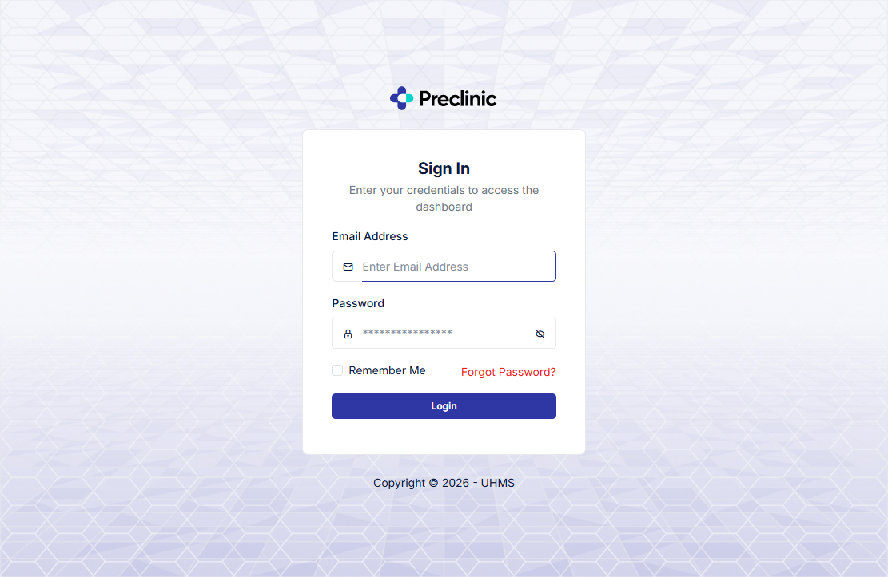
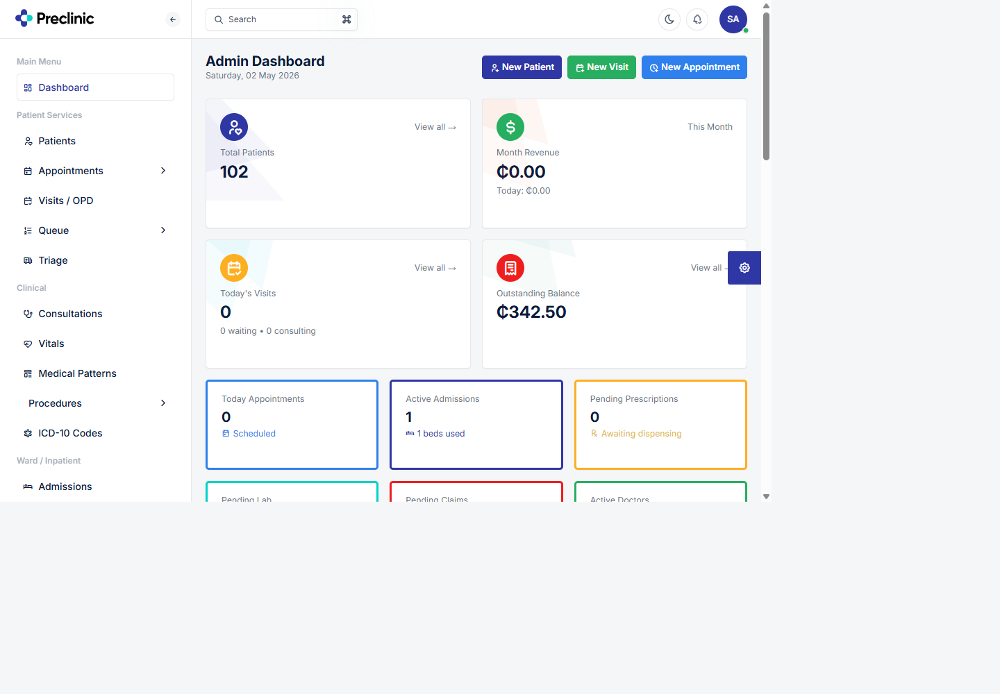
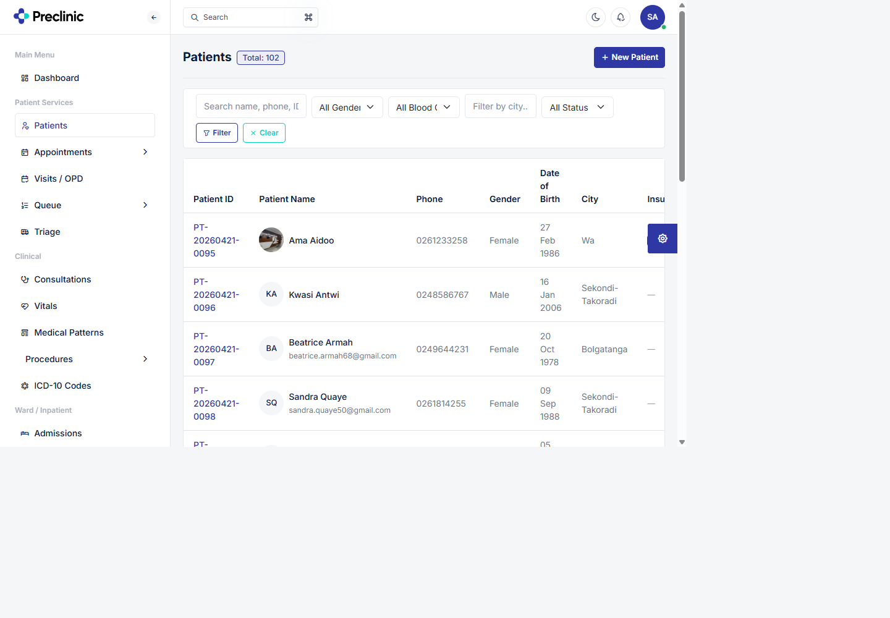
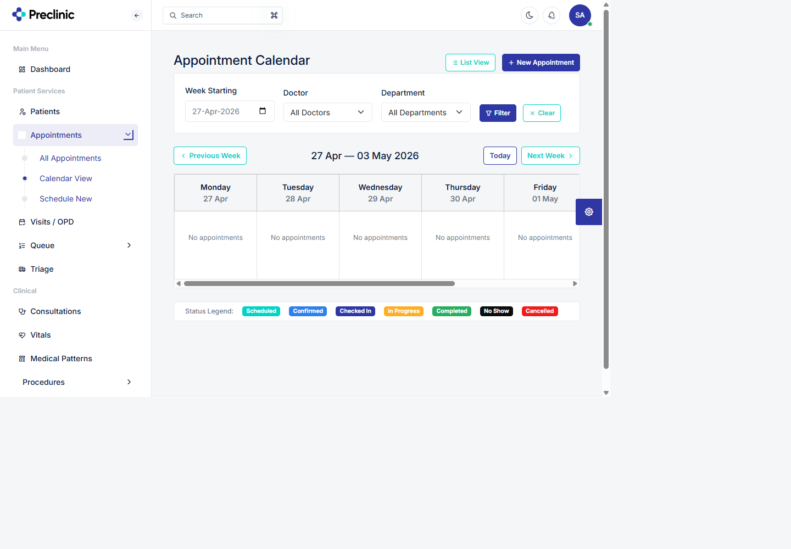
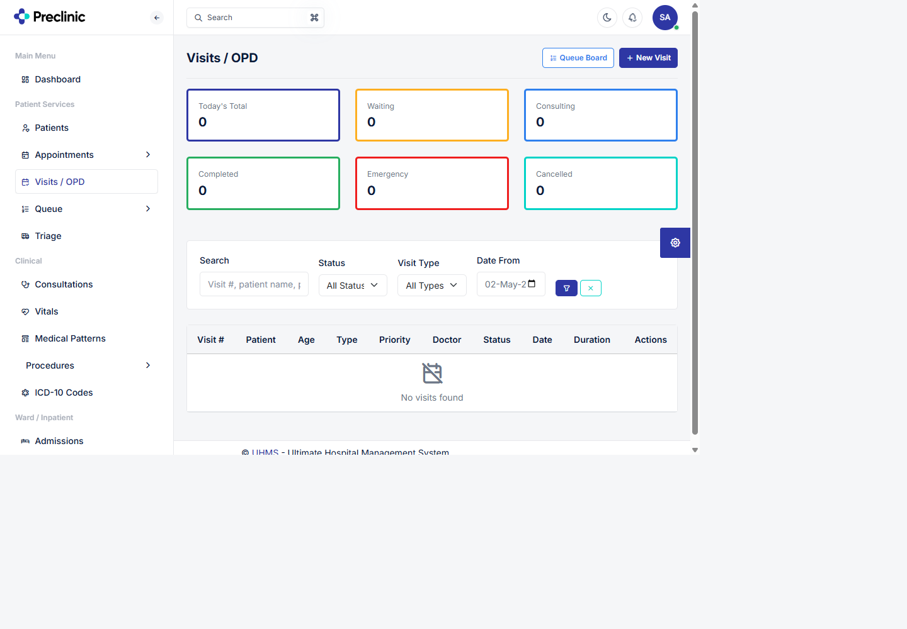
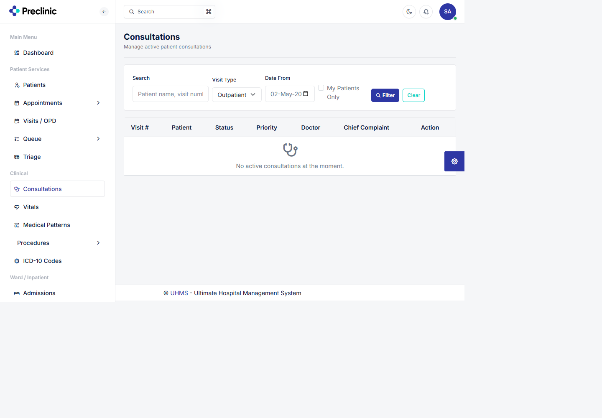
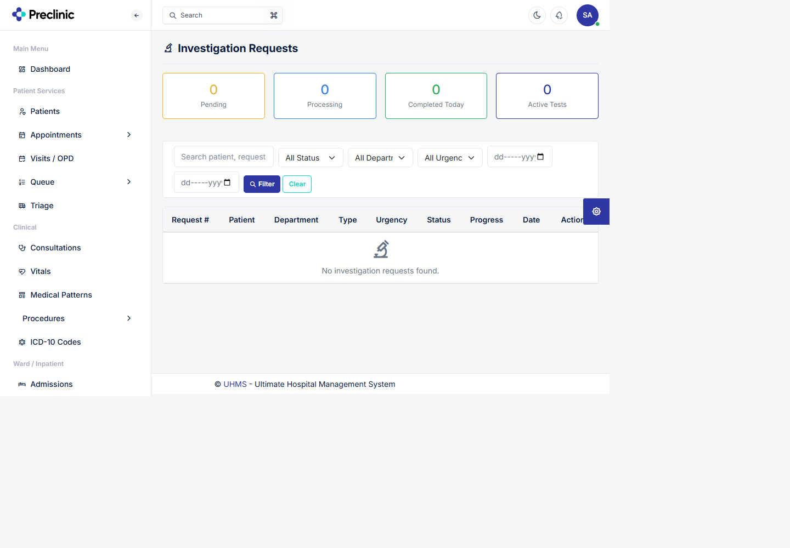
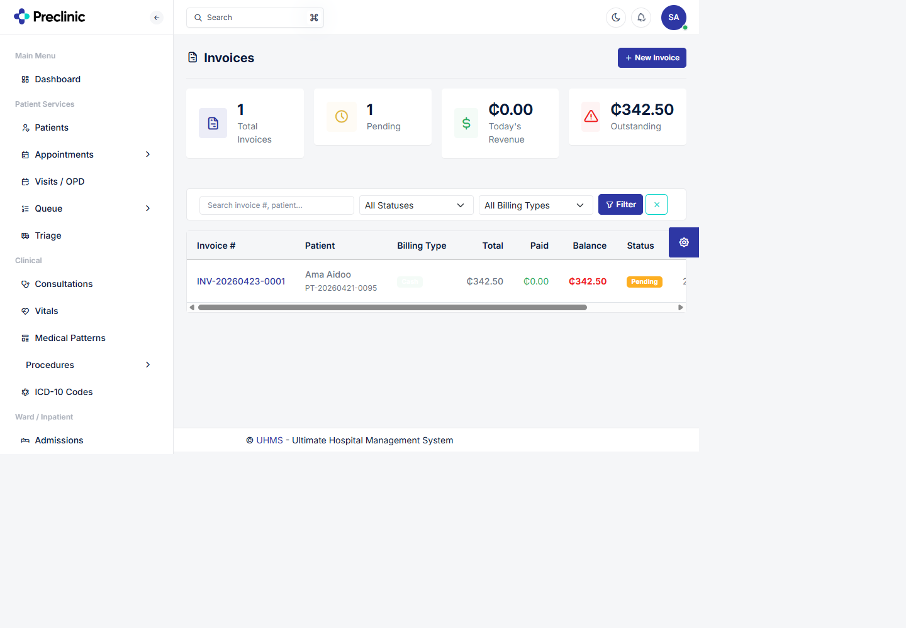
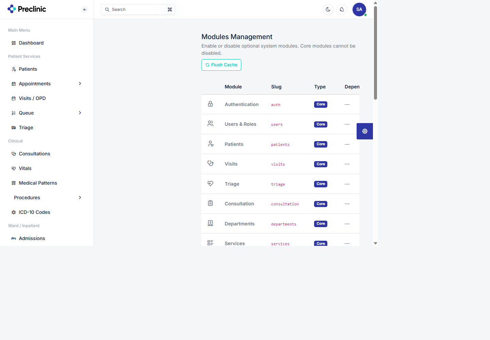

# UHMS User Manual

Current system state as of May 2, 2026.

## 1. Purpose

UHMS is a hospital management system for handling patient registration, OPD visits, appointments, triage, consultation, investigations, prescriptions, billing, pharmacy dispensing, insurance claims, wards, inventory, HR, reports, and administration.

This manual describes the features currently available in the system and how staff should use them in day-to-day operations. Access to each area depends on the user's role, permissions, and whether the related module is enabled.

## 2. Getting Started

### 2.1 Login

1. Open the UHMS application URL.
2. Enter your email and password.
3. Select Login.
4. The system redirects you to the correct dashboard for your role.

The login screen is the entry point for all staff. Users must authenticate before accessing patient, clinical, financial, or administrative pages.

### 2.2 Dashboards

UHMS routes users to a dashboard based on role:

| Role group | Dashboard behavior |
| --- | --- |
| Super Admin, Admin | Admin dashboard |
| Doctor | Doctor dashboard |
| Nurse, Receptionist, Pharmacist, Lab Technician, Accountant, Cashier, HR Manager, Store Manager | Staff dashboard |
| Other authenticated users | Admin dashboard fallback |

### 2.3 Logging out

Use the user menu in the top-right header and select Log Out. Logout is intentionally handled as a normal secure browser request, not an SPA background action.

### 2.4 Navigation

Use the left sidebar to move through the system. The menu is permission-aware:

- If you do not have permission for a feature, it may not appear.
- If an optional module is disabled, its menu items may not appear.
- Some menu groups expand to show sub-pages.
- Most internal navigation now uses the SPA bridge, so pages should open without full browser reloads.

### 2.5 Progressive Web App behavior

UHMS includes PWA basics:

1. The app exposes a web app manifest.
2. Supported browsers can offer installation to desktop or mobile home screen.
3. Static assets are cached by a service worker.
4. If the network is unavailable, the offline page explains that the system cannot continue until connection is restored.

Important: UHMS is an operational clinical system. Patient, billing, and authenticated pages are not designed to be fully used offline. Reconnect before entering or saving clinical, financial, or administrative data.

## 3. Roles and Typical Responsibilities

| Role | Typical access |
| --- | --- |
| Super Admin | Full system access, modules, settings, users, roles, all workflows |
| Admin | Full operational access, settings, users, roles, all workflows |
| Doctor | Consultations, patient viewing, visits, prescriptions, investigation requests, procedures, wards where permitted |
| Nurse | Triage, vitals, queues, prescriptions view, ward/bed visibility |
| Receptionist | Patient registration, visits, appointments, queue management, invoice viewing |
| Lab Technician | Investigation requests, result entry, test catalog, analyzers |
| Pharmacist | Prescriptions, dispensing, drug catalog, drug stock, stock transfers |
| Accountant | Invoices, payments, service catalog, reports, claims, accounts, cashier handover |
| Claims Officer | Claims, invoices, claim review/export, reports |
| Store Keeper | Suppliers, purchase orders, stock transfers, pharmacy stock |
| HR Manager | Employees, attendance, leave, payroll, HR reports |

Permission assignments may be changed by administrators in Roles & Permissions.

The dashboard gives administrators a quick view of operational totals, shortcuts, and the role-aware sidebar menu.

## 4. Main Navigation Areas

### 4.1 Main Menu

- Dashboard

Use this to return to your role-aware dashboard.

### 4.2 Patient Services

- Patients
- Appointments
  - All Appointments
  - Calendar View
  - Schedule New
- Visits / OPD
- Queue
  - Manage Queue
  - Queue Board
- Triage

### 4.3 Clinical

- Consultations
- Vitals
- Medical Patterns
- Procedures
  - Procedure Catalog
  - Scheduled Procedures
- ICD-10 Codes

### 4.4 Ward / Inpatient

- Admissions
- Bed Map
- Wards
- Bed Management

### 4.5 Pharmacy

- Prescriptions
- Dispensing
- Drug Catalog
- Drug Stock

### 4.6 Investigations

- Investigation Requests
- Investigation Results
- Test Catalog
- Investigation Items
- Investigation Stock
- Analyzers
- Analyzer Messages

Some backend route names still use `lab`, but the user-facing workflow should be treated as Investigations.

### 4.7 Billing

- Invoices
- Payments
- Service Catalog
- Specialties

### 4.8 Claims & Insurance

- Claims
- New Claim
- Insurance Providers

### 4.9 Store & Procurement

- Suppliers
- Purchase Orders
- Stock Transfers

### 4.10 Accounts & Finance

- Account Categories
- Expenses
- Income
- Daily Collection
- Reconciliation
- Cashier Handover

### 4.11 HR & Payroll

- Employees
- Attendance
- Leave Requests
- Payroll

### 4.12 Reports

- Financial Reports
  - Income Report
  - Daily Collection
  - NHIS Report
  - Claims Report
  - Patient Statement
- Clinical Reports
  - Patient Report
  - Visit Report
  - Consultation Stats
  - Admissions Report
  - Discharges Report
  - Investigation Revenue
- Pharmacy & HR
  - Pharmacy Sales
  - Sales Summary
  - Stock Valuation
  - Expired Stock
  - Leave Report
  - Payroll Report

### 4.13 Administration

- Users
  - All Users
  - Add User
- Roles & Permissions
- Departments
- Designations

### 4.14 Notifications

- Notifications list
- Recent notifications in the header dropdown
- Mark single notification as read
- Mark all notifications as read

### 4.15 Settings

- Organization
- Invoice Settings
- Payment Methods
- Activity Log
- Modules

## 5. Standard Page Controls

Most list pages follow the same pattern:

1. Use filters to narrow records by date, status, department, staff member, or search text.
2. Use action buttons or row menus to view, edit, approve, process, cancel, print, or export records.
3. Status badges show the current workflow state.
4. Success and error alerts appear near the top of the page after actions.
5. Some actions update the page inline without forcing a full reload.

## 6. Patient Registration and Management

The Patients page is the main register for searching, reviewing, and opening patient records.

### 6.1 Add a patient

1. Go to Patient Services > Patients.
2. Select Create or Add Patient.
3. Enter demographic and contact details.
4. Save the record.
5. Open the patient profile to review details.

### 6.2 Update patient information

1. Open the patient profile.
2. Select Edit.
3. Update the required fields.
4. Save changes.

### 6.3 Manage patient insurance

1. Open the patient profile.
2. Use the insurance section to add an insurance provider, tier, policy/member information, and validity dates.
3. Mark one policy as primary when appropriate.
4. Update or remove expired insurance records as needed.

### 6.4 Manage emergency contacts

1. Open the patient profile.
2. Use the emergency contacts section.
3. Add, edit, or remove contact records.

## 7. Appointments

### 7.1 View appointments

1. Go to Patient Services > Appointments > All Appointments.
2. Review appointment statistics and the appointment list.
3. Filter by status, doctor, date, or search text.
4. Open an appointment to view details.

### 7.2 Use the calendar view

The appointment calendar groups bookings by day and supports week navigation, doctor filters, and department filters.

1. Go to Patient Services > Appointments > Calendar View.
2. Choose a week start date.
3. Optionally filter by doctor or department.
4. Use Previous Week, Today, or Next Week to move through the calendar.
5. Select an appointment card to open the appointment.
6. Use the plus button on future dates to schedule a new appointment for that date.

### 7.3 Schedule an appointment

1. Go to Patient Services > Appointments > Schedule New.
2. Select or search for the patient.
3. Select department, doctor, date, time, visit type, and reason.
4. Add services where applicable.
5. Save the appointment.

### 7.4 Confirm or update appointment status

1. Open All Appointments.
2. Use the row action menu.
3. Choose Confirm, Check In, No Show, Cancel, Edit, or View Details depending on the current status and permissions.
4. Inline actions should return confirmation feedback without a full page reload.

### 7.5 Check in an appointment

1. Locate a confirmed appointment.
2. Select Check In.
3. UHMS creates a visit linked to the appointment.
4. Open the created visit when prompted.

## 8. Visits / OPD Workflow

### 8.1 Create a walk-in visit

1. Go to Patient Services > Visits / OPD.
2. Select Create Visit.
3. Search for or select the patient.
4. Choose visit type, department, doctor, insurance, services, and priority where applicable.
5. Save the visit.
6. The system creates a visit number and moves the patient into the next workflow state.

### 8.2 View visits

The Visits / OPD page shows visit status, patient details, linked appointment information, and workflow actions.

1. Go to Visits / OPD.
2. By default, the list focuses on today's visits unless search or date filters are used.
3. Filter by date range, doctor, status, or search text.
4. Open a visit to review patient, services, department, doctor, billing, and workflow details.

### 8.3 Transition a visit

Users with transition permission can move visits through workflow states. Common transitions include sending the patient to triage, consultation, investigation, completion, referral, or admission-related flow depending on current status and business rules.

## 9. Queue Management

### 9.1 Manage queue

1. Go to Patient Services > Queue > Manage Queue.
2. Review waiting patients and service queues.
3. Call next, complete, skip, or requeue patients as needed.

### 9.2 Queue board

1. Go to Patient Services > Queue > Queue Board.
2. Use this display for waiting room or department queue visibility.

## 10. Triage and Vitals

### 10.1 Open triage queue

1. Go to Patient Services > Triage.
2. Review patients awaiting triage.
3. Open a patient for assessment.

### 10.2 Record vitals

1. Open the visit's triage or vitals screen.
2. Enter temperature, blood pressure, pulse, respiratory rate, oxygen saturation, and other available fields.
3. Select or confirm priority where required.
4. Save the triage record.

### 10.3 Send patient onward

After triage, the patient may be assigned to consultation, moved to another department, or treated according to urgency. The exact available actions depend on visit status and staff permissions.

## 11. Consultations

### 11.1 Open consultation list

The consultation list helps clinicians find consultable visits and filter by visit type, date, assignment, or patient search.

1. Go to Clinical > Consultations.
2. By default, the list focuses on today's outpatient consultable visits.
3. Filter by search text, visit type, date range, or My Patients.
4. Open a visit to enter the consultation workspace.

### 11.2 Consultation workspace

The consultation screen can include:

- Patient summary
- Visit information
- Vitals
- Medical history
- Complaints
- Diagnoses
- Investigations
- Treatments
- Prescriptions
- Tasks
- Medical patterns
- Investigation request tools

### 11.3 Add complaints

1. Open a consultation.
2. Add presenting complaints.
3. Save each complaint.
4. Remove incorrect entries when needed.

### 11.4 Add diagnoses

1. Open the diagnosis section.
2. Add diagnosis details.
3. Mark the primary diagnosis where applicable.
4. Use ICD-10 search/coding if available.
5. Save changes.

### 11.5 Add treatment notes

1. Use the treatment section.
2. Enter treatment plan, advice, procedures, or notes.
3. Save the treatment item.

### 11.6 Create prescription

1. Open the prescription section.
2. Add one or more drug items.
3. Enter dosage, frequency, duration, and instructions.
4. Save the prescription.
5. Pharmacy users can later dispense it.

### 11.7 Request investigations

1. Open the investigation request section.
2. Select the target investigation department.
3. Choose catalog tests or enter free-text investigation items when applicable.
4. Add clinical information and urgency.
5. Submit the request.
6. The request appears in the Investigation Requests queue.

### 11.8 Refer a patient

1. Use the referral action in the consultation workflow.
2. Select the receiving department.
3. Enter referral reason or notes.
4. Submit. The visit is routed for follow-up according to workflow rules.

### 11.9 Medical patterns

Medical patterns allow doctors to reuse common sets of complaints, diagnoses, treatments, prescriptions, or investigation plans.

Common actions:

1. Open Clinical > Medical Patterns.
2. Create a pattern manually or save one from a consultation record.
3. Apply a pattern during a future consultation.
4. Toggle active status when a pattern should no longer be suggested.

## 12. Investigations

### 12.1 View investigation requests

Investigation staff use this queue to filter, accept, process, and track requests from consultations.

1. Go to Investigations > Investigation Requests.
2. Filter by status, urgency, department, date range, or search text.
3. Open a request to process it.

### 12.2 Accept a request

1. Open a pending request.
2. Select Accept.
3. The request and pending items move into processing status.

### 12.3 Enter results

1. Open a processing request.
2. Enter results for each request item.
3. Depending on result type, enter parameter values, rich text, or upload a file result.
4. Mark abnormal results where applicable.
5. Save.
6. When all request items are completed, the request status becomes completed.

### 12.4 Verify results

1. Open an entered result.
2. Select Verify if you have result creation/verification permission.
3. The result records verifier and verification time.

### 12.5 Test catalog

Use Test Catalog to maintain investigation categories and catalog tests.

Typical actions:

1. Add or update test categories.
2. Add or update tests.
3. Toggle tests active/inactive.
4. View tests by category.

### 12.6 Investigation items and stock

Use Investigation Items and Investigation Stock for consumables or stock items used by investigation departments.

Typical actions:

1. Maintain item catalog.
2. Add or update stock.
3. Search items.
4. Check available stock.

### 12.7 Analyzer integration

Analyzer tools are for configuring lab instruments and checking diagnostic messages.

Typical actions:

1. Go to Investigations > Analyzers.
2. Add or update analyzers.
3. Configure mappings.
4. View diagnostics or analyzer messages.
5. Reprocess messages if needed.

## 13. Pharmacy

### 13.1 View prescriptions

1. Go to Pharmacy > Prescriptions.
2. Open a prescription to review prescribed items.
3. Cancel prescriptions if permitted and clinically appropriate.

### 13.2 Dispense medication

1. Go to Pharmacy > Dispensing.
2. Open a prescription.
3. Dispense individual items or use batch dispensing.
4. Confirm quantities and instructions.
5. Review dispensing history when required.

### 13.3 Drug catalog

Use Drug Catalog to manage drugs, categories, strengths, dosage forms, and active status.

Typical actions:

1. Add a drug.
2. Update a drug.
3. Toggle active/inactive.
4. Search drugs.
5. Review drug history.

### 13.4 Drug stock

Use Drug Stock to manage available inventory and stock alerts.

Typical actions:

1. Add stock records.
2. Update stock records.
3. Review low stock or expiry alerts.

## 14. Billing and Payments

### 14.1 View invoices

The Invoices page centralizes billing status, outstanding balances, payments, and invoice actions.

1. Go to Billing > Invoices.
2. Filter by status, billing type, or search text.
3. Open an invoice to review items, patient, visit, payments, and totals.

### 14.2 Create invoice

1. Go to Billing > Invoices > Create.
2. Select patient or visit.
3. If a visit is selected, UHMS can suggest billable items from visit services, investigations, and prescriptions.
4. Add or update invoice items.
5. Select billing type, tax, discount, due date, and notes.
6. Save the invoice.

### 14.3 Record payment

1. Open the invoice.
2. Use the payment form.
3. Enter amount, payment method, and reference details.
4. Save payment.
5. UHMS updates invoice payment status and provides receipt access.

### 14.4 Print invoice or receipt

1. Open the invoice or payment.
2. Use Print Invoice or Receipt actions where available.
3. Print/PDF links intentionally bypass SPA interception and open normally.

### 14.5 Service catalog and specialties

Use Service Catalog to maintain billable services and prices. Use Specialties to maintain clinical specialty groupings used in services, appointments, and departments.

## 15. Claims and Insurance

### 15.1 Insurance providers and tiers

1. Go to Claims & Insurance > Insurance Providers.
2. Add providers.
3. Manage tiers under each provider.
4. Toggle provider status if needed.

### 15.2 Create claim

1. Go to Claims & Insurance > New Claim.
2. Select patient, provider, invoice, or visit context as required.
3. Add claim items.
4. Save the claim.

### 15.3 Create claim from invoice

1. Open or locate an eligible invoice.
2. Use claim creation from invoice where available.
3. Review claim items before submitting.

### 15.4 Submit and review claim

1. Open a claim.
2. Submit the claim when ready.
3. Claim reviewers can open the review screen.
4. Review individual items.
5. Complete review.
6. Mark paid when reimbursement is received.
7. Appeal if applicable.

### 15.5 Export claims

Users with export permission can export claim data from the claims list.

## 16. Ward and Inpatient

### 16.1 Admissions

1. Go to Ward / Inpatient > Admissions.
2. Select Create Admission when permitted.
3. Choose patient, ward, bed, admitting diagnosis, and admission details.
4. Save admission.
5. Open admission to review inpatient details.

### 16.2 Admission rounds, vitals, and services

From an admission record, permitted users can:

1. Add ward rounds.
2. Record inpatient vitals.
3. Add inpatient services.

### 16.3 Discharge

1. Open the admission.
2. Select Discharge.
3. Enter discharge details.
4. Process discharge.

### 16.4 Bed map and bed management

1. Use Bed Map to view bed occupancy.
2. Use Wards to manage wards.
3. Use Bed Management to add or update beds.

## 17. Procedures

### 17.1 Procedure catalog

1. Go to Clinical > Procedures > Procedure Catalog.
2. Add, update, or toggle procedures.

### 17.2 Schedule procedure

1. Go to Clinical > Procedures > Scheduled Procedures.
2. Select Schedule.
3. Enter patient, procedure, date/time, and assigned staff details.
4. Save.

### 17.3 Start, complete, or cancel procedure

Use actions on scheduled procedures to move them through their workflow.

## 18. Store and Procurement

### 18.1 Suppliers

1. Go to Store & Procurement > Suppliers.
2. Add or update supplier information.
3. Toggle supplier active status where needed.

### 18.2 Purchase orders

1. Go to Purchase Orders.
2. Create a purchase order.
3. Add items.
4. Submit for approval.
5. Approver reviews and approves.
6. Receive goods when delivered.
7. Cancel if necessary.

### 18.3 Stock transfers

1. Go to Stock Transfers.
2. Create a transfer.
3. Select source and destination stock context.
4. Add drug stock or investigation stock items.
5. Submit, approve, complete, or cancel according to workflow.

## 19. Accounts and Finance

### 19.1 Account categories

Use Account Categories to classify income and expenses.

### 19.2 Expenses and income

1. Go to Expenses or Income.
2. Create an entry.
3. Enter category, amount, date, description, and supporting details.
4. Save entry.
5. Approve entries if you have approval permission.

### 19.3 Daily collection

Use Daily Collection to review payments and collected revenue for a day or period.

### 19.4 Reconciliation

Use Reconciliation to compare expected collections with actual payments or handover records.

### 19.5 Cashier handover

1. Open Cashier Handover.
2. Open a cashier shift.
3. Close the shift at the end of the period.
4. A supervisor or authorized user verifies the shift.

## 20. HR and Payroll

### 20.1 Employees

1. Go to HR & Payroll > Employees.
2. Add employee records.
3. Open employee profiles to view or edit details.

### 20.2 Attendance

1. Go to Attendance.
2. Record attendance.
3. Review attendance summary.

### 20.3 Leave requests

1. Go to Leave Requests.
2. Create a leave request.
3. Approvers can approve or reject requests.

### 20.4 Payroll

1. Go to Payroll.
2. Process payroll.
3. Approve payroll when ready.
4. Mark payroll as paid.
5. Open payslips where available.

## 21. Reports

### 21.1 Financial reports

Use Financial Reports for:

- Income Report
- Daily Collection
- NHIS Report
- Claims Report
- Patient Statement

### 21.2 Clinical reports

Use Clinical Reports for:

- Patient Report
- Visit Report
- Consultation Stats
- Admissions Report
- Discharges Report
- Investigation Revenue

### 21.3 Pharmacy and HR reports

Use Pharmacy & HR reports for:

- Pharmacy Sales
- Sales Summary
- Stock Valuation
- Expired Stock
- Leave Report
- Payroll Report

### 21.4 Printable documents

The system also supports printable clinical and operational documents such as consultation records, investigation reports, prescriptions, invoices, receipts, and patient statements where routes and permissions allow.

## 22. Administration

### 22.1 Users

1. Go to Administration > Users.
2. View all users.
3. Add a user.
4. Edit user details.
5. Toggle user active status.

### 22.2 Roles and permissions

1. Go to Administration > Roles & Permissions.
2. Create or update roles.
3. Open role permissions.
4. Assign permissions carefully.
5. Save changes.

Note: Removing permissions immediately changes what affected users can access.

### 22.3 Departments

Use Departments to manage clinical and operational departments.

Key department behavior:

- Active departments appear in relevant dropdowns.
- Departments that accept investigation requests appear in consultation investigation workflows.
- Department settings may affect routing and service availability.

### 22.4 Designations

Use Designations to manage staff job titles and classifications.

## 23. Settings and Modules

### 23.1 Organization settings

Use Organization settings to manage hospital or facility identity and organization-level information.

### 23.2 Invoice settings

Use Invoice Settings to configure invoice display, numbering, or related billing presentation settings where available.

### 23.3 Payment methods

Use Payment Methods to configure available payment options.

### 23.4 Activity log

Use Activity Log to review significant system actions.

### 23.5 Modules management

Administrators use Modules Management to control which optional feature groups are available in the sidebar and protected routes.

Modules control which optional feature groups are shown and available in navigation.

Core modules cannot be disabled:

- Authentication
- Users & Roles
- Patients
- Visits
- Triage
- Consultation
- Departments
- Services
- Billing
- Settings

Optional modules can be enabled or disabled:

- Insurance
- Claims, depends on Insurance
- Pharmacy
- Inventory/Store
- Investigations
- Analyzer, depends on Investigations
- HR
- Payroll, depends on HR
- Reports
- Medical Patterns
- Notifications

To manage modules:

1. Go to Settings > Modules.
2. Review enabled/disabled status.
3. Toggle a non-core module.
4. If disabling a module, disable dependent modules first.
5. If enabling a dependent module, enable its parent module first.
6. Flush module cache if menu visibility does not update as expected.

## 24. Notifications

### 24.1 Header notification dropdown

The header shows recent notifications and an unread badge.

Common actions:

1. Open the notification bell.
2. Select a notification to view related content.
3. Use Mark all read to clear unread notifications.

### 24.2 Notifications page

Go to Notifications to view a full list of notifications.

## 25. Profile and Password

All authenticated users can access their profile.

Typical actions:

1. Open the user menu in the header.
2. Select My Profile.
3. Update profile details.
4. Change password from the password section.

## 26. Recommended Operational Workflows

### 26.1 Standard OPD walk-in flow

1. Reception registers or finds patient.
2. Reception creates visit.
3. Patient is queued for triage.
4. Nurse records vitals and triage details.
5. Patient is assigned to consultation.
6. Doctor performs consultation.
7. Doctor may prescribe medication, request investigations, refer, admit, or complete visit.
8. Billing creates or reviews invoice.
9. Patient pays or invoice is routed for insurance/claims.
10. Pharmacy dispenses prescribed drugs if applicable.
11. Investigation department processes requests if applicable.
12. Visit is completed after care and billing workflow are done.

### 26.2 Appointment-to-visit flow

1. Reception schedules appointment.
2. Staff confirms appointment.
3. Patient arrives.
4. Staff checks in appointment.
5. UHMS creates linked visit.
6. Visit continues through triage, consultation, billing, and any downstream workflows.

### 26.3 Consultation-to-investigation flow

1. Doctor opens consultation.
2. Doctor selects target investigation department.
3. Doctor selects tests/items and submits request.
4. Investigation staff accepts request.
5. Results are entered and optionally verified.
6. Doctor reviews completed results from the consultation or patient history.

### 26.4 Prescription-to-dispensing flow

1. Doctor creates prescription during consultation.
2. Pharmacist opens dispensing queue.
3. Pharmacist reviews prescription items.
4. Pharmacist dispenses individual items or batch dispenses.
5. Stock records and dispensing history are updated according to configured workflow.

### 26.5 Invoice-to-payment flow

1. Accountant or cashier creates invoice or opens an existing invoice.
2. User records payment.
3. UHMS updates invoice status.
4. Receipt can be opened or printed.
5. Fully paid visits may move toward completion depending on workflow rules.

### 26.6 Insurance claim flow

1. Patient has insurance configured.
2. Invoice is created for covered services.
3. Claim is created manually or from invoice.
4. Claim is submitted.
5. Claim officer reviews items.
6. Claim is marked paid, appealed, or otherwise followed up.

## 27. Troubleshooting for Users

### 27.1 I cannot see a menu item

Possible reasons:

- Your role lacks the required permission.
- The module is disabled.
- Your user account is inactive.
- The page is restricted to a different role.

Ask an administrator to check Roles & Permissions and Settings > Modules.

### 27.2 Page did not update after an action

1. Check for success or error alerts.
2. Refresh the page if needed.
3. If using the PWA install, confirm network connectivity.
4. Report persistent issues to system support.

### 27.3 Offline message appears

The network is unavailable or the server cannot be reached. Reconnect and refresh before entering or saving data.

### 27.4 A print or PDF link opens outside the SPA flow

This is expected. Print and PDF views use normal browser navigation so they can open printable pages reliably.

### 27.5 Appointment calendar shows no records

1. Check the selected week.
2. Clear doctor and department filters.
3. Confirm appointments exist for that date range.
4. Confirm your role has appointment view permission.

## 28. Current Implementation Notes

- The system uses role and permission based access control.
- Sidebar visibility is controlled by both permissions and module status.
- Most existing Blade pages are served through a legacy Inertia/Vue bridge for SPA-style navigation.
- Some backend routes still use old names such as `lab`, but the user-facing language is Investigation.
- The PWA currently provides install metadata, static asset caching, and an offline information page. It does not provide offline clinical data entry.
- Print, export, and PDF actions may use full-page browser behavior by design.

## 29. Quick Reference by Department

### Reception

- Register patients.
- Schedule appointments.
- Check in appointments.
- Create visits.
- Manage queues.
- View invoices where permitted.

### Nursing

- Manage triage queue.
- Record vitals.
- Update visit priority.
- Assign patients for consultation.
- View ward/bed information where permitted.

### Doctors

- Open consultations.
- Record complaints, diagnoses, treatments, and prescriptions.
- Request investigations.
- Refer patients.
- View patient history.
- Use medical patterns.

### Investigation staff

- View investigation request queue.
- Accept requests.
- Enter and verify results.
- Maintain test catalog and investigation stock where permitted.
- Manage analyzer diagnostics where permitted.

### Pharmacy

- View prescriptions.
- Dispense medications.
- Maintain drug catalog.
- Manage stock and alerts.

### Billing and accounts

- Create invoices.
- Record payments.
- Print invoices and receipts.
- Manage account entries.
- Review daily collection and reconciliation.
- Manage cashier handover.

### Claims

- Manage insurance providers and tiers.
- Create and submit claims.
- Review claim items.
- Mark claims paid or appeal.
- Export claim data.

### Store

- Manage suppliers.
- Create and approve purchase orders.
- Receive purchases.
- Manage stock transfers.

### HR

- Manage employees.
- Record attendance.
- Manage leave.
- Process payroll.

### Administrators

- Manage users and roles.
- Manage departments and designations.
- Configure organization, invoices, and payment methods.
- Review activity logs.
- Enable or disable modules.
